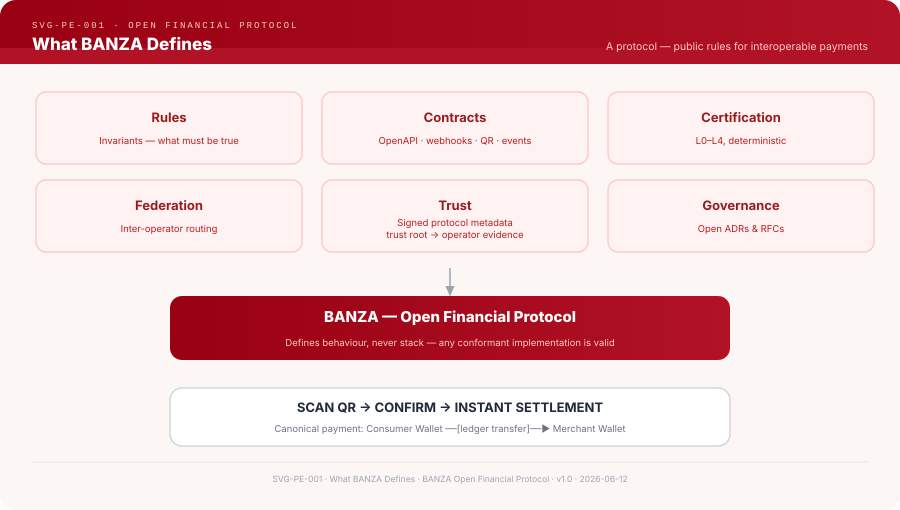
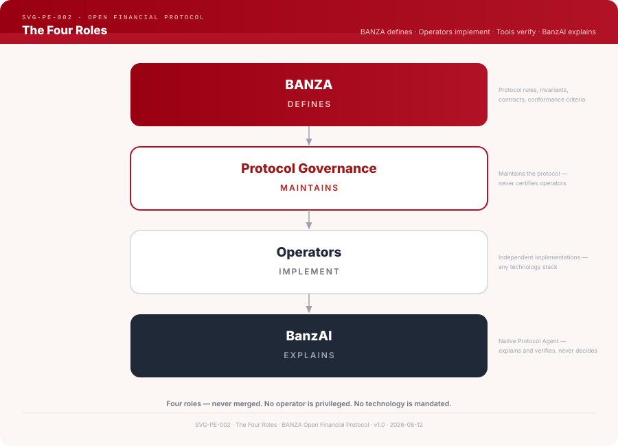
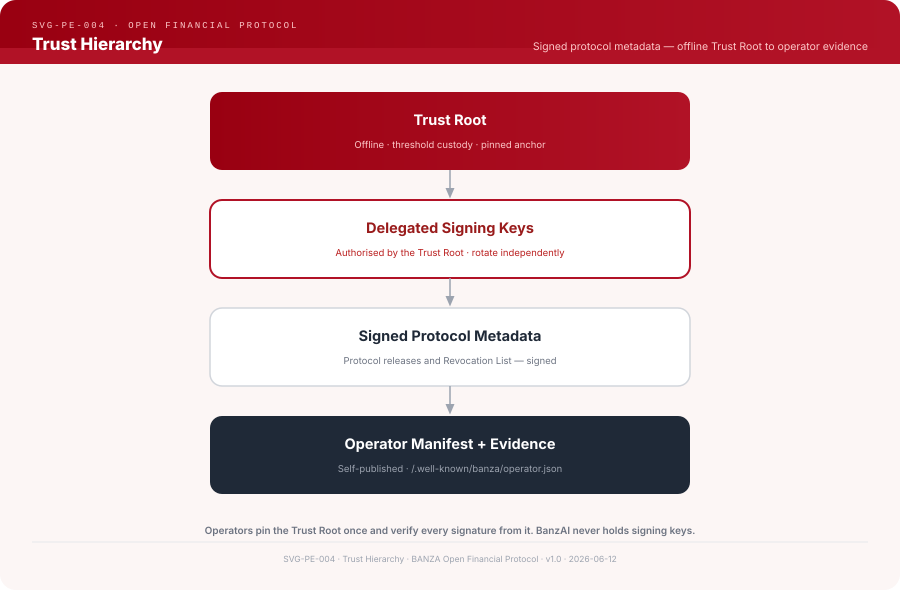

# BANZA

**The Open Financial Protocol for interoperable payments.**

Public rules, protocol contracts, machine-verifiable conformance evidence and an open
federation trust model — implementable by any independent operator, controlled by no one.

> **The protocol exists independently of any operator.**


| | |
|---|---|
| Protocol | [github.com/banza-protocol/banza](https://github.com/banza-protocol/banza) — this repository |
| Native Protocol Agent (BanzAI) | [services/banzai-api](services/banzai-api) — canonical runtime (this repo). Active BanzAI development lives entirely in this repository. |
| Reference | [`docs/reference/pt/completa.md`](docs/reference/pt/completa.md) (PT — canonical) · [`docs/reference/en/complete.md`](docs/reference/en/complete.md) (EN) |
| Website | `banza.network` |

---

## Overview

BANZA is a protocol — a set of public rules that defines how independent payment
operators interoperate.

```
HTTP  → Web
SMTP  → Email
BGP   → Internet routing
BANZA → Interoperable payments
```



BANZA defines **rules** (financial invariants), **contracts** (OpenAPI, webhook
schemas, QR payload, event schemas), **conformance** (deterministic suites and
machine-verifiable evidence, scoped by conformance levels L0–L4),
**conformance & interoperability certification** (per-implementation and
evidence-based — ADR-064), **federation**
(inter-operator routing evaluated from signed protocol metadata), **trust** (a trust root,
delegated signing keys and a revocation list) and **governance**
(an open ADR/RFC process).

BANZA does **not** process payments, store balances, maintain accounts, move
money, or depend on any specific rail, operator or technology stack.

BANZA is an open financial protocol accompanied by a **native AI agent, BanzAI**
(ADR-041), which is the **primary human-operator interface** for interacting with
the protocol (ADR-054). BanzAI interprets requests, consults the Reference, guides
implementation, routes to the verifiable Rust/WASM engines, explains results, helps
correct failures and prepares technical evidence. It is an orchestration and
guidance agent, not an authority: it does not approve, certify, license, publish
operators or decide participation, does not create or add rules or architectural
decisions, does not move funds, and does not replace the BANZA Reference or the
deterministic verification engines. The step-by-step journey is optional guidance;
the primary interactive interface is "Perguntar ao BanzAI". APIs, manifests,
schemas, endpoints and engines remain verifiable technical surfaces independent of
the AI, and machine-to-machine integration does not depend mandatorily on BanzAI.

> **BanzAI guia; os motores verificam; a evidência prova; a governança decide.**

## The three institutional layers

BANZA is organised as three separate institutional layers (ADR-059):

- **Layer 1 — BANZA Protocol.** The open, neutral, verifiable rules, contracts and
  invariants. This repository.
- **Layer 2 — Conformance & Interoperability Certification.** A per-implementation,
  evidence-based, Rust-decided determination against a public, versioned profile
  (ADR-064). It certifies an *implementation*, never an entity, and is not a licence,
  scheme admission or regulatory authorisation. Records are published to the Technical
  Registry (ADR-065), which is currently empty (pre-production).
- **Layer 3 — Banzami Operational Scheme.** The first operational scheme built on
  BANZA, with **Banzami — Tecnologia e Serviços, Lda.** as the designated operator, in
  regulatory preparation (`REGULATORY_AUTHORIZATION_IN_PROGRESS`) with real money off
  (ADR-060 · ADR-062). **BANZA ≠ Banzami**, and certification is never exclusive to
  this scheme.

**BanzAI** is the single human-operator interface at `/banzai` (ADR-054), transversal
across the three layers — not a fourth layer and not an authority. Rust decides; Qwen
only explains. Canonical detail lives in the Reference and ADR-059.

## The Protocol Test

HTTP does not define browsers. SMTP does not define email clients. BGP does
not define routers. In the same way, BANZA does not define wallets, apps,
software or companies.

If every current operator ceased operations tomorrow, the BANZA protocol —
its rules, contracts, invariants, conformance levels and open federation trust model — would remain fully valid and available to any new operator.

## Why BANZA Exists

Payment infrastructure exists. What is missing is a common protocol layer.
Without one, operators cannot interoperate without bilateral agreements,
trust must be negotiated case by case, and there is no shared definition of
correct financial behaviour — nor an open path to prove it.

BANZA defines the rules. Operators implement them. An operator that passes
conformance produces **machine-verifiable evidence** of correctness for the tested
level, publishes it alongside signed protocol metadata, and any counterparty can
verify it independently. BANZA é um protocolo financeiro aberto. A participação de
operadores é demonstrada por conformidade protocolar verificável, não por aprovação
humana central. Operators whose trust material passes Open Trust Evaluation may
federate — route payments between each other — without bilateral agreements.

## The Four Roles



```
BANZA                = Open Financial Protocol       (defines)
Protocol Governance  = Protocol Maintainers          (evolve · sign releases)
Operators            = Independent implementations   (implement · self-publish)
BanzAI               = Native protocol AI agent      (guides · orchestrates · explains)
```

These roles never merge. No operator is privileged. No technology is mandated.
Examples in BANZA documentation use **Operator A**, **Operator B**,
**Operator C** — never real commercial names.

## Financial Invariants

The protocol's integrity guarantees. Every operator implementing the protocol must
enforce them, regardless of implementation technology:

| Invariant | Description |
|-----------|-------------|
| `INV-LEDGER-001` | Every posting sums to zero (double-entry) |
| `INV-LEDGER-002` | Ledger entries are immutable after creation |
| `INV-LEDGER-003` | All monetary values are integers (no floating point) |
| `INV-LEDGER-004` | Postings are atomic — never partially applied |
| `INV-WALLET-001` | `balance = available + reserved` at all times |
| `INV-STL-001` | `gross = net + fee` (no money creation) |
| `INV-IDEM-001` | Same idempotency key always produces the same result |

Families: `INV-LEDGER-*` · `INV-WALLET-*` · `INV-SETTLE-*` · `INV-IDEM-*` ·
`INV-RECON-*` · `INV-QR-*`. Machine-readable registry: [`contracts/invariants.json`](contracts/invariants.json); prose specs: [`spec/`](spec/).

## Conformance Levels

The five conformance levels (L0–L4) are defined in the table below.

| Level | Name | What it means |
|-------|------|---------------|
| L0 | Protocol Sandbox | Protocol-correct sandbox; financial invariants verifiable |
| L1 | Core Payment Capability | Wallets, ledger, transfers, idempotency |
| L2 | Payment Initiation Capability | QR payments and payment links |
| L3 | Inter-Operator Interoperability | Routes to and receives from other conformant operators |
| L4 | External Interoperability | Integrates with external infrastructure |

Conformance is established by a **deterministic conformance suite** — never by
self-declaration and never by human approval. The suite produces evidence that any
counterparty can re-verify from published, signed material. BanzAI explains the
criteria; it does not evaluate trust and does not admit operators.

**Quick start — conformance evidence:**

BANZA is a protocol, not a runtime or operator. Operators implement it
independently and expose public endpoints; conformance testing is **URL-based**
against those endpoints.

For operators, the recommended way to validate protocol compatibility is
**BanzAI** (`/banzai`):

> **Open BanzAI → Manifest → Conformance → Trust → Federation → Evidence Bundle → Traces**

BanzAI guides you as you prepare the manifest, run conformance validations, verify
signed protocol metadata, evaluate revocation/fail-closed and produce an evidence
bundle. The operator's implementation is validated by verifiable artifacts, not by any
particular tool.

**Endpoint-originated (ADR-068).** Validating an operator means evaluating one of its
**published implementations** (the operator is the responsible entity; the
implementation is the technical system evaluated). BanzAI's **official** validation
uses **exclusively artifacts obtained from the public endpoints** of the selected
implementation: the target is resolved from the closed Technical Registry
(`operator_id → implementation_id → canonical_origin → discovery`) and every artifact
is fetched by a secure, SSRF-hardened **Rust** fetcher
([`engines/banza-artifact-fetcher`](engines/banza-artifact-fetcher)) — never the
browser, never a user-supplied URL. Each verdict is decided in Rust and bound to the
exact origin of its inputs in an `OperationReceipt`/`JourneyReceipt`; upload/paste is a
local, non-authoritative **draft** tool only. Technical validation is not an issued
certification; technical certification is not scheme admission nor regulatory
authorisation.

A PASS produces **machine-verifiable conformance evidence** that any counterparty can
re-verify independently.

> **Transparency & maintenance tooling (not an operator obligation).** The
> conformance engine, contracts and test vectors are public — the conformance runner
> and vectors live in [`tools/banza-conformance/`](tools/banza-conformance/) and
> [`conformance/`](conformance/), and the official Rust engines in
> [`engines/`](engines/). They exist for transparency and protocol maintenance, so
> anyone can inspect the rules and reproduce results independently. They are **not**
> the operator path: for operator use, the recommended path is BanzAI.

**Evidence Bundle.** The conformance report and the operator's signed protocol
metadata are aggregated into an **Evidence Bundle** — a single integrity-checked
artifact carrying SHA-256 hashes plus the versions of the tools that produced it. The
operator self-publishes the bundle; any third party recomputes the hashes and re-runs
the checks to reproduce the result. The bundle is assembled by the Rust engine
[`engines/banza-evidence-bundle`](engines/banza-evidence-bundle) (compiled to WASM),
so TypeScript never decides the result — it only displays it. Model:
[`docs/governance/OPERATOR_SELF_PUBLICATION_AND_CONFORMANCE.md`](docs/governance/OPERATOR_SELF_PUBLICATION_AND_CONFORMANCE.md).

**How operators participate** (ADR-039 — self-publication):

1. Read the protocol reference — [`docs/reference/pt/completa.md`](docs/reference/pt/completa.md) (PT) · [`docs/reference/en/complete.md`](docs/reference/en/complete.md) (EN)
2. Read the conformance and self-publication model — [`docs/governance/OPERATOR_SELF_PUBLICATION_AND_CONFORMANCE.md`](docs/governance/OPERATOR_SELF_PUBLICATION_AND_CONFORMANCE.md)
3. Implement the protocol in your chosen technology stack and expose a public endpoint (`/health`, `/.well-known/banza/operator.json`)
4. Validate conformance with **BanzAI** (`/banzai`) against your public URL to generate an evidence report — no local tooling to install
5. Publish your manifest, signed protocol metadata and conformance evidence at your own endpoints — no submission queue, no review board, no waiting for a decision
6. Counterparties fetch that material and run Open Trust Evaluation against it themselves; the Public Protocol Registry indexes it so it can be discovered

There is no approved SDK, approved language, or approved infrastructure — and no
entity that admits you. The conformance suite verifies correctness; its runner and
test vectors live in [`tools/banza-conformance/`](tools/banza-conformance/) and
[`conformance/`](conformance/) as maintainer/transparency tooling, not as an operator
step.

**Published state:**

| Item | Status |
|---|---|
| Operator validation path | **BanzAI** (`/banzai`, no local install) |
| Conformance engine + test vectors | Public — `tools/`, `conformance/`, `engines/` (maintainer/transparency tooling) |
| Public Protocol Registry (`/operators`) | `[]` — no operator metadata published yet |
| `production_certificates` | `false` — unchanged published state (BANZA issues nothing to operators) |
| Certification (L2) | Conformance & Interoperability Certification is per-implementation and evidence-based (ADR-064), decided by the Rust engines and published to the Technical Registry (ADR-065) — currently empty (pre-production). BANZA runs no central issuing body and grants no per-operator credential; there is no `/certificates` route. Conformance evidence is at `/conformance/evidence` |
| M2/M3 | Trust root and protocol production milestones |

> A PASS is conformance evidence for the requested level. It is one of the ten
> inputs to Open Trust Evaluation — it does not by itself make an operator
> routable, and it does not replace legal, regulatory, KYC/KYB or banking
> obligations. Operators are independent and carry their own legal, regulatory and
> financial responsibility; any authorisation to operate comes from the competent
> regulator, never from BANZA.

**Developer / internal fallback** (for contributors working inside the BANZA repository):

```bash
python3 tools/banza-conformance/run.py \
  --url http://localhost:3000 \
  --level 0 \
  --output report.json
```

## Federation — Open Trust Evaluation

Operators federate when their published trust material passes **Open Trust
Evaluation**. There is no admission step and no entity that lets an operator in:

- Operator A routes a payment to a user of Operator B
- No bilateral agreement required — trust is established by verifying Operator B's
  signed protocol metadata and conformance evidence against the trust root
- Routing follows open protocol contracts; settlement rules are defined by the protocol

Operator A evaluates Operator B against exactly these ten checks (ADR-040):

| # | Check |
|---|-------|
| 1 | Valid operator manifest |
| 2 | Compatible protocol version |
| 3 | Signed protocol metadata |
| 4 | Conformance evidence present and valid |
| 5 | Trust root / delegated signature valid |
| 6 | Not revoked in the revocation list |
| 7 | Capabilities compatible |
| 8 | Endpoint contract compatible |
| 9 | Evidence freshness within policy |
| 10 | **Fail-closed** on missing, invalid, expired, revoked or incompatible trust material |

Every check is machine-verifiable from published material. Any party — a
counterparty operator, an auditor, a regulator — can run the same evaluation and
reach the same result, without asking BANZA anything.

Details: [`spec/federation/`](spec/federation/) · ADR-040 · test vectors: [`conformance/`](conformance/)

## Trust Model



```
Trust Root  (offline · ceremony-controlled · INV-ROOT-001)
    ↓
Delegated Signing Keys  (HSM-protected)
    ↓
Signed Protocol Metadata + Revocation List  (ed25519)
    ↓
Operator-published Manifests & Conformance Evidence  (signed · /.well-known/banza/operator.json)
```

A Trust Root assina apenas o Manifesto de Chaves; as chaves delegadas assinam metadados do protocolo, releases e revogações.
Ela não autoriza operadores, não emite licença e não autoriza pagamentos.

Operators pin the trust root once and use it to verify all subsequent signed
protocol metadata, delegated keys and revocations. BanzAI never holds production keys.

**Public Protocol Registry.** O Public Protocol Registry é um índice de metadata e
evidência verificável. Não é uma lista de operadores licenciados, aprovados ou
admitidos pela BANZA. Absence from the registry is not a regulatory prohibition —
it means metadata has not been indexed, nothing more.

**Revocation List.** A Revocation List é um mecanismo de segurança e trust do
protocolo. Não é licença, sanção regulatória ou autorização financeira. Evaluation
fails closed against it.

Details: ADR-038 · ADR-039 · ADR-040 · [`docs/security/`](docs/security/)

## Governance

The protocol evolves through an open process, available to all operators:

- **ADRs** record accepted architecture decisions — [`decisions/adr/`](decisions/adr/)
- **RFCs** propose protocol changes for open comment — [`decisions/rfc/`](decisions/rfc/)

**To propose a change:** open an RFC in [`decisions/rfc/`](decisions/rfc/) for open
comment; once the direction is agreed, the accepted decision is recorded as an ADR in
[`decisions/adr/`](decisions/adr/). Anyone may propose — see [CONTRIBUTING.md](CONTRIBUTING.md).
Humans maintain and evolve the protocol; they do not authorise, accept, approve or
certify operators.

**Origin and open governance.** BANZA was originally created on **01/08/2025 (1 de agosto de 2025)** by
**BANZAMI - TECNOLOGIA E SERVIÇOS, LDA.**, which is the original creator and initial institutional
maintainer. That date is the protocol's historical creation / initial availability — not a production,
certification, financial-authorisation or active-operator date — and the creator holds no operational
authority over operators. **BANZA governance is open
today through the public GitHub repository** (issues, pull requests, reviews, ADRs, RFCs, specs,
releases) — it is not a future promise. See [GOVERNANCE.md](GOVERNANCE.md) and
[MAINTAINERS.md](MAINTAINERS.md).

Model: [`docs/governance/README.md`](docs/governance/README.md)

## Technology Neutrality

BANZA does not prescribe implementation technology. The protocol defines
*behaviour*, never *stack*:

- Monetary values: integer arithmetic in minor units — no floating point
- Ledger writes: synchronous and atomic at the posting step
- Double-entry: every debit has a corresponding credit
- Wallet balances: always ledger-derived
- Every financial operation: idempotent and replay-safe

Any language, database or runtime that satisfies the invariants and passes
conformance is a valid implementation.

This operator neutrality is permanent, and it is **orthogonal** to the language of
the project's *own* official tooling. Per [ADR-037](decisions/adr/ADR-037-rust-first-official-engines.md),
the **official** BANZA/BanzAI engines — conformance, crypto/trust/BRL, invariant
checking, the BanzAI evidence engine, guards and evals — are **Rust**; TypeScript is
UI/glue, Python is temporary legacy. A CI guard (`make rust-rule-check`) blocks new
non-Rust engines. See
[docs/governance/RUST_FIRST_IMPLEMENTATION_POLICY.md](docs/governance/RUST_FIRST_IMPLEMENTATION_POLICY.md).

## BanzAI — the Native Protocol Agent

BanzAI is the native protocol AI agent at `banza.network/banzai` (ADR-041). It
guides operators, orchestrates the verifiable Rust/WASM tools and explains the
rules; it never makes them:

| BanzAI does | BanzAI does NOT do |
|-------------|-------------------|
| Explain protocol rules with citations | Define or change rules |
| Explain conformance criteria and gaps | Admit, approve or vouch for an operator |
| Explain recorded traces against invariants | Execute the authoritative conformance suite |
| Search and navigate ADRs, RFCs, contracts | Hold production keys |
| Validate documents against published schemas | Perform Open Trust Evaluation for a counterparty |

**Current state (reference deployment).** `banza.network/banzai` is the **single public interface**;
the browser calls same-origin `POST /banzai/ask` → the internal `banzai-api`. The effective default
engine is **`local_qwen`** — Qwen3-4B-GGUF run on-host by `llama.cpp`, reasoning disabled, 384 tokens,
60 s timeout, concurrency/queue 1. **External model calls = 0** (`external_model_called=false`, no API
key, nothing leaves the host); `llama.cpp` and PostgreSQL are internal only. Rust/WASM owns retrieval,
Qwen-first routing, source packing, validation, the journey state machine and the upload scan; Qwen is
only a local language layer and is **non-normative**. Every answer reports its own path — *Gerado por
Qwen local · Resposta determinística · Resposta em cache · Evidência insuficiente · Fallback seguro*.

**Guided operator journey.** The public agent walks an operator through **Guia → Manifest →
Conformidade → Trust → Federação → Evidence Bundle → Traces/Relatório**, with *Perguntar ao BanzAI*
available at every step. Journey **session state lives only in the browser's memory** — it persists
across menus, disappears on reload/*Limpar sessão*, uses no `localStorage`/`sessionStorage`/
`IndexedDB`, is never written to PostgreSQL and stores no uploaded files on the server. Steps accept a
real protocol JSON (read only in-session, scanned by Rust — private keys/secrets are rejected); only a
safe summary (step, statuses, file name/size) ever reaches `/ask`.

**Pre-production.** The public state is pre-production: `/operators=[]`, `production_certificates=false`,
no operator evidence published. Public validations are **technical/demonstration evidence, not
authorisation** — BanzAI never certifies, approves, licenses or accepts operators.

Runtime: [services/banzai-api](services/banzai-api) (canonical, this repo — the sole active BanzAI source) ·
Documentation: [`docs/banzai/`](docs/banzai/) ([protocol agent](docs/banzai/BANZAI_PROTOCOL_AGENT.md) ·
[response paths](docs/banzai/RESPONSE_PATHS.md) · [operator journey](docs/banzai/OPERATOR_JOURNEY.md) ·
[session state](docs/banzai/SESSION_STATE.md)) · public reference: [`/referencia/banzai`](https://banza.network/referencia/banzai)

> **Tools determine truth. AI explains truth.**

## Contracts

All protocol specifications live in [`contracts/`](contracts/):

| Path | Content |
|------|---------|
| `contracts/openapi/` | REST API definitions — what operators must expose |
| `contracts/webhooks/` | Webhook payload schemas |
| `contracts/qr/` | QR code content specification |
| `contracts/events/` | Event schemas |
| `contracts/federation/` | Federation contract surface — trust evaluation, routing, obligations, events, manifest, key manifest and revocation list |

No feature exists in prose only: once implementation begins, every feature has
a corresponding artifact in `contracts/`.

## Repository Structure

```
banza/
├── spec/                   What the protocol IS — invariants, lifecycles, federation/ (human-normative)
├── contracts/              Machine-readable contracts — OpenAPI, schemas, events, invariants registry
├── conformance/            Proof — conformance test vectors + fixtures
├── decisions/              Governance record — ADRs (adr/, ADR-001..040) and RFCs (rfc/, RFC-0001..0006)
├── docs/
│   ├── reference/          Consolidated reference (PT canonical · EN), diagrams, terminology
│   ├── governance/         Public governance, policies, trust architecture, ceremony records
│   ├── security/           Public security — root-key ceremony (M2), readiness
│   └── guides/             Human how-to guides (conformance, operators)
├── examples/               Conceptual examples (illustrative only, non-normative)
├── website/                Public protocol website (banza.network, pt-PT)
├── services/               Minimal public services — verification-api, banzai-api (local Qwen)
├── infra/banza-network/    Minimal reproducible public infra (compose, nginx, DB schema)
├── tools/                  Identity, purity, invariant, conformance and SVG checks
├── assets/                 Public brand & social assets
└── README.md · VERSION · LICENSE · SECURITY.md · Makefile
```

**This repo contains:** the protocol specification (`spec/`), machine-readable
contracts (`contracts/`), the conformance proof (`conformance/`), the governance
record (`decisions/`), human documentation (`docs/`), the public website
(`website/`), minimal public services (`services/`) and reproducible infra
(`infra/`). `examples/` is conceptual and non-normative.

**This repo does NOT contain:** any operator, wallet, financial app, payments
runtime, real settlement, custody of funds, or backoffice — those belong to
operators. The Public Protocol Registry currently publishes **no operator metadata**
(`/operators` returns `[]`) and `production_certificates` remains `false`; the public
state is **pre-production**.

The protocol-only boundary is documented in
[`docs/governance/REPOSITORY_STRUCTURE.md`](docs/governance/REPOSITORY_STRUCTURE.md)
and enforced by `make purity-check` + `make identity-check` (CI: `Repository Purity`, `Identity Guard`).

## What BANZA Is / Is Not

| BANZA is | BANZA is not |
|---|---|
| An open protocol specification | A consumer app or wallet |
| Rules for interoperable payments | A payment processor |
| Conformance levels and machine-verifiable evidence (L0–L4) | A card gateway |
| A federation model for operators | Any operator's private property |
| A trust root with delegated signing keys and a revocation list | An authority that admits or authorises operators |

## FAQ

**Is BANZA a product?**
No. BANZA is a protocol specification. Products are built outside this repository by independent operator implementations. Operators are independent and carry their own legal and regulatory responsibility; any authorisation to operate comes from the competent regulator, never from BANZA.

**Who can become an operator?**
Anyone who implements the protocol. An operator publishes a manifest, exposes compatible endpoints, and produces machine-verifiable conformance evidence signed against the trust root. There is no application, no queue and no approval: counterparties run Open Trust Evaluation against the published material and decide for themselves whether to route. Participation is demonstrated by verifiable protocol conformance, not by central human approval.

**Which technology stack is required?**
None. The protocol defines behaviour, never stack.

**Does BANZA depend on BanzAI?**
No. Remove BanzAI and the protocol loses nothing normative. BanzAI depends on
BANZA — never the other way around.

**Who owns the protocol?**
No one operator. Governance is open via ADRs and RFCs; the specification is
published under open licenses.

## Verification

```bash
make identity-check      # no operator-specific brand contamination
make purity-check        # protocol-only artifacts, no build outputs
make conformance-check   # conformance vectors against a live operator
make reference-svg-check # required protocol diagrams present
```

## Contributing

Contributions welcome to protocol contracts, the conformance suite,
documentation (ADRs, RFCs, reference material) and examples.
See [CONTRIBUTING.md](CONTRIBUTING.md). Protocol rule changes happen here —
via the open ADR/RFC process.

## Security

Report vulnerabilities to [security@banza.network](mailto:security@banza.network).
Do not open public issues. See [docs/security/README.md](docs/security/README.md).

---

## License, trademarks and governance

The code, protocol contracts and specifications in this repository are licensed under the
**Apache License 2.0** — see [`LICENSE`](LICENSE) (standard template) and [`NOTICE`](NOTICE)
(copyright/attribution). Public documentation is published under **Creative Commons CC BY 4.0**.
Full policy: [`docs/governance/licensing.md`](docs/governance/licensing.md).

The license **does not grant trademark rights** to the **BANZA**, **BanzAI** or **Banzami**
names/logos — those are governed separately by [`TRADEMARKS.md`](TRADEMARKS.md).

BANZA is not a bank, PSP, wallet, payment operator or financial service provider.

- [`LICENSE`](LICENSE) · [`NOTICE`](NOTICE) · [`TRADEMARKS.md`](TRADEMARKS.md)
- [`GOVERNANCE.md`](GOVERNANCE.md) · [`MAINTAINERS.md`](MAINTAINERS.md) · [`CONTRIBUTING.md`](CONTRIBUTING.md)
- Reference: [`docs/reference/pt/completa.md`](docs/reference/pt/completa.md) · Decisions: [`decisions/adr/`](decisions/adr/)
BANZA is operator-neutral protocol infrastructure — no operator owns it.
