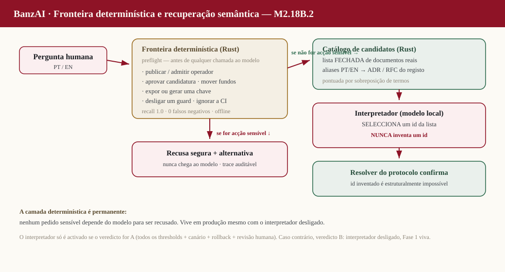

# BanzAI — Intent-First Grounded Reasoning Architecture (M2.18)

> ⚠️ **SUPERSEDED (M2.18B.6 · [ADR-055](../../decisions/adr/ADR-055-banzai-rust-first-grounded-synthesis.md)).**
> This document is a **historical design record** of the M2.18 intent-first exploration, including the
> Phase-2 **two-pass** design (a Qwen input-interpretation pass emitting an `IntentEnvelope`, then a
> synthesis pass). That two-pass / model-entry architecture was **retired**. The current architecture is
> **Rust-First Grounded Synthesis**: Rust understands, routes and grounds the question deterministically;
> the Qwen model explains **exactly once** from a closed `FactualPackage`; the Rust factual validator gates
> the answer before publishing. The canonical source of truth is **ADR-055** and
> [docs/reports/M2_18B6_RUST_FIRST_GROUNDED_SYNTHESIS.md](../reports/M2_18B6_RUST_FIRST_GROUNDED_SYNTHESIS.md).
> The `IntentEnvelope`, the input Qwen pass, and the `BANZAI_INTENT_INTERPRETER` / `BANZAI_UNIFIED_TWO_PASS`
> flags referenced below no longer exist in the active codebase. Retained unedited as a design record.

**Status:** Historical design record (superseded by ADR-055) · Phase 1 in delivery · Phases 2–3 designed, gated, not yet activated
**Milestone:** M2.18 — one continuous milestone delivered through independently testable,
independently deployable, gated phases.
**Scope:** the BanzAI answer pipeline (`engines/banzai-api-kb` Rust/WASM classifier +
`services/banzai-api` JS orchestrator + `website` answer UI). No protocol contract, no financial
invariant, no operator-facing certification claim is changed by this milestone.

> **Princípio.** O BanzAI **interpreta primeiro, resolve depois, recupera fontes canónicas, formula
> com o Qwen e valida antes de responder.**
>
> **Frase canónica.** *O Qwen compreende e explica; os resolvers encontram; os motores verificam; as
> fontes sustentam.*

This document is the canonical architecture + staging + risk review for M2.18. It is authored **before**
any Phase-1 code so that every permanent contract is designed once, versioned, and never discarded in a
later phase. The input-Qwen interpretation, output-Qwen grounded synthesis, conversational state and the
evaluation harness are **designed and versioned here** and **activated in later gated phases** — their
interfaces and integration points are fixed now.

---

## 0. The incident this milestone answers (PART 0 — reproduced live)

Two defects, both reproduced against the live agent before any change:

| # | Query | Observed | Root cause |
|---|-------|----------|------------|
| A | `ADR 002` (bare) | `intent=critical_boundary`, `resolved_document=None` → generic *"Uma ADR é um Architecture Decision Record…"* | `route()` reaches `critical_entry()` (glossary `def-adr` path) **before any document resolution**; the `002` is discarded because a 2-token `adr …` query matches the definition gate. |
| B | `me fala sobre a ADR 002` | resolves `ADR-002` correctly, **but sources include `CLAUDE.md`** + `ADR-INDEX` + `ADR` | the repo index (`repoindex/banzai-repo-index.json`) indexes **internal files** (CLAUDE.md, CI YAMLs, reports) and retrieval can surface them into public answers; there is **no public-source policy at presentation**. |
| C | any answer card | the answer-card avatar reads as a **warning triangle (⚠)**, not the BanzAI symbol | UI glyph choice in the answer card. |

M2.18 fixes A/B/C **architecturally** — never as a hardcoded ADR-002 answer (ADR-002 is only ever used
as an acceptance fixture, never special-cased in code).

---

## 1. Target architecture (the full intent-first pipeline)

```
                 ┌──────────────────────────── deterministic Rust spine ────────────────────────────┐
  Pergunta ─►  INTERPRET ─►  RESOLVE ─►  RETRIEVE ─►  RERANK ─►  PACKAGE ─►  SYNTHESIZE ─►  VALIDATE ─► Resposta
              (intenção     (entidade   (fontes      (prioridade (pacote     (Qwen           (motores    + fontes
               estruturada)  exacta)     orientadas   exacta,     factual)    formula)        verificam)  + trace)
                                         pela          fontes
                                         intenção)     públicas)
                 └── Qwen (Fase 2) ──┘                              └── Qwen (Fase 2/3) ──┘
```

Two rules are permanent and guard-enforced:

- **R1 — Intent before retrieval.** No documentary retrieval may start on the raw question. Retrieval is
  always driven by a **structured intent** (`IntentEnvelope`). (Guard: resolver/interpret runs before the
  glossary/critical tiers in `route()`.)
- **R2 — No protocol claim on Qwen alone.** Every protocol/document claim is grounded in a resolved
  canonical source; Qwen only *formulates* over a factual package it did not choose. (Guard: validator
  rejects any answer whose asserted entity/source is not present in the factual package.)

Qwen appears **twice** in the final architecture — INTERPRET (input) and SYNTHESIZE (output) — with a
**deterministic Rust middle** (RESOLVE → RETRIEVE → RERANK → PACKAGE) and a **deterministic Rust
VALIDATE** at the end. The middle and the validator never call a model.

---

## 2. Permanent versioned contracts

All contracts are Rust types in `engines/banzai-api-kb` (compiled to WASM), serialised as JSON across the
Rust→JS boundary, and **versioned** with an explicit `schema_version`. A contract may gain optional fields
in later phases; existing fields never change meaning. These are the interfaces the Phase-2/3 model passes
must produce/consume.

### 2.1 `IntentEnvelope` v1 — the structured intent (output of INTERPRET)

```jsonc
{
  "schema_version": 1,
  "original": "me fala sobre a ADR 002",
  "normalized": "me fala sobre a adr 002",
  "language": "pt",                 // pt | en | unknown
  "primary_intent": "explain_document",
  // enum: explain_document | define_term | list_documents | compare_documents |
  //       protocol_fact | boundary_refusal | safety_refusal | tool_action |
  //       operator_journey | clarify | unknown
  "entities": [
    { "kind": "document", "family": "ADR", "raw": "adr 002",
      "normalized_id": "ADR-002", "confidence": 0.99 }
    // kind: document | term | operator | endpoint | schema | engine | unknown
  ],
  "operation": "explain",           // explain | summary | decision | consequences | implementation | define | list | compare | none
  "scope": "protocol",              // protocol | governance | operator | development | unknown
  "depth": "normal",                // brief | normal | deep
  "needs_exact_source": true,       // a specific canonical document is required
  "needs_engine": false,            // a verification engine must run
  "candidates": [],                 // ranked alternates when ambiguous
  "confidence": 0.95,
  "ambiguity": "none",              // none | multiple_documents | vague_reference | mixed_intent
  "needs_clarification": false,
  "boundaries": [],                 // e.g. ["financial_action","safety"] — refusal reasons if any
  "interpretation_source": "deterministic",  // deterministic | qwen | hybrid  (Phase 1 = deterministic)
  "trace_id": "…"
}
```

Phase 1 populates this **deterministically** (`interpret_deterministic`). Phase 2 adds a Qwen interpreter
that produces the *same* envelope for informal/ambiguous input; the deterministic path stays the fast-path
for exact IDs and boundaries. Nothing downstream changes when the interpreter changes —
`interpretation_source` records which produced it.

### 2.2 `SourceClass` + public-source policy

```jsonc
{ "id": "ADR-002", "path": "decisions/adr/ADR-002-….md",
  "category": "adr",            // adr | rfc | spec | reference-chapter | glossary | contract |
                                // conformance | schema | endpoint | readme | internal
  "visibility": "public",       // public | internal
  "is_canonical": true }
```

**Policy (permanent):** a source is **internal** — never shown in a public answer, never cited — when it
is any of: `CLAUDE.md` / `CLAUDE_BASE.md`, anything under `.github/`, `tools/`, `engines/*/src`,
`docs/reports/`, `docs/governance/rust-first-legacy-allowlist.json`, memory files, prompt files, or any
index entry whose `source_category` marks it guard/CI/report/internal, or any path containing the
`operador-zero` internals that M2.14B keeps out of public sources. Public categories: ADRs, RFCs, specs,
reference chapters, glossary, contracts, conformance vectors, schemas, endpoints, public READMEs. The
policy is applied **twice**: at RETRIEVE (internal sources are never candidates) and at PACKAGE/present (a
belt-and-braces filter before anything reaches the answer or the `sources[]`).

### 2.3 `FactualPackage` v1 — the grounded package handed to SYNTHESIZE

```jsonc
{
  "schema_version": 1,
  "intent": { /* IntentEnvelope */ },
  "primary": { "source": { /* SourceClass */ },
               "title": "ADR-002 — …", "status": "accepted",
               "excerpt": "…canonical text used to formulate…" },
  "supporting": [ { "source": {…}, "excerpt": "…" } ],   // ranked, public only
  "facts": [ { "claim": "…", "source_id": "ADR-002" } ], // atomic, each source-attributed
  "boundaries": [],                                       // refusals to honour in the answer
  "answer_format": "adr",   // adr | rfc | definition | list | prose | refusal
  "sources_public": ["ADR-002", "ADR-INDEX"],            // exactly what may be cited
  "trace_id": "…"
}
```

This is what the output-Qwen (Phase 2/3) formulates over — it never sees the raw index and never chooses
sources. Phase 1 builds the package deterministically for the document/definition paths.

### 2.4 `ValidationResult` — the deterministic gate after SYNTHESIZE

```jsonc
{
  "ok": true,
  "checks": [
    { "name": "entity_grounded",  "pass": true },   // asserted entity ∈ package
    { "name": "sources_public",   "pass": true },   // no internal source cited
    { "name": "no_unbacked_claim", "pass": true },  // no protocol claim without a source
    { "name": "boundary_honoured", "pass": true },  // refusals not overridden
    { "name": "format_matches",    "pass": true }
  ],
  "action": "accept"   // accept | strip_sources | downgrade_to_grounded | refuse
}
```

Fail-closed: an ungrounded/leaky answer is **downgraded** (sources stripped / replaced by the deterministic
grounded answer), never shipped as-is. Phase 1 runs the source + entity + boundary checks over the
deterministic answer; Phase 2/3 runs them over the Qwen answer.

### 2.5 `ReasoningTrace` v1 — the per-answer trace

```jsonc
{
  "schema_version": 1, "trace_id": "…",
  "stages": [
    { "stage": "interpret", "source": "deterministic", "ms": 1,  "out": { "primary_intent": "explain_document", "entities": ["ADR-002"] } },
    { "stage": "resolve",   "ms": 0,  "out": { "resolved": "ADR-002", "candidates": [] } },
    { "stage": "retrieve",  "ms": 3,  "out": { "public": 2, "dropped_internal": 3 } },
    { "stage": "rerank",    "ms": 0,  "out": { "top": "ADR-002", "reason": "exact_entity" } },
    { "stage": "package",   "ms": 1,  "out": { "format": "adr", "sources": ["ADR-002","ADR-INDEX"] } },
    { "stage": "synthesize","source": "qwen|deterministic", "ms": 40500, "out": { "chars": 812 } },
    { "stage": "validate",  "ms": 0,  "out": { "action": "accept" } }
  ],
  "external_model_called": false
}
```

Non-PII, non-secret, structured; attachable to a response for observability and eval.

### 2.6 `ConversationState` v1 — designed now, activated in Phase 2

```jsonc
{ "schema_version": 1, "turns": [ { "intent": {…}, "resolved_ids": ["ADR-002"] } ],
  "last_document": "ADR-002", "last_intent": "explain_document" }
```

Lets a follow-up ("e as consequências?") inherit the previous `IntentEnvelope`. Phase 1 leaves the existing
history handling untouched; the type is fixed so Phase 2 wiring is additive.

---

## 3. The orchestration state machine (Rust)

A single Rust entry, `orchestrate(question, context) -> Orchestration`, sequences the stages, produces the
`ReasoningTrace`, and returns the `FactualPackage` (+ the deterministic answer for the fast paths).
Stage boundaries are the permanent seams:

| Stage | Phase 1 | Phase 2 | Phase 3 |
|-------|---------|---------|---------|
| INTERPRET | deterministic (`interpret_deterministic`) | + Qwen interpreter fallback (informal/ambiguous) | eval-tuned |
| RESOLVE | full (exact-entity resolver) | — | — |
| RETRIEVE | full (intent-oriented, public-only) | — | — |
| RERANK | full (exact-entity priority) | — | — |
| PACKAGE | full (deterministic package) | — | — |
| SYNTHESIZE | existing document-mode Qwen over the package | grounded output-Qwen from the package | eval-tuned |
| VALIDATE | full (source/entity/boundary/format) | + claim-level grounding on Qwen output | eval-tuned |

The orchestration output is consumed by `services/banzai-api/src/pipeline.js`. The JS layer's job shrinks
to: call `orchestrate`, honour its source policy, call the model where the state machine says to, and pass
the validator verdict through.

---

## 4. Phase plan (acceptance / latency / tests / eval / rollback / dependency)

### Phase 1 — Deterministic spine + permanent contracts (this session)

**Delivers, production-safe and activated:** all §2 contracts as Rust types; the §3 state machine
(deterministic INTERPRET, full RESOLVE/RETRIEVE/RERANK/PACKAGE, existing-model SYNTHESIZE, full VALIDATE);
the exact-entity resolver (fixes defect A); the public-source policy (fixes defect B); exact-source
priority reranking; the validator; structured traces; the BanzAI answer-symbol correction (fixes defect C);
the public documentation section + the architecture SVG; the guard; Rust + JS tests; PR → CI → merge →
deploy → live QA.

- **Acceptance:** bare `ADR 002` / `adr2` / `ADR-002` / `RFC 14` → the exact document with
  `primary_intent=explain_document`; `me fala sobre a ADR 002` → ADR-002 with **no `CLAUDE.md`** (no
  internal file) in `sources[]`; a bare unknown id → `clarify`/candidates, never a wrong document; the
  answer card shows the BanzAI symbol; `/operators=[]`, `production_certificates=false` unchanged.
- **Latency budget:** **no regression** — the deterministic spine adds < 5 ms; SYNTHESIZE is the existing
  local Qwen document mode (~40 s), unchanged.
- **Tests:** Rust unit (resolver, source-policy, rerank, validator, interpret_deterministic) + JS
  (pipeline source-policy, orchestration wiring) + the M2.18 golden **seed** set (ADR/RFC identifier
  matrix). Full battery (tsc, vitest, next build, all guards, identity/purity/rust/private-key).
- **Eval threshold (Phase 1 gate):** the seed golden set passes 100 %; **0** internal-file leaks across
  the seed set; **0** boundary regressions.
- **Rollback:** redeploy the pre-M2.18 website + banzai-api images; branch rollback ref `89b9e8d`.
- **Dependency:** none (baseline).

### Phase 2 — Two-pass Qwen (interpretation + grounded synthesis) + conversational state (gated, later)

**Activates** the Qwen INTERPRET fallback (informal/ambiguous language → `IntentEnvelope`, deterministic
fast-path preserved), the grounded output-Qwen SYNTHESIZE from the `FactualPackage`, claim-level validator
grounding, the clarification flow, and `ConversationState`.

- **Acceptance:** informal/typo/ambiguous queries produce the correct `IntentEnvelope`; ambiguous refs ask
  a clarifying question; no protocol claim survives validation without a package source; follow-ups inherit
  context.
- **Latency budget:** INTERPRET adds one input-Qwen call **only** when the deterministic interpreter is
  low-confidence; a hard ceiling + fallback to deterministic on timeout so p95 stays bounded. Measured live
  and reported before the phase is declared done.
- **Tests + eval:** the full golden suite (every public ADR/RFC/chapter/endpoint/schema) + interpretation
  accuracy, grounding, source-purity and boundary metrics **above documented thresholds**.
- **Rollback:** feature-flag the Qwen passes off → the Phase-1 deterministic spine still answers.
- **Dependency:** Phase 1 merged + live.

### Phase 3 — Evaluation harness + human evaluation + final verdict (gated, later)

**Activates** the evaluation harness (matrix + metrics + thresholds) and the human-evaluation loop
required by the M2.18 completion criteria.

- **Acceptance / eval:** automated thresholds met **and** human evaluation above threshold across the
  documented matrix; only then may M2.18 (whole) be declared complete.
- **Rollback:** N/A (measurement).
- **Dependency:** Phase 2 merged + live.

**M2.18 is complete only after Phase 3.** Each phase is reported as its own subphase completion.

---

## 5. Risk review (documented, pre-implementation)

| Risk | Severity | Mitigation |
|------|----------|------------|
| route.rs surgery breaks the 105 existing Rust tests / other intents | High | Resolver runs **before** `critical_entry` but only fires on a confident exact-entity match; everything else falls through unchanged. Full Rust suite is a Phase-1 gate. |
| Over-broad exact-entity match hijacks legitimate glossary/definition queries ("o que é uma ADR") | High | The resolver requires a **family + a numeric/explicit id** (`ADR 002`, not bare `ADR`); a family with no id still flows to the glossary/definition path. Guard + tests cover both sides. |
| Source-policy false-positive hides a legitimate public source | Med | Allowlist of public categories + denylist of internal paths; unit tests assert both directions; belt-and-braces filter is idempotent. |
| Qwen (Phase 2) latency doubling | Med | Deterministic fast-path for exact IDs/boundaries; input-Qwen only on low confidence; hard ceiling + deterministic fallback; measured before Phase 2 is declared done. |
| Contamination gate flags a literal operator brand in new files | Med | Build brand at runtime by concatenation in guards + tests; run a **fresh** `banza-repo-guards` binary before trusting local `identity-check`. |
| Declaring the whole milestone done after Phase 1 | High (process) | This document + the verdict template forbid it; each phase reports only its own subphase. |

**Architecture review outcome:** the deterministic spine is a strict superset of today's routing (adds a
resolver + policy + validator + trace around the existing tiers), carries no latency cost, is fully
testable without the model, and establishes every contract the Qwen phases consume. It is safe to
implement now. Phases 2–3 are additive behind their documented gates. **Approved to implement Phase 1.**

---

## 6. Files (Phase 1)

- Rust (`engines/banzai-api-kb/src/`): `intent.rs` (new), `source_policy.rs` (new), `factpack.rs` (new),
  `rerank.rs` (new), `orchestrate.rs` (new), `trace.rs` (new); `route.rs` (resolver-first ordering),
  `docref.rs` (exact-entity resolution + candidates), `validate.rs` (validation contract), `lib.rs`
  (WASM exports).
- JS (`services/banzai-api/src/`): `pipeline.js` (consume orchestration + source policy), `knowledge.js`
  (public-source filter), `answerContract.js` (drop internal sources).
- Repo index: `engines/banzai-api-kb/src/repoindex/banzai-repo-index.json` visibility tags (no internal
  file reaches a public answer).
- Website: `components/banzai/BanzaiAgent.tsx` + `components/home/HomeAsk.tsx` (BanzAI answer symbol).
- Docs: this file; a public Reference section; `docs/diagrams/banzai-intent-first-grounded-reasoning.svg`.
- Guard/tests: `tools/check-banzai-intent-first-grounded-reasoning.sh` (new), `Makefile`,
  `.github/workflows/identity-guard.yml`; Rust `#[test]`s; `website/lib/*.test.ts` + JS tests.
- Report: `docs/reports/M2_18_PHASE1_BANZAI_INTENT_FIRST_GROUNDED_REASONING.md`.

---

## 7. Boundaries preserved (unchanged by M2.18)

- No operator is certified/approved/published; `/operators=[]`, `production_certificates=false`.
- Operador Zero remains the only demo/example, never presented as real/production.
- Financial-action, safety and boundary refusals are honoured **before** any resolution/synthesis and are
  re-checked by the validator.
- No protocol contract, financial invariant, or certification criterion is modified.

---

## 8. M2.18B — Interpretação semântica de entrada (input Qwen) — IMPLEMENTED, flag-gated

Princípio: **O Qwen compreende a pergunta; o Rust confirma o que ela significa para o protocolo.**
Regra operacional: **nenhuma recuperação documental ampla começa antes de existir uma intenção
estruturada válida.** M2.18B activa o Qwen de INTERPRETAÇÃO à ENTRADA (a interpretação; a síntese
fundamentada de saída é a M2.18C). Entregue atrás do flag `BANZAI_INTENT_INTERPRETER` (default `0` =
OFF → comportamento da Fase 1 inalterado); activado após avaliação acima dos thresholds.

**Porquê o Qwen antes da recuperação.** A recuperação por palavras-chave não liga uma paráfrase
("explica a decisão sobre nomes") ao documento certo (ADR-002). O interpretador converte a linguagem
humana numa `IntentEnvelope` estruturada; só então o resolver Rust procura. O interpretador **não
responde** ao utilizador — apenas interpreta.

**Interpretação ≠ resposta.** O Qwen de entrada emite apenas JSON (uma `IntentEnvelope`); nunca texto
para o utilizador, nunca lê documentos. A resposta continua a ser produzida pelo caminho fundamentado.

**Fast-path (sem Qwen).** Identificadores exactos (`ADR-002`, `RFC 14`), fronteiras (acção/segurança,
determinísticas e soberanas) e artefactos inequívocos resolvem-se sem o interpretador — latência da
Fase 1, `intent_interpreter_called=false`.

**Contrato.** `IntentEnvelope v1` (Rust `engines/banzai-query-core/src/intent.rs`), validado
deterministicamente (enums, intervalos, coerência, `deny_unknown_fields`). O Qwen **propõe**
`proposed_canonical_id`; o **resolver Rust (docref) confirma** ADR/RFC exactamente — um id inventado
nunca é aceite (→ esclarecimento).

**Ambiguidade.** Baixa confiança ou múltiplos candidatos → `requires_clarification` → pergunta de
esclarecimento **determinística** a partir dos candidatos reais. Nunca escolha silenciosa.

**Follow-up.** Suporte mínimo e seguro (entidade/intenção imediatamente anterior); memória
conversacional longa é a M2.18D. Sem contexto suficiente → esclarecimento (nunca inventar o referente).

**Fallback (PART 16).** Falha do interpretador (timeout / JSON inválido / indisponível) → **nunca**
recuperação ampla sobre a pergunta bruta: tenta resolução determinística; se incerto, pede
esclarecimento. Uma única reparação controlada, sem ciclos.

**Latência (PART 15).** Prompt compacto, temperatura 0, limite curto de tokens, timeout próprio
(`BANZAI_INTERPRETER_TIMEOUT_MS`, default 20s), sem carregar documentos na interpretação; fast-path sem
regressão.

**Segurança (PART 18).** Pergunta, instruções de sistema, contexto e artefacto colado ficam separados
(o interpretador trata `<PERGUNTA>`/`<CONTEXTO>` como dados); enums fixos em Rust; `deny_unknown_fields`
rejeita campos injectados; as fronteiras determinísticas decidem antes do Qwen.

**Traces (PART 17).** `fast_path_used`, `intent_interpreter_called`, `interpreter_status`,
`repair_attempted`, `interpreter_latency_ms`, `interpreter_model`, `intent`, `confidence`,
`routing_result`, `fallback_used` — sem prompt, instruções internas ou conteúdo não público.

**Limitações desta fase.** A síntese fundamentada final (M2.18C), o `FactualPackage` completo, o
validador factual final, o estado conversacional longo (M2.18D), a golden suite integral e o human eval
final permanecem por fazer. **M2.18 não está completa.** O interpretador só corre no modelo on-host
(VPS); a avaliação (`services/banzai-api/eval/m2-18b-intent-interpretation.dataset.json`) corre em vivo
após deploy e deve cumprir os thresholds antes da activação.

### 8.1 M2.18B.1 — Observabilidade, fiabilidade e activação de produção

Resolve os dois bloqueadores de activação da M2.18B e torna o interpretador **observável, mensurável,
fiável, activável e auto-reversível**. Detalhe completo em
[`docs/reports/M2_18B1_INTENT_OBSERVABILITY_RELIABILITY_ACTIVATION.md`](../reports/M2_18B1_INTENT_OBSERVABILITY_RELIABILITY_ACTIVATION.md).

**Observabilidade (bloqueador A).** Cada resposta de `/banzai/ask` inclui um `reasoning_trace` público,
versionado, presente em **todos** os caminhos (fast-path, interpretação, esclarecimento, fronteira,
fallback) — `services/banzai-api/src/reasoningTrace.js`, conjunto de chaves congelado em
`PUBLIC_TRACE_KEYS`. A confiança é **banda** (`confidence_band`), nunca o número exacto; `boundary_detected`
é verdadeiro tanto na espinha determinística como no interpretador. O modo diagnóstico é **só por
ambiente** (`BANZAI_INTENT_TRACE_MODE=diagnostic`), nunca por parâmetro de query. O harness de avaliação
lê este trace e falha se estiver ausente.

**Fiabilidade (bloqueador B).** Descodificação **restringida**: o Rust constrói o JSON Schema da
`IntentEnvelope` a partir dos **mesmos enums** que o validador (`intent_envelope_json_schema`, teste de
lock-step), e o transporte entrega-o ao modelo on-host como `response_format:{type:"json_schema"}` —
JSON malformado / fora-de-enum / com campos desconhecidos torna-se **estruturalmente impossível**. A
pergunta é normalizada antes do modelo (`normalizeForInterpret`); mantém-se a única reparação
controlada. O validador Rust continua a correr (coerência entre campos, que um schema não exprime).
Opt-out: `BANZAI_INTENT_STRUCTURED_OUTPUT=0`.

**Activação (`services/banzai-api/src/interpreterGate.js`).** `BANZAI_INTENT_INTERPRETER` (tudo),
`BANZAI_INTENT_INTERPRETER_CANARY_PERCENT` (canário determinístico por bucket FNV-1a da pergunta),
`BANZAI_INTENT_INTERPRETER_MODEL`/`_TIMEOUT_MS` (modelo/timeout do interpretador),
`BANZAI_INTENT_INTERPRETER_AUTO_ROLLBACK` (disjuntor em memória: acima do limiar de falhas numa janela,
desliga o interpretador para o processo — fail-safe, fica desligado até flip/restart — e cada pedido
segue a espinha determinística). É o gémeo em runtime do rollback por ambiente da M2.8x.

**Avaliação (PART 17).** 150 casos com severidade; thresholds estritos — JSON válido pré-reparação
≥0.97, pós ≥0.995, intent ≥0.95, entidade ≥0.97, esclarecimento ≥0.90, recall de fronteira 1.0,
fast-path 1.0, selecção silenciosa 0, ids inventados 0. **Os thresholds são o portão — nunca baixados
para declarar sucesso.** O harness corre em vivo (`eval/run-m2-18b-eval.mjs`).

**Regra de conclusão.** A M2.18B só é declarada *completa e activa* se **todos** os thresholds passarem
em vivo + canário + human eval. Caso contrário, o veredicto honesto permitido é *implementada mas não
activável com os modelos locais avaliados*, com o interpretador a permanecer OFF (Fase 1 é o
comportamento em produção). Nunca declarar sucesso com o interpretador desligado.

### 8.2 M2.18B.2 — Endurecimento da fronteira e recuperação semântica

A M2.18B.1 concluiu, honestamente, que o interpretador não era activável com `qwen3-4b` e que na via do
interpretador o recall de fronteira era 0.8125 — ou seja, **alguns pedidos sensíveis podiam chegar ao
modelo**. A M2.18B.2 resolve isto em duas frentes, numa só fase contínua e gated. Detalhe completo em
.

**Fronteira determinística (a camada de segurança permanente).** `engines/banzai-query-core/src/boundary.rs`
é um detector Rust de taxonomia — 23 categorias em cinco famílias sensíveis (**funds,
operator_publication, operator_approval, key, governance**) — corrido como **preflight antes de qualquer
chamada ao interpretador ou ao modelo** (em `route.rs`, depois dos detectores de segurança existentes,
antes do encaminhamento de ferramentas). `bnorm` normaliza (minúsculas, sem acentos) **preservando os
separadores** (`: ; ,`), a forma imperativa distingue uma *instrução* de uma *pergunta*,
`has_hidden_imperative` varre a cauda depois de um separador e as referências a documentos são tratadas
— nunca um bypass. **Nenhum pedido sensível depende do modelo para ser recusado.** Esta camada é provada
*offline* (sem modelo, sem rede) por `eval/run-m2-18b2-boundary-eval.mjs`, que o guard corre em CI:
**recall 1.0, 0 falsos negativos, 0 bypass por documento, 0 sobre-bloqueio informativo** em 110 casos de
fronteira (23 categorias) + 50 casos informativos quase-fronteira. Mesmo sob o veredicto B (interpretador
desligado), esta camada está viva em produção.

**Recuperação semântica (a espinha determinística do interpretador).**
`engines/banzai-query-core/src/catalogue.rs` (`generate_candidates`) transforma uma pergunta em linguagem
natural numa **lista fechada de documentos REAIS**, pontuada a partir de uma tabela curada de aliases
PT/EN sobre o registo docref. O `interpret.js` injecta essa lista no turno do interpretador com a
instrução de que o `proposed_canonical_id` tem de ser exactamente um dos ids reais listados — **"NUNCA
inventes um id"** — e o resolver Rust continua a confirmar o id escolhido. É o desenho de entidade em
dois passos: o modelo *selecciona*, o Rust *confirma*; um id inventado torna-se estruturalmente
impossível.

**Guard.** `make banzai-boundary-semantic-recovery-check` prova os invariantes na árvore **e corre a
avaliação de fronteira offline em CI** — o portão de segurança é aplicado, não apenas afirmado.



**Regra de conclusão (inalterada).** A M2.18B.2 termina apenas com um veredicto inequívoco: **Resultado
A** (interpretador activo em produção, todos os thresholds + canário + rollback + revisão humana
passados) ou **Resultado B** (segurança determinística e infraestrutura semântica completas, mas nenhum
modelo local permitido atingiu os thresholds → interpretador permanece desligado, a Fase 1 permanece
viva). Os thresholds nunca são baixados.

**Veredicto: Resultado B.** A fronteira determinística está 100 % viva em produção (recusa toda a acção
sensível antes de qualquer chamada ao modelo) e a infraestrutura de recuperação semântica está completa,
mas na avaliação em vivo o único modelo local permitido (`qwen3-4b`) não atingiu os thresholds — intent
0.933 (< 0.95) e, decisivamente, entidade 0.000 (< 0.97): o modelo devolve `proposed_canonical_id: null`
mesmo com uma lista fechada de candidatos reais. O interpretador **permanece desligado** em produção; a
Fase 1 é o comportamento vivo. Detalhe em
 §12.

### 8.3 M2.18B.3 — Arquitectura unificada de dois passos (um modelo, dois passos)

A M2.18B.1 e a M2.18B.2 provaram a *entrada* (interpretar → validar → confirmar) e a *fronteira
determinística*, mas concluíram com o Resultado B: o `qwen3-4b` não atingia os thresholds de entrada.
A M2.18B.3 entrega a **arquitectura definitiva do BanzAI** — **um único modelo local usado em dois
passos**, com o Rust a ser o dono de todas as decisões que importam:

```
pergunta humana
  → preflight de fronteira (Rust, boundary.rs)               ← recusa acção sensível ANTES de qualquer modelo
  → geração de candidatos (Rust, catalogue.rs)               ← lista fechada de documentos REAIS
  → PASSO DE ENTRADA (o mesmo modelo)                        ← IntentEntry com decodificação restringida a candidatos
  → validação de coerência (Rust, intent.rs)                 ← rejeita id inventado / enum inválido
  → selecção de entidade só-candidatos (Rust, catalogue.rs)  ← confirma / preenche o candidato dominante / pede esclarecimento
  → recuperação canónica + reranking → FactualPackage (Rust, factpack.rs)   ← evidência ordenada e versionada
  → PASSO DE SAÍDA (o MESMO modelo)                          ← síntese fundamentada + mapa afirmação→facto
  → validação factual (Rust, factcheck.rs)                   ← afirmações sem suporte 0, citações ⊆ permitidas, sem falsa identidade de doc
  → resposta pública
```

**Os motores permanentes (Rust, com exports WASM).** Cada peça é pura, total, testada e coberta pelo
guard `make banzai-unified-two-pass-architecture-check`:

- **Esquema de entrada restringido a candidatos** (`intent.rs::intent_entry_schema`) — o
  `proposed_canonical_id` é um *enum* de gramática dos ids de candidatos REAIS gerados pelo Rust para
  *aquele* pedido (mais `""`). Um id inventado torna-se **estruturalmente impossível** e o JSON fecha
  sempre — mata os dois modos de falha do de-risk (o `qwen3-4b` a devolver `null`; o texto livre verboso
  a estourar o limite de tokens). `validate_intent_entry` reforça a pertença ao enum e a selecção
  só-candidatos (defesa em profundidade).
- **Selecção de entidade só-candidatos + coerência** (`catalogue.rs::select_entity`) — confirma a escolha
  do modelo, **descarta um id inventado**, **preenche** o candidato dominante que o modelo deixou vazio
  numa pergunta dirigida a documento (o exacto buraco que a avaliação offline mostrou: *"explica a decisão
  da política rust-first"* → ADR-037), e **pede esclarecimento** quando vários candidatos fortes
  competem. Nunca inventa, nunca fixa uma pergunta no código.
- **FactualPackage versionado** (`factpack.rs`) — a evidência canónica ordenada que o passo de saída pode
  sintetizar, e **mais nada**: factos com id estável (`F1`…), texto canónico recortado e uma âncora de
  fonte exacta (document_id/kind/título/secção/âncora/path), mais `allowed_source_ids` (o conjunto
  **fechado** de documentos citáveis) e um `content_hash` determinístico para invalidação de cache.
- **Contrato de síntese de saída + mapa afirmação→facto** (`synth.rs`) — o passo de saída corre sob o
  *mesmo* mecanismo de restrição de candidatos: `claims[].fact_ids` é um enum dos ids de factos reais do
  pacote e `cited_source_ids` um enum de `allowed_source_ids` — uma referência a facto inventada ou uma
  citação fora do conjunto é estruturalmente impossível. `insufficient_evidence` obriga a declinar em vez
  de inventar.
- **Validador factual** (`factcheck.rs`) — o último portão determinístico: afirmações sem suporte,
  citações fora do conjunto, identidade de documento errada na prosa, fuga de fonte interna e coerência
  de evidência insuficiente. `ok:false` ⇒ a resposta **não** é publicada (recai na espinha da Fase 1).

**Runtime unificado + activação.** `services/banzai-api/src/twopass.js` orquestra o fluxo ponta a ponta
com **um único artefacto de modelo** para os dois passos; qualquer falha devolve `status:"fallback"` e a
resposta nunca é publicada por validar. `twoPassGate.js` é o gémeo de runtime do `interpreterGate`:
`BANZAI_UNIFIED_TWO_PASS` (+ canário + auto-rollback), **por omissão DESLIGADO**, expondo **uma só**
substituição de modelo enfiada nos dois passos. O `pipeline.js` serve a resposta fundamentada **apenas**
quando o validador factual passa; as duas chamadas ao modelo passam pela **mesma fila** de inferência do
Tier 5 (fila/timeout/cancelamento herdados).

**Benchmark e selecção (thresholds inalterados).** A M2.18B.3 avalia **ambos** o Qwen2.5-7B e o
Qwen2.5-14B na *pipeline completa de dois passos*, com o **mesmo artefacto de modelo para os dois passos**
de cada candidato e a **mesma metodologia** (`eval/twopass-benchmark.mjs`, sobre a via de produção real
`runTwoPass`, contra um contentor llama isolado — produção intocada). Selecciona-se o 7B **apenas** se
limpar *todos* os thresholds de entrada, saída, segurança, factualidade, latência e operação com margem
de produção; caso contrário o 14B. Os thresholds **nunca** são baixados: entrada JSON pré-reparação
≥ 0.97, intent ≥ 0.95, entidade ≥ 0.97, recall de fronteira 1.0, sensível-ao-modelo 0, id-inventado 0;
saída afirmações-sem-suporte 0 (crítico), fontes-internas 0, citações-fictícias 0, identidade-de-doc-
errada 0, suporte-de-afirmação ≥ 0.98, factual ≥ 0.97; operação OOM 0, reinícios-de-modelo 0.

**Veredicto: portão automático NÃO PASSADO — STOP na avaliação humana (PART 34).** O benchmark completo dos
dois modelos correu numa VM isolada (produção intocada, 6/6 saudáveis, *flags* DESLIGADAS). Sobre os 79 casos
`interpreter_called` (que já excluem os casos de fast-path — a via real do dois-passos):

| Eixo | Threshold | Qwen2.5-14B | Qwen2.5-7B |
|---|---|---|---|
| entry JSON pré-reparação | ≥ 0.97 | 1.000 ✅ | 1.000 ✅ |
| intent | ≥ 0.95 | 0.911 ❌ | 0.867 ❌ |
| entidade | ≥ 0.97 | 0.842 ❌ | 0.842 ❌ |
| taxa de resposta fundamentada servida | ≥ 0.97 | 0.804 ❌ | 0.981 ✅ |
| afirmações sem suporte / citações ilegais / doc errado / fuga interna **servidas** | 0 | 0/0/0/0 ✅ | 0/0/0/0 ✅ |
| latência e2e p50 / p90 | margem de produção | 48s / 95s | 25.7s / 44.3s |

**Segurança 100 % intacta em ambos: zero respostas más servidas** — o validador factual Rust apanhou e
rejeitou todas as saídas problemáticas, recaindo na Fase 1. Na primeira corrida **nenhum modelo limpava
intent ≥ 0.95 nem entidade ≥ 0.97**; o **7B era a melhor base** (≈ 2× mais rápido, maior taxa de serviço).

**M2.18B.3-R1 — remediação determinística do 7B: TODOS os portões automáticos PASSAM (corrida em HEAD).**
As falhas eram estreitas e foram corrigidas de forma **determinística e genérica** (sem fixar perguntas, sem
mudar de modelo, sem baixar thresholds): (1) referências ordinais ("a segunda ADR") resolvidas pelo registo
(`docref::detect_refs`); (2) referências explícitas (numeradas/ordinais) injectadas como candidatos líderes
e resolvidas com autoridade (`catalogue`); (3) uma camada de **refinamento de intent** por vocabulário
canónico (`intent::refine_intent`) que corrige governance/status/compare/locate — **nunca** re-etiqueta uma
pergunta sinalizada pela fronteira nem com um radical de acção sensível (revisão adversarial). Re-benchmark
completo do 7B, metodologia idêntica (mesmo dataset, artefacto, quantização Q4_K_M, `-c 4096 -t 4`, contentor
isolado, produção intocada):

| Eixo | Threshold | 7B (antes) | **7B após R1 (HEAD)** |
|---|---|---|---|
| entry JSON pré-reparação | ≥ 0.97 | 1.000 | **1.000** ✅ |
| intent | ≥ 0.95 | 0.867 | **1.000** ✅ |
| entidade | ≥ 0.97 | 0.842 | **1.000** ✅ |
| factual / cobertura de suporte (taxa servida) | ≥ 0.97 | 0.981 | **0.982** ✅ |
| afirmações-sem-suporte / doc-errado / citações-ilegais / fuga-interna / fronteira **servidas** | 0 | 0 | **0** ✅ |
| chamadas a modelo externo · OOM · reinícios | 0 | 0 | **0** ✅ |
| latência e2e p50 / p90 | margem de produção | 25.7 / 44.3s | **30.1 / 64.9s** |

Por categoria (HEAD) tudo perfeito — governance 3/3 (era 1/3), entidade paraphrase 15/15, mista 3/3, typo
1/1; 0 falhas de intent, 0 de entidade. Auditados os rótulos do dataset: todos consistentes com a taxonomia
publicada → **nenhum rótulo alterado**. Testes de regressão para cada classe de falha (Rust 101 + node 301).
**Modelo seleccionado: Qwen2.5-7B.** As *flags* permanecem DESLIGADAS — passar os portões automáticos é
necessário mas **não** suficiente: segue-se o portão de avaliação humana (PART 34) antes de qualquer canário.
Pacote de evidência completo em
[`docs/reports/M2_18B3_UNIFIED_TWO_PASS_BENCHMARK_VERDICT.md`](../reports/M2_18B3_UNIFIED_TWO_PASS_BENCHMARK_VERDICT.md) §0.

### 8.4 M2.18B.3A — Integridade do corpus + perfil de latência CPU aceite

Duas frentes, mantidas separadas. **(1) Integridade do corpus — concluída e protegida:** tabela-verdade
global 60/60 (54 ADR + 6 RFC), cada documento *descobrível* (chunks no doc-index), *resolúvel* (geração de
candidatos Rust) e *citável* (`allowed_source_ids` do FactualPackage pela via de fonte-exacta) — ADR-053 e
ADR-054 confirmados; guard `make banzai-canonical-corpus-integrity-check` (auto-teste: um id inexistente não
é citável; em CI). **(2) Latência — grande redução real, alvo original não atingido em CPU.**

Round B (perfis de profundidade compactos, `brief` por omissão) + Round C (`-t 10 -fa on` + cache de prompt)
medidos na via de dois passos real, no host de produção actual (82.165.165.97, 12 vCore), rede isolada,
produção intocada:

| Eixo | R1 (antes) | Round B+C | redução |
|---|---|---|---|
| e2e p50 | 30.1 s | **13.7 s** | −54 % |
| e2e p90 | 64.9 s | **19.1 s** | −71 % |

Qualidade mantida (intent 1.0, entidade 1.0, entry JSON 1.0, 0 citações ilegais / 0 doc-errado / 0 fuga
interna / **0 respostas erradas servidas**; factual_ok 0.941 — 1 afirmação sem suporte **apanhada e recusada**
pelo validador Rust, nunca servida).

**Distinção honesta de latência (a registar sem ambiguidade):**
- **Alvo original (aspiracional):** p50 < 8 s / p90 ≤ 10 s.
- **Limite medido em CPU:** piso arquitectural ≈ 9 s — dois passos sequenciais de um 7B a ~21 tok/s não
  descem abaixo disso, independentemente de mais compactação.
- **Perfil de produção ACEITE (CPU):** p50 ≈ 13–14 s / p90 ≈ 19–20 s para uma resposta breve fundamentada.
- **Decisão de infraestrutura (fechada):** o BanzAI permanece **apenas na VPS actual** — **sem GPU, sem
  serviços de inferência externos, sem hardware pago adicional, sem streaming de narrativa não validada**.
  O alvo dos 10 s foi formalmente **superado pela realidade medida em CPU** e não bloqueia produção.

Não se afirma que o alvo p50 < 8 s / p90 ≤ 10 s foi atingido. A arquitectura de dois passos é activada a 100 %
na VPS actual **apenas após a avaliação humana (PART 34) passar**; a Fase 1 permanece **exclusivamente** como
caminho de *rollback* de emergência automático, não como encaminhamento misto normal. Relatório completo:
[`docs/reports/M2_18B3A_CANONICAL_CORPUS_AND_LATENCY_OPTIMISATION.md`](../reports/M2_18B3A_CANONICAL_CORPUS_AND_LATENCY_OPTIMISATION.md).

### Nota pública (capítulo BanzAI)
> O BanzAI usa IA para **compreender** a pergunta, mas uma entidade só é aceite depois de ser
> **confirmada pelos resolvers do protocolo**. Pedidos ambíguos geram um pedido de esclarecimento em vez
> de uma escolha silenciosa; pedidos fora de âmbito ou de acção são recusados com segurança.
> Os pedidos de acção sensível (publicar/aprovar/certificar um operador, mover fundos, expor ou gerar
> segredos, desligar um guard) são recusados por uma **camada determinística** — nunca dependem do
> modelo de IA para serem travados.
