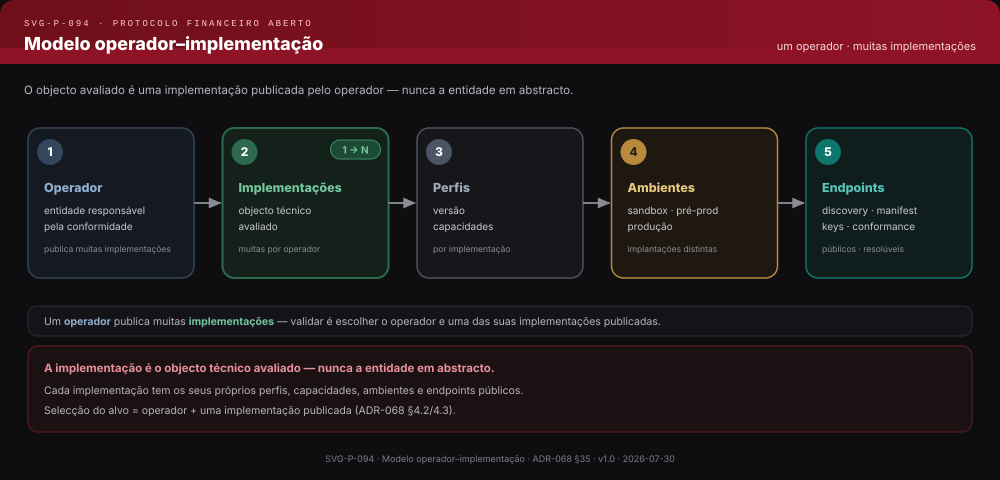
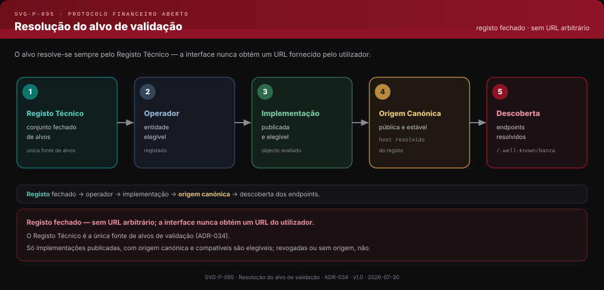
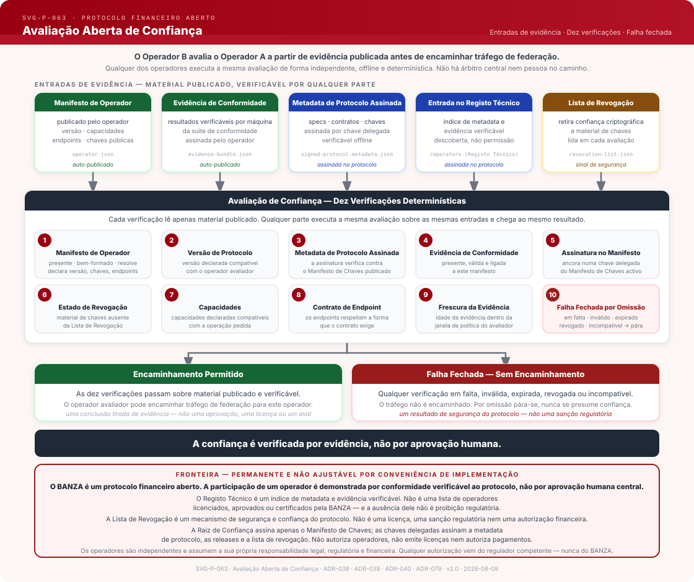
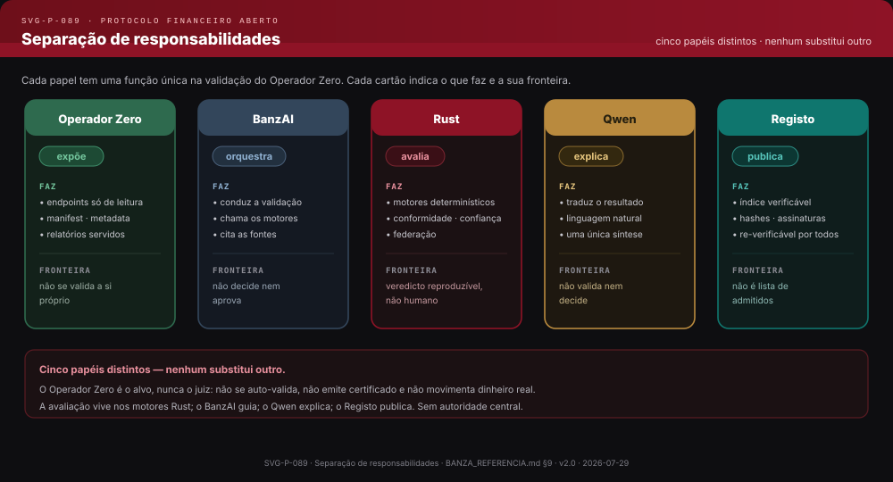
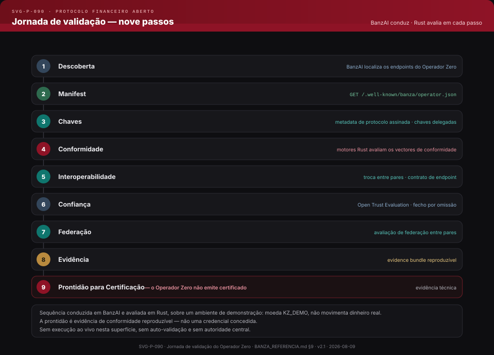

# BANZA — Protocol Reference

**Version:** 1.0 · **Status:** pre-production · real payments disabled · no certified implementations in production

> **Official English translation.** This file is the official English translation of the
> [canonical Portuguese Reference](../pt/BANZA_REFERENCIA.md). It is not independently canonical: in
> the event of an unintended divergence, the Portuguese edition prevails.
>
> **The Reference is descriptive, not normative.** It organises and explains the normative surface; it
> does not define it. Normative authority lies with the
> [Normative Manifest](../../../contracts/production/normative-manifest.json) and the artifacts it
> indexes — specifications, contracts and registries. Where this Reference and a normative artifact
> diverge, the normative artifact prevails.
>
> The public surfaces — website and BanzAI — consume or derive from this file. They do not edit it, and
> they do not keep a competing editorial copy. See [`docs/reference/README.md`](../README.md).

---

## Executive Summary

BANZA is an open financial interoperability protocol. It defines the rules — contracts, messages, profiles, invariants (rules that may never be violated) and verifiable conformance mechanisms — that independent implementations use in order to interoperate and produce verifiable evidence, without rebuilding bilateral technical integrations between every pair of participants and without central human approval at the protocol level. Real operation in production depends on legal, regulatory, banking, KYC/KYB and AML/CFT obligations, which belong to the operator and to the competent authorities.

**What it is not:** BANZA is not a bank, a PSP, a wallet, a scheme, a financial operator or a financial service provider. It is not a running service and not a single endpoint. It does not hold funds, does not maintain customer accounts, does not perform settlement and does not grant regulatory authorisation. It is the set of rules that makes interoperability possible — the ability of different systems to process payments between one another in a verifiable way.

**How it is structured:** the ecosystem has three layers — **Layer 1**, the open protocol (open, neutral and verifiable rules); **Layer 2**, Conformance and Interoperability Certification (per implementation, evidence-based, decided in Rust); and **Layer 3**, the independent operational schemes — the first of which is the Banzami Operational Scheme, with Banzami as the scheme's designated operator (in regulatory preparation, with real payments disabled). **BanzAI** is the primary human interface, transversal to the three layers — it is neither a fourth layer nor an authority. See [§4](#4-protocol-architecture).

**Who participates:** *operators* are independent legal entities that implement the protocol and process payments. BANZA is an open financial protocol. An implementation's protocol conformance is demonstrated by verifiable evidence, not by central human approval at the protocol level. An operator implements the protocol, publishes its manifest, exposes compatible endpoints and produces conformance evidence that any party may verify. At the protocol level there are no minimum volumes, no prior bilateral technical integrations required and no discretionary decisions. See [§8](#8-operators).

**How trust is established:** through signed protocol metadata, conformance evidence, a public registry with a verifiable index, a Trust Root, delegated signing keys, and revocation that fails closed. At the protocol level, no human entity decides the outcome of the trust evaluation: it is deterministic and executable by any party. See [§7](#7-conformance-and-certification) and [§6](#6-trust).

**Who governs:** BANZA governance, in its bootstrap phase, defines the process by which ADRs and RFCs are approved and maintains the protocol's neutrality. Governance evolves the protocol's rules — it does not admit, approve or authorise operators. The formal governance entity is defined by the institutionalisation process. The protocol evolves through a documented process — no operator decides unilaterally. See [§11](#11-governance).

**How it works at a high level:** once production federation is active, operators holding the applicable conformance profile and verifiable evidence will be able to exchange payments with one another through federation — with trust established by evaluation over signed metadata and verifiable evidence, without rebuilding bilateral technical integrations between every pair of operators; the capability to federate does not imply automatic operation. Conformance verification demonstrates that conformant implementations respect the same financial invariants. At present `/operators` returns an empty list; production federation depends on the federation production conditions. See [§10](#10-federation).

**Why it exists:** Angola has the components of a modern financial system and has operational interoperability between participants; what it does not yet have is an open layer that makes that interoperability public and reproducible by third parties. BANZA is that layer — open, verifiable, independent of any operator — and it complements the infrastructures already in use. The protocol outlives any individual operator, by design. See [§2](#2-why-banza-exists).

> **Recommended entry point for new readers:** [§15 — Frequently Asked Questions](#15-frequently-asked-questions) gives direct answers to the most common questions. To implement an operator: [§7 Conformance and Certification](#7-conformance-and-certification) → [§8 Operators](#8-operators) → [§13 Developer Resources](#13-developer-resources).

> **Public status v1.0:** this Reference describes the BANZA v1.0 protocol in pre-production. The Technical Registry returns an empty list. The Key Manifest and the BRL (BANZA Revocation List) have specified canonical locations, but production publication depends on the production conditions. Production federation depends on the federation production conditions. Technical conformance does not replace the applicable legal, regulatory, banking or KYC/KYB obligations. Operational status is documented in [§5 Protocol State](#5-protocol-state); protocol evolution in [§14](#14-protocol-evolution).

---

## Contents

1. [What BANZA Is](#1-what-banza-is)
2. [Why BANZA Exists](#2-why-banza-exists)
3. [Protocol Structural Properties](#3-protocol-structural-properties)
4. [Protocol Architecture](#4-protocol-architecture)
5. [Protocol State](#5-protocol-state)
6. [Trust](#6-trust)
7. [Conformance and Certification](#7-conformance-and-certification)
8. [Operators](#8-operators)
9. [Operator Zero](#9-operator-zero)
10. [Federation](#10-federation)
11. [Governance](#11-governance)
12. [BanzAI — Protocol Agent](#12-banzai-protocol-agent)
13. [Developer Resources](#13-developer-resources)
14. [Protocol Evolution](#14-protocol-evolution)
15. [Frequently Asked Questions](#15-frequently-asked-questions)

---

## Quick Navigation

### Conformance and Certification
- [Conformance profiles (L0–L4)](#conformance-profiles-l0l4) · §7
- [How an implementation is validated](#how-an-implementation-is-validated) · §7
- [Formal technical certification (Layer 2)](#formal-technical-certification-layer-2) · §7
- [What certification does not grant](#what-certification-does-not-grant) · §7
- [Revocation of trust material](#the-brl-banza-revocation-list) · §6

### Federation
- [Technical eligibility: the L3 profile](#technical-eligibility-the-l3-profile) · §10
- [How federation is evaluated](#how-federation-is-evaluated) · §10
- [What federation does not create](#what-federation-does-not-create) · §10

### Trust
- [What trusting means](#what-trusting-banza-means) · §6
- [The Key Manifest](#the-key-manifest) · §6
- [The BRL — Revocation List](#the-brl-banza-revocation-list) · §6
- [What trust does not prove](#what-trust-does-not-prove) · §6
- [Open Trust Evaluation](#open-trust-evaluation) · §8
- [Institutional trust architecture](https://github.com/banza-protocol/banza/blob/main/docs/governance/BANZA_TRUST_ARCHITECTURE.md) · dedicated document

### Governance
- [What governance governs](#what-governance-governs) · §11
- [What remains outside its authority](#what-remains-outside-its-authority) · §11
- [Who governs and how a change is decided](#who-governs-and-how-a-change-is-decided) · §11
- [Versioning and publication](#versioning-and-publication) · §11

### Developers
- [Normative sources and artifacts](#normative-sources-and-machine-readable-artifacts) · §13
- [Interfaces per profile](#interfaces-per-conformance-profile) · §13
- [Validation tooling](#validation-and-conformance-tooling) · §13
- [From implementation to validation](#from-implementation-to-validation) · §13
- [What is not a protocol requirement](#what-is-not-a-protocol-requirement) · §13

### Frequently Asked Questions
- [§15 — full FAQ](#15-frequently-asked-questions)

---

## 1. What BANZA Is

**BANZA is an open financial interoperability protocol: it defines public rules, contracts, messages, profiles and verifiable mechanisms that independent implementations may adopt in order to interoperate verifiably.** Two implementations that have never met interoperate because both respect the same public contracts and produce the same verifiable evidence.

BANZA is not a bank, a PSP, a wallet, a scheme, a financial operator or a financial service provider. It does not hold funds, does not maintain customer accounts, does not perform settlement and does not grant regulatory authorisation. It is the common layer of rules — contracts, messages, invariants, evidence and trust — that makes interoperability verifiable and reproducible, without each pair of participants having to rebuild the same technical integrations separately.

### A common, open and verifiable protocol

This section's title names four ideas — a protocol that is common, open, verifiable and about interoperability — which together define what kind of protocol BANZA is. Each is explained below, with its meaning, its reach and its boundary.

A **protocol** is a set of common rules that independent implementations follow in order to produce compatible behaviour and artifacts. In BANZA those rules cover contracts and formats, financial invariants, discovery and technical identity, trust mechanisms, evidence and conformance.

The purpose of a common protocol is to replace the repetition of the same technical decisions with public, versioned rules: each implementation adopts the same applicable contracts instead of redefining equivalent formats, semantics and validation criteria with every counterparty. This reduces bilateral technical integrations, but it does not remove the remaining relations between operators — connectivity, commercial agreements, participation in a scheme, settlement, support and regulatory obligations may still be necessary.

The protocol makes common only the technical part necessary for interoperability. Why that repetition exists, and what makes it avoidable, is the subject of [§2 Why BANZA Exists](#2-why-banza-exists).

**Open** means that the protocol's rules can be known and implemented without depending on private specifications negotiated between participants. The rules are public; the contracts are versioned; the evolution of the rules follows a documented governance process; and an independent party may study and implement the protocol.

Openness also permits scrutiny: the rules, the contracts and the evaluation mechanisms can be examined by third parties, and the reference implementation is made available as open source.

Open does not mean the absence of regulation, of operators, of conditions for participating in a scheme, or of institutional responsibility. A public protocol rule does not replace commercial, operational, legal or regulatory requirements — it only means that nobody needs private permission to read, implement or verify the rules.

**Verifiable** means that a technical claim about an implementation does not have to be accepted merely because whoever publishes it declares that it conforms.

The evaluation identifies the observed implementation, the protocol version, the profile, the environment, the artifacts consumed and the engine versions that produced the result; signatures, cryptographic digests (*hashes*), reason codes, evidence and receipts make it possible to relate those inputs to the result obtained. A third party can therefore inspect what was evaluated, under which rules, and with what outcome.

Given the same inputs, the same specification, the same profile and the same engine version, that third party can also re-run the evaluation and obtain a semantically equivalent result. Reproducibility is one of those guarantees, but it does not exhaust verifiability: verifying also implies knowing the provenance of the inputs, confirming their integrity and binding each result to the evidence that supports it.

This verifiability remains bounded. Demonstrating how a technical result was obtained does not turn BANZA into an authority, nor does it convert conformance into certification, admission to a scheme or regulatory authorisation.

The **interoperability** that BANZA makes common is, first of all, technical: independent implementations share contracts, formats, invariants, trust mechanisms, evidence and conformance profiles.

Operational interoperability is broader. The effective exchange of payments in production may still depend on connectivity, participation in a scheme, settlement, commercial agreements and the applicable regulatory authorisations; implementing the protocol does not remove those dependencies.

BANZA therefore does not seek to make operators alike. The products, interfaces, business models, risk policies and regulatory frameworks of implementations may remain different: the protocol standardises only what needs to be common and verifiable for interoperability.

### Protocol, operator and implementation

BANZA is the protocol — it is not an operator. These terms are not interchangeable, and the distinction runs through the whole Reference:

| Term | What it is |
|---|---|
| **Entity** | An independent legal person; legally and regulatorily answerable for its activity. |
| **Operator** | An entity that implements BANZA in order to process payments, under its own authorisations. |
| **Implementation** | The set of artifacts (the *build*) of an operator, identified by its *hash*; it is the subject of conformance and of technical certification. |

It is the **implementation**, and never the entity or the brand, that is subject to conformance and to technical certification. An operator may publish more than one implementation, and a technical result applies to a bounded implementation, not to the entity in the abstract. The full distinction — including certified implementation and scheme participant — is in [§8 Operators](#8-operators).

Three determinations remain distinct, with distinct owners, and none implies the others: **technical certification ≠ scheme admission ≠ regulatory authorisation** (ADR-005). Demonstrating conformance, obtaining technical certification for an implementation, being admitted to an operational scheme and obtaining regulatory authorisation are different steps — see [§7 Conformance and Certification](#7-conformance-and-certification).

### Properties

Four structural choices make BANZA this kind of protocol:

- **Separation of responsibilities.** The open protocol, conformance certification and the operational schemes are distinct layers, separated by responsibility, infrastructure and keys.
- **Evaluation of implementations, not of entities.** What is evaluated, tested and certified is a bounded implementation identified by its *hash* — never reputation, brand or entity.
- **Results bound to evidence.** Each technical result is bound to the observed inputs and is accompanied by verifiable, reproducible evidence: given the same canonical inputs and the same specification and profile version, independent executions produce equivalent verdicts.
- **Deterministic decision, subordinate explanation.** Decisions are deterministic and taken by engines written in Rust; a local language model may explain a result, but never decides it.

These properties are the protocol's identity; the structural properties that follow from them — neutrality, financial correctness, openness and separation of responsibilities — are developed in [§3 Protocol Structural Properties](#3-protocol-structural-properties). **Neutrality**, in particular, means that the protocol's rules grant no technical privilege to any implementation; it does not mean the absence of governance, of responsibility or of external policy.

### Fundamental Principles — BANZA R²S²

BANZA has **four** fundamental principles, and only four. Together they are called **BANZA R²S²** — *Robust · Resilient · Secure · Simple*.

| Principle | Meaning |
|---|---|
| **Robust** | deterministic and correct behaviour under independent implementation, adversarial input and boundary conditions |
| **Resilient** | contains failures, preserves safe operation where possible and recovers deterministically without weakening the protocol's guarantees |
| **Secure** | critical properties are enforced by construction and fail closed when they cannot be established |
| **Simple** | uses the smallest mechanism sufficient to provide the required property |

The order is canonical. The short form is **R²S²**; where the superscript is not technically suitable, write `R2S2`.

The principles are the **criterion by which decisions are taken** — not a description of what the protocol does. Every architectural decision answers four questions: does an independent implementer still obtain the same behaviour? what happens when this fails? can a failure, an attack or a fallback violate trust or an invariant? is there a smaller mechanism that provides the same property? A decision that does not survive all four is reconsidered.

**Resilience does not override security.** It preserves safe operation and deterministic recovery in the face of failures; it never permits trust, authorisation, integrity or any protocol invariant to be bypassed merely in order to stay available. Nor does resilience mean the absence of unavailability: it means that a failure is contained, explicit and recoverable, and that it does not turn into a violation of the protocol.

These principles are distinct from two other axes, and the distinction is deliberate: the **structural properties** ([§3](#3-protocol-structural-properties)) are what the protocol must possess, and the **invariants** ([§4](#4-protocol-architecture)) are constraints the architecture may not violate. Principles decide; properties characterise; invariants constrain.

### Scope and Boundaries

BANZA defines the rules (Layer 1); it does not execute financial activity. The boundary is explicit:

| BANZA defines (Layer 1) | BANZA never executes |
|---|---|
| Contracts, messages, schemas, profiles and versions | KYC/KYB, AML/CFT |
| Financial invariants and *reason codes* | Customer accounts and wallets |
| Technical identity, discovery and manifests | Holding or moving funds (*safeguarding*) |
| Keys, signed metadata, trust and revocation | Settlement and clearing of real funds |
| Conformance, interoperability and evidence | Admission to a scheme |
| Technical certification, technical registry and federation | Regulatory authorisation |

What BANZA defines is verifiable by any party; what it does not execute belongs to the operators and to the competent authorities and exists entirely outside the protocol. Each operator implements the protocol on its own infrastructure — the protocol does not reside on a central payment-execution server. The only common surfaces are those of discovery and trust anchoring — the Technical Registry, the signed trust metadata, the Revocation List and the Key Manifest — which neither move funds nor execute payments.

The ecosystem is organised into three layers, separated by responsibility, infrastructure and keys (ADR-004): **Layer 1**, the open protocol; **Layer 2**, Conformance and Interoperability Certification, per implementation and evidence-based; and **Layer 3**, the independent operational schemes — the first being the Banzami Operational Scheme, with **Banzami — Tecnologia e Serviços, Lda.** as the scheme's designated operator, in regulatory preparation and with real payments disabled. The detail is in [§4 Protocol Architecture](#4-protocol-architecture). **BanzAI** is the primary human interface, transversal to the three layers — it is neither a fourth layer nor an authority, and the protocol works without it: conformance and machine-to-machine verification remain possible independently of whether it is used ([§12](#12-banzai-protocol-agent)).

Dependency runs in a single permanent direction: operators depend on BANZA; BANZA and BanzAI never depend on any operator. This direction is an architectural invariant, not a design preference.

The v1.0 specification is published and the environment is pre-production: the Technical Registry returns an empty list, there are no production certifications and real payments are disabled. Published is not frozen — freezing is a deliberate decision about an exact candidate, and it has not been taken. This state is verifiable on the protocol's public routes and documented in [§5 Protocol State](#5-protocol-state).

---

## 2. Why BANZA Exists

Financial interoperability is not an unsolved problem: it happens every day. Independent operators exchange value and information through several models — direct integrations, networks and switches, schemes and shared infrastructures, common messaging standards. Those models work and may be appropriate to their context. BANZA's reason for existing is more specific, and this chapter delimits it.

### Financial interoperability already exists

Independent financial operators already interoperate. They may integrate directly with one another, participate in shared settlement and exchange infrastructures, or adopt common standards for messaging and operation. These mechanisms permit the exchange of value and information and continue to play an essential role — BANZA does not replace them.

The problem that motivates BANZA appears on another plane. The technical rules, the tests and the results needed in order to *demonstrate* interoperability tend to be specific to each relationship, or to be available only to authorised participants. When a third party cannot implement those rules, compare results and reproduce the validation independently, each participant repeatedly solves similar problems and produces results that are difficult to set against one another.

This chapter's thesis is therefore precise: **what is missing in certain contexts is not operational interoperability, but a common public basis that allows technical conformance to be implemented, compared, verified and reproduced independently.** That basis is what BANZA adds.

The protocol's context of origin and first application is Angola. As in other markets, operational interoperability between participants already exists — through banks, through shared settlement and exchange infrastructures and through digital channels. That context motivates the work but does not bound the problem: the gap the protocol addresses is technical and general, and the same analysis applies to other contexts.

### Bilateral integrations

The most direct way for two operators to interoperate is a bilateral integration: they agree between themselves the technical elements they need — message formats, identity, keys, error handling, acceptance tests, support and the specific operation of that link. It is a valid model and, for many relationships, sufficient.

The potential cost lies not in an isolated integration but in the repetition. When the same elements have to be defined afresh for each relationship, every pair rebuilds similar technical work, with slightly different rules each time. Bilateral is not in itself a defect; it is the possibility of repeating the technical integration as the number of participants grows.

#### The full mesh

This pattern of repetition has a familiar shape. If `n` operators all connect to one another, the number of distinct technical relationships is `n(n−1)/2`: five operators give ten relationships; ten operators give forty-five. What this expression counts is technical relationships between pairs — not implementations, not monetary costs, and not the number of APIs, contracts or transactions.

With a common set of public rules, the quantity changes in nature. Each operator implements the same set of rules once: `n` operators give `n` implementations. The second expression counts independent implementations, not relationships. The two formulas describe different growth patterns of different quantities — relationships against implementations — and it is that difference, and not a specific cost, that the comparison illustrates.

The full mesh is an illustrative model, not a description of every market. Real ecosystems frequently rely on hubs, networks, gateways, central systems or partially shared integrations, precisely so as not to multiply pairwise links. A new participant adds, at the limit of a full bilateral mesh, up to `n` new relationships; under a common set of rules, it adds one implementation.

### Shared infrastructures

The second model of interoperability is the shared infrastructure: a common system — a network, a switch, a scheme, a central infrastructure — through which several participants interoperate without negotiating a distinct link with every counterparty. This model solves precisely part of the bilateral multiplication problem; the full mesh is not the only way to contain the multiplication of pairwise links.

Centralisation is not, in itself, the problem. A central infrastructure may offer efficiency, security, operation, settlement, governance and supervision, and controlled participation — with membership and authorisation criteria — is a legitimate institutional characteristic of many systems. BANZA does not remove the need for institutional participation where it applies.

The question that matters for BANZA is a different one: to what extent a third party can independently observe, implement and reproduce the technical rules and evaluations. An infrastructure may solve operational interoperability very well and still keep its specifications, its tests and its results accessible only to participants — which leaves verification dependent on cooperation.

### The verifiability problem

This is the central gap. When the specifications, the inputs, the tests, the criteria, the versions, the reason codes and the results are not sufficiently available, a third party may be unable to reproduce the technical evaluation. This is not a matter of insecurity or of malfunction — the system may work perfectly; it is a matter of reduced comparability, auditability and independence of verification.

Comparability suffers for the same reason. Results produced under different criteria, different versions, private tests or unidentified artifacts are difficult to set against one another. A common basis makes explicit the evaluated subject, the version, the profile, the environment, the inputs, the engine and the evidence — so that two results can be placed side by side with the same meaning. The formal treatment of this binding between inputs, execution and result is developed in [§7 Conformance and Certification](#7-conformance-and-certification).

The practical difference is between *trusting* and *verifying*. In a verifiable model, a third party does not have to accept the mere declaration that an implementation passed a given test: it can inspect the technical basis of the result. This does not eliminate trust — which continues to exist in origins, governance, keys, institutions, operators and regulators — but it moves part of it from a declaration to the evidence.

### What BANZA adds

A common set of public rules changes the starting point. There now exist public rules, versioned contracts, comparable profiles, explicit invariants, common criteria, evidence bound to the inputs and reproducible evaluation. It is no longer necessary to redefine the same technical rules between every pair of participants: whoever implements the specification once is able to interoperate technically with any other conformant implementation.

BANZA adds — it does not replace. To the operational interoperability that already exists, it joins an open basis of common rules, public profiles, deterministic conformance and verifiable evidence. *Basis* is preferred here to *layer* so as not to confuse it with the three institutional layers described in [§4 Protocol Architecture](#4-protocol-architecture).

In summary, the gap is closed by four needs: common rules, comparable evaluation, verifiable evidence and independent reproduction. That — and only that — is what the protocol makes public and common. Reducing repeated technical integrations does not remove the remaining relations between operators — commercial, connectivity, settlement, scheme and regulatory ([§1](#1-what-banza-is)) — which may still be necessary.

### What remains outside

Making the technical rules explicit and conformance verifiable has a deliberate limit. BANZA does not replace operational infrastructures, settlement systems, existing standards or regulatory decisions. The following remain the responsibility of operators and of the competent entities:

- **adoption** — no protocol guarantees users, merchants or use cases;
- **regulation and authorisation** — operating financial services requires the applicable licences and authorisations, which only the competent entities grant;
- **liquidity and banking relationships** — funding operations and access to settlement rails are the operators' relationships;
- **KYC/KYB and AML/CFT** — identification, verification and prevention belong to the operators, under whatever legal framework applies to them;
- **operational risk** — availability, systems security and business continuity are the responsibility of whoever operates.

These determinations remain distinct, and with distinct owners: **demonstrating conformance, obtaining technical certification for an implementation, being admitted to an operational scheme and obtaining regulatory authorisation are different steps** (see [§7 Conformance and Certification](#7-conformance-and-certification)). The protocol gives a common verifiable basis; it does not confer institutional or legal status.

### Where to Continue

This chapter explained why an open and common protocol exists: financial interoperability already exists, but in certain contexts there is no public, common and reproducible basis on which it can be demonstrated and verified independently. What BANZA is was defined in [§1 What BANZA Is](#1-what-banza-is); the principles under which it was designed are the subject of [§3 Protocol Structural Properties](#3-protocol-structural-properties).

---

## 3. Protocol Structural Properties

BANZA was designed so that technical interoperability can be demonstrated without depending on implicit rules or on a privileged implementation. From that choice follows a set of properties that condition the protocol's architecture, validation and evolution.

These properties describe neither components nor technologies. They describe qualities that must remain true independently of the implementation, the versions and the tools used to realise the protocol. That is the difference between a structural property and an implementation decision: the implementation may change; the property has to survive the change.

**Properties are not principles.** BANZA's **Fundamental Principles** are four — **Robust · Resilient · Secure · Simple**, the **R²S²** set — and they are the criterion by which decisions are taken ([§1 What BANZA Is](#1-what-banza-is)). The properties in this chapter are what the protocol must possess; the principles are how one decides to build it so that it possesses them. The distinction exists because a document that calls both things *principle* can protect neither.

Each property is presented through its **meaning**, the structural **consequence** it produces and the **boundary** that delimits it.

### Financial correctness

Where the protocol defines financial behaviour, correctness is not optional. Monetary values, the integrity of postings and the safe repetition of operations are specified as invariants, so that every operation is auditable and reproducible by a third party.

The consequence is that an implementation cannot trade correctness for convenience: the applicable financial guarantees are enforced by conformance verification, not left to each operator's discretion. The formal detail — which invariants apply, and under which profile or capability — belongs to [§4 Protocol Architecture](#4-protocol-architecture) and [§7 Conformance and Certification](#7-conformance-and-certification).

The boundary is twofold. First, financial correctness does not mean that the protocol holds or moves money — non-custody is a boundary defined in [§1 What BANZA Is](#1-what-banza-is); what follows from it for this property is only that the protocol defines how postings must behave, but does not execute them: value moves in the operators' systems and on the competent settlement rails. Second, not all financial requirements are universal: some apply only from a specific profile or capability onwards and must not be read as requirements of the whole protocol.

### Neutrality

The protocol's rules apply without granting technical privilege to any implementation. The same contracts, profiles, criteria and evaluation mechanisms hold for any implementation within the same scope, including the reference implementation.

The consequence is that conformance is with the protocol, not with the code of any particular implementation. Two implementations in different languages or architectures may satisfy the same profile; the reference implementation is an open example, never a mandatory implementation. Value accumulates in the common layer of rules, not in an individual implementation.

The boundary is that neutrality does not mean the absence of governance, of responsible parties, of operators or of authorities. A protocol may be governed and remain technically neutral: neutrality limits technical privilege, not the existence of institutional responsibility.

### Public, explicit and versioned rules

No normative rule exists in prose alone. When implementation begins, the rule has to exist as a public artifact — contract, schema, invariant or conformance vector — and no implementation is evaluated against implicit or undeclared rules.

The consequence is a fixed order: the rule originates in the specification, then is implemented, then produces evidence, then is evaluated. What has no public contract cannot be tested; what cannot be tested can neither generate evidence nor be compared. And the version applicable to a result is always explicit, so that one can know which rules were in force when the result was produced.

The boundary is that this property fixes only that the rules are public and versioned — not how they evolve. The process of change, deprecation and compatibility belongs to [§11 Governance](#11-governance).

### Deterministic decision

Technical states are determined by rules and by deterministic engines, not by linguistic interpretation or by discretionary judgement at evaluation time. Given the same inputs and the same rules, the decision is the same.

The consequence is that results are reproducible and accompanied by machine-readable reasons, which allows them to be compared and automated without depending on natural language.

The boundary is that determinism does not mean the absence of explanation. An interface may guide, route and explain a result, but explaining is not deciding: the engines verify, the evidence proves and the competent authority decides — the protocol's human interface is treated in [§12 BanzAI — Protocol Agent](#12-banzai-protocol-agent). The property is that the normative decision be deterministic and controlled, not any specific implementation technology.

### Evidence and reproducibility

A result must be traceable back to the inputs that sustain it. The protocol's relevant claims are verifiable through public artifacts — machine-format routes, reproducible tests, signed documents — without requiring trust in a website, a company or a person.

The consequence is that independent audit becomes possible by construction: a competent authority or a third party finds the same artifacts as any participant and, given the same material, can re-run the evaluation and obtain an equivalent result. Verification ceases to depend on the active cooperation of the party being evaluated.

The boundary is that reproducing is not reproducing the whole result byte for byte: non-deterministic metadata — such as an instant or an execution identifier — may vary without invalidating semantic equivalence. And reproducibility is one of the guarantees of verifiability, not the whole of it; the distinction is in [§1 What BANZA Is](#1-what-banza-is).

### Explicit scope and no implicit authority

No technical result is universal. It applies to the subject, the version, the profile, the environment and the evidence actually evaluated — and the subject is the bounded implementation, never the entity or the brand.

The consequence is twofold. A result does not silently generalise beyond what was evaluated, which is what makes it meaningfully comparable. And a technical result does not acquire institutional meaning that the protocol does not assign to it: conformant is not certified, certified is not admitted to a scheme, admitted is not authorised by a regulator.

The boundary is that the protocol asserts only what it observes. A technically conformant implementation implies neither good internal governance, nor solvency, nor legal compliance, nor organisational security, nor authorisation — those properties are not observable by technical evaluation and are not deduced from it.

### Fail closed

The absence or inconsistency of proof of trust is not converted into approval. Faced with missing, invalid, expired or incompatible evidence, the correct behaviour is not to proceed: the system fails towards the safe side (*fail-closed*).

The consequence is that interoperability between operators is granted by deterministic verification — not open by default, and not granted by a human decision at routing time — and that removing trust has to be as fast as granting it. The concrete mechanism, with deterministic verifications and signed public revocation, is treated in [§6 Trust](#6-trust) and [§10 Federation](#10-federation).

The boundary is that failing closed describes the available evidence; it does not judge an entity. It is not an exclusion list, a sanction, a prohibition or a regulatory decision: it is a technical safety posture in the face of uncertainty.

### Separation of responsibilities

The protocol, the technical evaluation of conformance, operation and regulatory authority are distinct responsibilities, and none automatically inherits the decisions of the others. No participant holds unilateral authority over the protocol's trust layer.

The consequence is that different responsibilities do not collapse into a single authority — which is what allows operators, supervisors and competing implementations to coexist on the same common layer without any of them having privileged access. The concrete materialisation of this separation, in layers distinct by responsibility, infrastructure and keys, is the subject of [§4 Protocol Architecture](#4-protocol-architecture).

The boundary is that the separation is of responsibilities, not of cooperation: the layers continue to articulate with one another. And it does not eliminate governance — it distributes it, so that the capture of one participant does not capture the protocol.

### Where to Continue

These properties condition everything that follows. How they materialise in components, layers and keys is the subject of [§4 Protocol Architecture](#4-protocol-architecture); how an implementation demonstrates conformance with them is in [§7 Conformance and Certification](#7-conformance-and-certification); and how the rules evolve without breaking these properties is in [§11 Governance](#11-governance).

---

## 4. Protocol Architecture

BANZA's architecture answers a simple question: who does what, and where each party's competence ends. It separates three responsibilities that must not inherit authority from one another — defining rules, evaluating implementations and operating services — and keeps them distinct by design, not by convention.

This chapter describes responsibilities and boundaries, not servers or software. It is a description that survives a change of language, database or infrastructure, because it fixes what has to remain true, not how it happens to be implemented today.

### Overview

The ecosystem has three institutional layers and one transversal interface. **Layer 1** is the open protocol, which defines the rules. **Layer 2** is certification, which evaluates implementations against those rules. **Layer 3** is the operational schemes, which adopt the protocol in order to operate. **BanzAI** crosses all three as the human interface — it guides and explains, but does not decide.

Two ideas support the rest of the chapter. First: each responsibility is separated from the others by design, and no determination passes automatically from one to the next. Second: the protocol does not execute itself — those who process payments are the operators, on their own infrastructures, under the protocol's rules but outside it.

### The three layers

The ecosystem is organised into three institutional layers, separated by responsibility, infrastructure and keys. The separation is an architectural invariant, not a presentational choice (ADR-004).

| Layer | Responsibility |
|---|---|
| **Layer 1 — Open protocol** | The common public rules: contracts, messages, schemas, invariants, technical identity, discovery, trust, revocation, conformance and evidence. It defines correct behaviour; it is not a bank, a PSP, a wallet, a scheme or an operator, and it neither holds nor moves funds. |
| **Layer 2 — Conformance and Interoperability Certification** | Evaluates a bounded implementation against public, versioned profiles, by evidence and deterministic decision. It certifies an implementation, never an entity; it is not a licence, scheme admission or regulatory authorisation (ADR-032). |
| **Layer 3 — Independent operational schemes** | Independent operational schemes that may adopt the protocol in order to operate, defining participation, operation and responsibilities under the applicable framework (ADR-006). The first is the Banzami Operational Scheme, promoted by **Banzami — Tecnologia e Serviços, Lda.** as designated operator. BANZA ≠ scheme: the protocol's continuity does not depend on any scheme. |

The three layers are simultaneous responsibilities, not stages of a process and not maturity levels. Each can exist, evolve and be audited without depending on the internal decisions of the others: an implementation may be certified at Layer 2 without belonging to any scheme, and a Layer 3 scheme may operate under its own framework without altering the Layer 1 protocol.

**The layers are not the conformance profiles.** Layers 1, 2 and 3 divide *responsibilities between institutions* — who defines, who evaluates, who operates. The L0–L4 conformance profiles measure something else: the *technical capabilities* that a single implementation has demonstrated and the scope of its evaluation. One axis divides competences between institutions; the other describes the reach of one implementation. They neither replace nor overlap one another — the detail of the profiles is in [§7 Conformance and Certification](#7-conformance-and-certification).

![BANZA institutional architecture in three layers separated by responsibility, infrastructure and keys — Layer 1 Open protocol (public, neutral and verifiable rules; moves no funds), Layer 2 Conformance and Interoperability Certification (certifies an implementation, never an entity, by evidence and deterministic decision; not a licence, admission or authorisation) and Layer 3 Independent operational schemes that may adopt the protocol — with BanzAI transversal to all three, the primary human interface, neither a fourth layer nor an authority; technical certification ≠ scheme admission ≠ regulatory authorisation, no determination propagates automatically, and BANZA moves no funds](../../../website/public/diagrams/protocol/banza-protocol-architecture-overview-v1.svg)

### BanzAI is transversal, not a layer

BanzAI crosses the three layers as the primary human interface: it guides, consults the protocol's sources, invokes the deterministic engines and explains the results with their sources cited. It is where a person works with the protocol, from the rules to validation.

Its position gives it no authority. The rule is constant across the whole architecture: **BanzAI guides, the deterministic engines verify, the evidence proves and the competent authority decides.** The explanation is never the decision.

BanzAI is therefore neither a fourth layer nor an authority: it does not define rules, does not decide conformance, does not certify, does not admit, does not authorise and does not move funds. Nor is it indispensable. The protocol works without it — conformance and interoperability are verifiable directly through the public interfaces, and an automated consumer can obtain the artifacts and reproduce the evaluation without going through the human interface ([§12 BanzAI — Protocol Agent](#12-banzai-protocol-agent)).

### The protocol's planes

Within Layer 1, the protocol exists as three planes of public artifacts — Normative, Verification and Trust. None of them processes payments; together they define correct behaviour, allow it to be verified, and sustain trust between independent implementations.

| Plane | Artifacts | Responsibility |
|---|---|---|
| **Normative** | Specification, ADRs, RFCs, contracts, schemas, invariants | Define correct behaviour — what a conformant implementation has to do. |
| **Verification** | Conformance vectors, conformance runner, reproducible evidence | Test implementations against the specification and produce evidence that third parties can reproduce. |
| **Trust** | Trust Root, Key Manifest, delegated keys, Revocation List (BRL), Technical Registry | Anchor, publish and revoke trust material cryptographically, with no human authority in the path. |
| **Execution** *(outside the protocol)* | Operators' implementations, on their own infrastructures | Process payments, hold balances and meet legal obligations — external to the protocol, under its rules. |

Execution is not a fourth plane of the protocol. Processing payments, holding balances and meeting legal obligations belongs to the operators, on their own infrastructures — under the protocol's rules, but outside it. It is this separation that keeps the protocol neutral: it defines correct behaviour without ever executing it.

The common surfaces — Technical Registry, signed metadata, Revocation List, manifests and conformance evidence — publish the state of these artifacts in machine format, so that any party may verify it without trusting presentational text. The Technical Registry is a public index of metadata and evidence: being in it is not a licence, an admission or an authorisation.

### Local execution, no central server

The protocol does not reside on a central server. Each operator implements it on its own infrastructure, and two operators interoperate because they respect the same public rules — not because they connect to a common BANZA infrastructure. Interoperability arises from common rules and verifiable conformance, not from a shared central point.

The path from an implementation to interoperation is a sequence of verifiable artifacts, with no human approval at any step:

1. **The specification defines behaviour** — public, versioned contracts, invariants and conformance criteria.
2. **The operator implements locally**, on its own infrastructure and technology, under its own authorisations.
3. **The tests verify the behaviour** against the official conformance vectors.
4. **The evidence is published**, reproducible by third parties — a technical result, not a legal authorisation.
5. **The operator self-publishes signed metadata** — manifest, version, capabilities, endpoints and evidence, anchored in the protocol's trust chain. The entry then appears in the Technical Registry through public indexing rules, not by anyone's decision.
6. **Interoperation is evaluated at each routing**, through Open Trust Evaluation — deterministic verifications over metadata, evidence, signatures and revocation, which fail closed in the face of any inconsistency ([§10 Federation](#10-federation)).

At no step is there an entity that decides who gets in: what changes from step to step is the available evidence, not an evaluator's will.

The figure below follows this path end to end — from the person or the automated consumer through to interoperation — and shows where each responsibility begins and ends. It is a flow of architecture, validation and evidence; it is not a flow of money, which never crosses the protocol.

![BANZA architectural flow end to end — a person works through BanzAI, the primary and optional human interface, which guides and explains but does not decide, while an automated consumer reaches the same public interfaces directly without going through BanzAI; the operator implements the protocol on its own infrastructure and self-publishes the public artifacts (discovery, manifest, key manifest, endpoints); the deterministic engines verify those artifacts and produce reproducible evidence and receipts; Layer 2 certifies the implementation from that evidence and the record enters the Technical Registry; the independent Layer 3 operational schemes may then adopt conformant implementations. The authority rule runs through the whole flow: BanzAI guides, the engines verify, the evidence proves and the competent authority decides. BANZA moves no funds — this is a flow of validation and evidence, not of money](../../../website/public/diagrams/protocol/banza-architectural-flow-v1.svg)

### Normative core: financial correctness

The Normative plane of Layer 1 is where *financial correctness* ([§3 Protocol Structural Properties](#3-protocol-structural-properties)) stops being a property and becomes structure. It fixes correct financial behaviour as invariants that any conformant implementation has to satisfy:

- monetary values in integer units, without floating point;
- a double-entry ledger, immutable and atomic;
- the settlement identity — the gross amount is the sum of the net and the fee, without creating or destroying money;
- balances derived from the ledger and never negative;
- idempotent operations, safe under repetition;
- complete traceability of every operation.

The protocol organises its invariants into families — those of financial correctness and the remainder, of trust, identity and federation — each with its own scope:

| Family | Scope |
|---|---|
| `INV-LEDGER-*` | Double entry, immutability, integer arithmetic, atomicity |
| `INV-WALLET-*` | Consistent balance, no negatives |
| `INV-STL-*` | Settlement identity (gross = net + fee), no creation of money |
| `INV-IDEM-*` | Idempotency key scope, replay safety |
| `INV-TRACE-*` | Completeness of traceability |
| `INV-QR-*` · `INV-IDENT-*` | QR lifecycle and unique resolution; identifier uniqueness |
| `INV-OTE-*` · `INV-FEDEVAL-*` | Open Trust Evaluation and routing trust |
| `INV-ROOT-*` | Trust Root, key manifest and validation of production keys |

Not all financial requirements are universal: some apply only from a specific profile or capability onwards. The complete enumeration of invariants, reason codes and monetary representation is fixed in the public contracts, and how an implementation is evaluated against them is the subject of [§7 Conformance and Certification](#7-conformance-and-certification).

### Authority boundaries

The architecture prevents a determination produced within one responsibility from automatically acquiring meaning within another. Demonstrating conformance is not obtaining technical certification for an implementation: the evidence is not the certificate (ADR-032). And **technical certification ≠ scheme admission ≠ regulatory authorisation** (ADR-005). Each boundary requires its own determination, and passing one does not grant the next.

The boundary between the protocol's environment and the operator's environment is a limit of responsibility:

- **The protocol's environment** publishes specification, registry, revocation, manifests and evidence. It does not touch money, does not store customer data and takes part in no transaction — compromising it moves no money, because there is no value in it to move.
- **The operator's environment** processes payments, maintains accounts and balances, stores customer data and meets KYC/KYB, AML/CFT and the remaining obligations, under its own licences. The protocol defines how that environment must behave in order to be conformant; it does not operate it, does not supervise it and does not answer for it.
- **Conformance evidence** attests verifiable technical behaviour, within a given scope and at a given moment. It is neither a licence nor a regulatory approval, and it transfers none of the operator's responsibility to the protocol. Authorisation, where required, comes from the competent regulator.

The separation extends to infrastructure and to keys: no layer acquires authority over another by sharing infrastructure, and no key exercises power beyond the scope the Trust Root explicitly delegates to it. The detail of the trust model is in [§6 Trust](#6-trust).

### Where to Continue

This chapter showed how the properties become structure: three separated institutional layers; three planes of protocol artifacts, plus the execution that is external to it; local execution with no central server; and authority boundaries that do not propagate. How protocol state is held verifiably — without the protocol holding financial value — is the subject of [§5 Protocol State](#5-protocol-state); how an implementation declares and demonstrates the conformance profile it satisfies is in [§7 Conformance and Certification](#7-conformance-and-certification).

---

## 5. Protocol State

The protocol does not merely define rules: it maintains a set of durable facts that make it inspectable and reproducible by third parties. We call that set **protocol state** — public artifacts, mostly signed, whose *semantics* are defined by the protocol, independently of the technology that stores them.

One boundary governs the whole chapter: **protocol state is state of the protocol, not financial value.** It is not a payments ledger, a wallet, a banking core or an operator database. The double-entry ledger, balances and settlement are each operator's responsibility, in its own environment; the protocol holds the *conformance evidence of a bounded implementation* — never its financial data.

This chapter describes the semantics of that state: what it contains, where its authority comes from, what is observed and what is current, what is derived and what is persisted, what is historical. The reference implementation's database choice is treated at the end, as what it is — an implementation decision.

### What constitutes protocol state

Protocol state divides into categories of distinct natures. None of them holds value: all of them hold facts, references and verifiable proofs.

| Category | What it contains |
|---|---|
| **Signed trust artifacts** | Trust root and key manifest (public keys and fingerprints only), revocation list. Never private key material ([§6](#6-trust)). |
| **Technical Registry** | Operators' self-publications and pointers to their public metadata. Empty in the current phase. |
| **Conformance evidence** | Report hashes and result markers, never the underlying financial data. A technical result, not a certification ([§7](#7-conformance-and-certification)). |
| **Agent index** | The index of the **public** reference text that BanzAI consults in order to explain the protocol — questions, answers and source identifiers, never secrets or user identifiers ([§12](#12-banzai-protocol-agent)). |
| **Audit log** | An append-only record of the governed writes. |
| **State markers** | Protocol phase flags. |
| **Validation receipts** | Append-only, content-addressed receipts of each validation journey; the authoritative artifact is the canonical form the response returns, not the stored row. |

Most of these categories are **verifiable without trusting the storage**: by recomputing hashes and checking signatures anchored to the root, a third party confirms them with no account and no privileged endpoint. That is why the technology holding them is invisible to whoever verifies.

### Source, derived state and persisted state

Not all state has the same authority. The decisive distinction is between the **source** of a fact and its stored *representation*.

**Authority comes from the rules, the canonical sources, the evidence and the applicable process — never from persistence.** A value does not become true by being stored in a database. Storing is convenience and performance; the truth of a fact is always recheckable from its source.

Hence three natures of state:

- **Canonical source** — the public, signed artifact (or the contract that defines it). This is the authority.
- **Derived state** — what is deterministically reconstructed from the sources, the evidence and the engines. A conformance verdict reconstructed this way gains no authority by being materialised; it continues to be worth whatever the sources say.
- **Persisted state** — the durable materialisation of one or the other, in order to serve and to audit. A cache, a snapshot or an index is persisted state: it speeds up reading, it does not decide truth.

The figure below follows this path: from a canonical source, through observation and deterministic evaluation, to a result with evidence, then materialised and published on a surface. It distinguishes what is source, what is derived, what is merely persisted and what is published.

![BANZA protocol state model — from a canonical source (signed public artifacts, contracts) through observation and deterministic evaluation to a result with reproducible evidence, then materialised (persistence) and published on a public surface; the legend distinguishes three natures — source (authority), derived state (recomputable) and persisted state (materialisation, without authority) — and the public surface where state is published; persistence creates no authority and the protocol holds no financial value](../../../website/public/diagrams/protocol/banza-estado-protocolar-modelo-v1.svg)

### Identity, scope and version of state

A state fact does not float free: it belongs to a subject and to a context.

**The subject of a technical state is a bounded implementation, not an entity.** A conformance result describes a build/implementation within a profile and environment, not "the operator". Representing `operator = certified` would collapse that distinction; technical state applies to what was evaluated ([§8](#8-operators)).

Each state fact is therefore bound to the **protocol version, the profile, the environment, the implementation and the evidence** that produced it. When the evaluated content changes — a new artifact hash — the subject of the evaluation changes: the earlier state describes the earlier version, not the new one.

And scope does not generalise silently: **no technical state holds beyond the scope in which it was produced.** A result under one profile is not a result under another; an evaluation in one environment does not speak for another.

### Persistence, history and revocation

Holding state over time requires distinguishing words that are not synonyms:

- **Immutable** — does not change once written (for example, the canonical form of a receipt).
- **Append-only** — never rewritten or deleted; only added to. This is the case for the audit log and the validation receipts.
- **Versioned** — successive versions coexist, each identifiable.
- **Superseded** — one version becomes current without deleting the previous one.
- **Revoked** — future trust is withdrawn.

Certain historical facts must not be silently rewritten: that is what append-only guarantees — in the protocol, at the level of semantics, and in the reference implementation, at the level of storage itself. It is neither an immutable ledger nor event sourcing: it is the simpler rule that governed history is not rewritten.

**Revoking is not deleting.** Withdrawing future trust from a key or an artifact does not eliminate past evidence: the history remains, and the new state only invalidates what follows ([§6](#6-trust)).

### Observed state and current state

This is the chapter's most important temporal distinction, and the easiest to lose.

A result or a receipt describes **state observed at an instant `t`** — what was verified when the sources had a given content. It is not, by itself, the **current state**. Sources change: an artifact is republished and its hash changes, metadata is updated, a key expires, a revocation appears.

Hence **persistence is not currency**. A stored state may become out of date without ceasing to be a faithful record of what was observed; its validity depends on the freshness of the canonical sources.

When the sources change, a **new evaluation** is necessary. The figure below shows that cycle: the artifacts change, a new observation and a re-evaluation are produced, and from them a new result — while the previous result is preserved, not deleted.

### The boundary: state, not value

The boundary announced at the opening is the invariant that keeps the protocol neutral. **Protocol state holds facts and proofs, never value.**

Never — not in the model, not in storage, not in backups: balances, funds or wallets; real payment transactions, settlement, bank accounts, IBANs or cards; KYC/AML or personal data of users, customers or merchants; private keys, seed phrases or custody secrets. Those data belong — where they exist — to the operator's regulated environment, never to the protocol's neutral state.

**BANZA neither holds nor moves money**: it is not a banking core, it does not execute settlement and its database is not a ledger. The financial invariants (`INV-LEDGER-*`, `INV-WALLET-*`, `INV-STL-*`) remain rules that the protocol **defines and verifies** for the operators — the protocol measures ledgers; it does not keep one (ADR-013).

### Technical Registry

The Technical Registry is a **public surface of metadata and evidence** — a projection of part of the state, not the protocol's whole state, and still less a register of authorised participants.

Two consequences, which the conformance chapter develops ([§7](#7-conformance-and-certification)):

- **Appearing in the registry is not authorisation.** It is the verifiable publication of an implementation's metadata and evidence, not a licence, a scheme admission or a regulatory authorisation.
- **The absence of an entry is not prohibition.** The registry projects what has been published and verified; what is not listed is not thereby forbidden.

### Reference implementation

Nothing in the foregoing depends on a database technology. **Persisting protocol state is an implementation decision, not a protocol requirement.**

The BANZA reference implementation persists this state in a dedicated **PostgreSQL** database (with `pgvector` for the agent index), internal to the protocol's infrastructure, and enforces the data boundary there with a single schema, least-privilege roles and append-only constraints, verified by `make postgres-data-boundary-check`. This is the mechanism chosen for the protocol's *service* — it is not a condition of conformance.

**No BANZA implementation is required to use PostgreSQL.** An alternative implementation may use another persistence technology provided it preserves the same state semantics, the same observable contracts and the same boundary. The protocol is defined by its verifiable surfaces and contracts, not by how data are stored internally: for the same reason, verifying a state fact does not require access to the database.

### Where to Continue

This chapter defined protocol state by its semantics — categories, authority, identity, temporality and boundary — and put the database in its place: implementation, not protocol. How the trust artifacts that make up much of this state are anchored, published and revoked is the subject of [§6 Trust](#6-trust); how an implementation demonstrates the conformance whose evidence is held here is in [§7 Conformance and Certification](#7-conformance-and-certification).

---

## 6. Trust

### What trusting BANZA means

In BANZA, trust is a bounded, verifiable technical property — not a general approval of an entity. To say that something is trustworthy means that one can verify, with public material and without asking anyone's permission, where it came from, who signed it with a recognised key, whether it was altered, whether it is still valid, and whether trust in it has since been withdrawn. None of this asserts that the entity behind it is solvent, is licensed or may operate: those are questions of another domain.

The right question is therefore never simply "do I trust it?", but four narrower lenses: **trust in what, on what basis, valid when and valid for what.** The chapter keeps apart claims that are easily confused — that an artifact came from the expected origin, that a signature was produced by an authorised key, that this key was neither revoked nor expired at the relevant instant, that a result was computed over given inputs — from claims the protocol never makes: that an implementation satisfies a profile, that an entity may operate financially, that an authority has authorised it. The former are verifiable within the protocol; the latter belong to conformance ([§7](#7-conformance-and-certification)), to the operational scheme and to regulation.

BANZA does not eliminate trust. It transforms a set of claims that previously depended on someone's word — "this partner is reliable" — into properties that any party recomputes deterministically. What changes is not the absence of trust, but the fact that it now rests on a verifiable chain of signatures and rules, rather than on a physical infrastructure or on any particular participant.

### Each mechanism answers a different question

The model's strength lies in keeping apart questions that look like one. Each trust mechanism answers exactly one, and no answer converts automatically into the others:

- **Origin** — where was this artifact published? (the domain the operator controls)
- **Signature** — who signed it, with a key authorised for that domain?
- **Integrity** — has the content changed since it was signed?
- **Freshness** — is it still valid, or has it expired?
- **Revocation** — has trust in this material since been withdrawn?

These five questions are cryptographic and local: any party answers them offline, with the public artifacts, and two independent evaluators always reach the same result. Bringing them together into a single decision is the role of **Open Trust Evaluation**, which establishes trust only when all of them verify and, in any other case, fails closed — the absence, expiry or inconsistency of material never produces assumed trust. At the protocol level, no human entity decides the outcome of this evaluation: it is deterministic and executable by any party. The ten concrete verifications and their application to routing are in [§8 Operators](#open-trust-evaluation) (ADR-025); what matters here is the principle.

Two other questions are deliberately outside this set, because they are of another nature:

- **Conformance** — does this implementation satisfy the applicable rules? It is a reproducible measurement, treated in [§7](#7-conformance-and-certification).
- **Authorisation** — may this entity provide financial services? It is a decision of the competent authorities, entirely outside the protocol.

Keeping these seven questions distinct is what prevents the commonest error: reading a valid signature as though it were a licence.

### Origin and technical identity

Each implementation publishes its artifacts at an **origin that the operator controls** — its own domain, at well-known paths. The origin answers a modest but essential question: where should I fetch this implementation's metadata, keys and evidence? Nobody issues that material on the operator's behalf; the operator publishes and signs it (ADR-031). Fetching that material securely is treated as a mechanism of its own; what matters here is only that the relationship with the origin — an artifact's technical provenance — is verifiable.

Controlling an origin demonstrates a technical relationship with that domain, and nothing more. It does not mean that the implementation is conformant, nor that it is certified, nor that the entity is authorised. The protocol verifies technical control of the origin; it does not verify legal identity and does not perform KYB. Where there is no mechanism, the chapter does not insinuate that there is one.

Technical trust always attaches to the **implementation and its artifacts**, not to the entity in the abstract. An operator may have several implementations, each with its own metadata, its own keys and its own evidence. "Technical identity" is that set of identifiers, origin, keys and artifacts which allows an implementation to be distinguished and verified — and it is not to be confused with the legal identity of the entity that operates it.

The Technical Registry may help to **locate** an implementation, its origin and its metadata, but it is a discovery index, not a root of trust: appearing in the registry creates no cryptographic trust, and verification may proceed from the origin and the published artifacts without depending on a registry entry.

### The Trust Root and the delegated keys

At the top of the chain is the **Trust Root**: the anchor that each conformant implementation pins and uses in order to verify all subsequent material. The root is generated offline, held in threshold-split custody — no single person reconstructs it — and never touches the operational path. Its scope is deliberately narrow: **it signs only the Key Manifest and the set of authorities that succeeds it.** It does not sign operator metadata, revocations or evidence, and — the point that governs the whole chapter — **it does not authorise operators, does not issue a licence and does not authorise payments.** The Trust Root is not a certificate authority over operators; it is the verifiable origin of a chain of signatures (ADR-025).

The root is not a single key held by someone. It is **three independent signing authorities**, and any authorised root action requires **two signatures from two of them**. A single signature never authorises. That is the practical meaning of a "distributed anchor": no party acts alone, the compromise of one key is not enough, and the unavailability of one of the three does not block the protocol.

The threshold is cryptographic and logical. How many devices exist, where they are held and how the material is transported are custody controls, which may change without redefining the protocol's authority.

What is pinned in the verifiers is not a key: it is the **genesis set** of authorities. From it, the root advances as a lineage — each set of authorities is authorised by the threshold of the predecessor set, which names it by digest. The distinction is not formal. A set signed by its own keys proves only that two keys named within it agree with one another, something anyone can produce over keys generated a moment ago; what has to be proved is that the **already trusted** set authorised this one.

Continuity follows from this. If an authority is lost, compromised or refuses to cooperate, the remaining two authorise a successor set that replaces it — without its participation, because requiring it would make the path three-of-three and would give it a veto. If fewer than the threshold remain, canonical continuity is blocked and so it stays: there is no emergency master key and no recovery path for a single party. Such a door would be a one-person path to the protocol's highest authority — exactly what the threshold exists to prevent — and would be more dangerous than the loss it would protect against.

From that root derive **delegated signing keys**, of short validity and limited scope, each restricted to a single domain:

- **protocol metadata signing**,
- **revocation**,
- **conformance evidence**.

Separation by domain is a trust principle, not a detail: a key authorised for one domain **gains no authority in another** — each key's scope is only what the protocol explicitly delegates to it. The compromise of a key is therefore contained: it affects one domain, not the whole chain, and the root, offline, remains intact so as to issue a new manifest with renewed keys. The concrete key identifiers follow an implementation naming convention; what is normative is the separation of domains and the limited validity, not the format of the name.

All this material rests on a single, documented and auditable signing mechanism, chosen to be replaceable. The protocol is designed to be able to migrate algorithm through governance — a new root ceremony, a new manifest, a period of coexistence — and not to depend indefinitely on a single cryptographic choice.

### The Key Manifest

The **Key Manifest** is the public document that the Trust Root signs in order to declare which delegated keys are active, each with its domain, its validity and its status. It is signed by two distinct authorities of the active set, and it is from it that any party decides whether a delegated key is recognised. It is deliberately separate from the set of authorities: delegated keys rotate frequently and authorities rarely, and joining the two in a single document would require convening the root threshold for every routine delegation. A threshold that has to be convened constantly ends up being circumvented, and the security property would erode through operational pressure rather than through attack. Its canonical location is a well-known path on `banza.network`; the source of truth is the signed manifest itself, not any library that copies it.

An implementation pins the manifest at release time and may keep it cached for offline verification. But the cache is convenience, not authority: an expired manifest ceases to be acceptable, and the implementation then rejects the trust material that depended on it until the manifest is renewed. Trusting a manifest is trusting the root's signature over it — never its mere presence on a server.

### The BRL — BANZA Revocation List

Not all trust lasts forever, and withdrawing it has to be as verifiable as granting it. The **BANZA Revocation List** (BRL) is the signed list of trust material that has ceased to be acceptable on the network. It is signed by the delegated key of the revocation domain — not by the root — and published at a canonical path, in short cycles, so that the withdrawal of trust propagates across the whole network without notifying each peer individually.

Revoking is a change in the trust status applicable to given material — it is not deleting, it is not sanctioning and it is not a judgement about the legality of anyone's activity. It withdraws the future cryptographic acceptability of a key or an artifact; **it does not eliminate past evidence**, which remains verifiable, and it does not affect authorisations, which live outside the protocol. A BRL entry always requires an objective ground, published with it: there is no revocation by discretionary judgement.

> **Three distinct "revocations", which share the informal name but not the mechanism:**
> 1. **Key revocation** — a delegated or operator key enters the BRL; metadata signed by it ceases to verify. A trust mechanism.
> 2. **Revocation of operator material** — an operator's self-published material enters the BRL; Open Trust Evaluation then fails closed for that operator. This is not "revocation of the operator" as an entity — it is the withdrawal of acceptability from its material. A trust mechanism.
> 3. **Suspension or revocation of a certification record** — a Layer 2 record transitions to `SUSPENDED` or `REVOKED` in the closed certification state machine (ADR-032). A certification mechanism, treated in [§7](#7-conformance-and-certification).
>
> None of these is a regulatory sanction: authorisation and sanctions belong to the competent authorities, outside the protocol.

### Freshness, expiry and trust over time

A valid signature answers "who signed this?" — not "should I trust this now?". The two questions separate over time. A key expires; it may be replaced; it may be revoked. An artifact correctly signed in the past may today be out of date, incompatible or revoked. Trust therefore also depends on **freshness**: on the material's temporal validity and its current status, and not only on the signature. Material signed by an expired, replaced or revoked key ceases to verify until it is republished under a valid key.

From this follows the lesson of temporality that [§5](#5-protocol-state) already established, now applied to trust: **a trust result represents the material observed at an instant.** When keys change, when revocation changes, when validity expires, the result of an earlier instant does not silently remain valid — it must be re-evaluated. Conformance evidence, in particular, is not revoked by anyone as it ages: it simply ceases to satisfy the freshness policy, and the evaluation fails closed from that moment on.

### What trust does not prove

It is worth stating the boundaries directly, because this is where language slips. A valid trust chain allows origin, key, signature, integrity and revocation status to be verified. By itself it produces none of the claims in the right-hand column:

| A valid trust chain **establishes** | A valid trust chain does **not** establish |
|---|---|
| That an artifact came from the expected origin and was not altered | That its content is correct or conformant in every sense |
| That it was signed by a recognised and still valid key | That the implementation satisfies a conformance profile ([§7](#7-conformance-and-certification)) |
| That trust in the material has not been withdrawn | That the entity is admitted to an operational scheme |
| A technical basis for a subsequent decision | That an authority has authorised it to operate |

Three planes coexist and none replaces another: **technical evidence** says what an implementation does; **cryptographic trust** says that this claim is authentic and current; **legal authorisation** says that the entity may carry on the activity. The protocol covers the first two and never the third. In particular, a valid signature is not a certification: Conformance and Interoperability Certification (Layer 2) is a process of its own, per implementation and evidence-based ([§7](#7-conformance-and-certification)). It is distinct both from trust evaluation and from admission to an operational scheme (Layer 3), which the scheme decides under its own policy, and from regulatory authorisation, which belongs to the competent authorities. These boundaries do not propagate from one to another (ADR-005).

### Where to continue

- [§7 Conformance and Certification](#7-conformance-and-certification) — how an implementation demonstrates that it satisfies the rules, and what Layer 2 Certification adds to trust.
- [§8 Operators](#open-trust-evaluation) — the ten verifications of Open Trust Evaluation and the distinction between entity, operator and implementation.
- [§10 Federation](#10-federation) — how verifiable trust sustains interoperability between operators.
- [§11 Governance](#11-governance) — the institutional architecture that governs the Trust Root: its split custody, recovery and continuity, detailed in [`docs/governance/BANZA_TRUST_ARCHITECTURE.md`](https://github.com/banza-protocol/banza/blob/main/docs/governance/BANZA_TRUST_ARCHITECTURE.md).

---

## 7. Conformance and Certification

Conformance and certification answer different questions. **Conformance** determines whether an implementation satisfies public technical requirements within a declared scope; **technical certification** is a formal Layer 2 determination, produced by a process of its own and based on bounded evidence. Between the two there is also **certification readiness**, which aggregates technical results but never certifies by itself. This chapter separates these objects — and distinguishes them, at the end, from what belongs to other domains: scheme admission and regulatory authorisation.

One idea runs through the whole chapter: BANZA evaluates **implementations** against public and bounded requirements; it does not assign global statuses to entities. Everything that follows — scopes, validation, evidence, readiness, certification — is always a claim about a concrete implementation, within a concrete scope, supported by evidence that any party reproduces.

### Two different objects: conformance profile and certification profile

Two things in this chapter use the word "profile" and are not the same. A **conformance profile** — **L0–L4** — describes *what an implementation has demonstrated it can do*: it is a position on a ladder of technical capabilities. A **certification profile** is a *document*: the public, versioned criterion against which an implementation is measured. The first is an attribute of the implementation; the second is the ruler.

A certification record binds the two in different ways: it names the **certification profile** by which the implementation was measured — the document that fixes, among other things, a target conformance profile — and records the **scope** that the evidence actually supports (the L0–L4 profiles and the capabilities demonstrated, never broader than the evidence). The L0–L4 profile is therefore a *field* of the certification profile (the target) and a *result* confirmed by the evidence (the scope attained) — never an object of the same type as the document that is the certification profile. A certification profile is therefore not an "L5", a rung above the ladder: many of its versions may fix the same L0–L4 profile.

Neither of the two is a **layer** of the architecture. The layers — Layer 1 (protocol), Layer 2 (certification), Layer 3 (schemes) — divide responsibilities between institutions ([§4](#4-protocol-architecture)); the **L0–L4 conformance profiles** describe the technical reach of an implementation. **The letter "L" belongs to the profiles; never to a layer.** Layers and profiles are different axes: one divides competences between institutions, the other measures the capabilities of an implementation.

### Conformance profiles L0–L4

The conformance profiles describe, cumulatively, what an implementation has demonstrated. Each profile is a claim about verifiable behaviour, always accompanied by the evidence that supports it — not a status that someone grants.

| Profile | Name | What it adds |
|---|---|---|
| **L0** | Protocol Sandbox | Instantiate the protocol safely: reachable, valid manifest (`simulated=true`), monetary values in integer units |
| **L1** | Core Payment Capability | Wallets, transfers, double-entry ledger, idempotency and traceability |
| **L2** | Payment Initiation Capability | Payment requests, dynamic QR, instant execution |
| **L3** | Inter-Operator Interoperability | Routing and settlement between operators, reconciliation, signed and verifiable protocol metadata |
| **L4** | External Interoperability | Verifiable integration with infrastructures external to the protocol, defined by profile |

The profiles are **cumulative**: L(n) includes the requirements of all lower profiles. Demonstrating L2 implies having demonstrated L1 and L0. The cumulativeness is of technical capability, not of authority — L3 is not "more authorised" than L1; it merely covers more evaluated behaviour.

Evaluating an isolated **implementation** in a sandbox demonstrates L0 to L2; **L3** requires evidence of interoperability between implementations of distinct operators, and **L4** is defined by profile and never assigned automatically. L4 — interoperability with infrastructures external to the protocol, in a technology-neutral way — is defined; its demonstration depends on capabilities introduced in later versions of the protocol (see [§14](#14-protocol-evolution)).

### How an implementation is validated

To **validate** an implementation is to execute, over a bounded implementation and the artifacts it publishes, the deterministic verifications applicable to the declared profile. The evaluation runs on the protocol's deterministic engines; the result does not depend on who runs it, and two independent evaluators reach the same verdict because they evaluate the same artifacts under the same rules.

The validation journey runs through nine steps, each decided by an engine of its own: **discovery, manifest, keys, conformance, interoperability, trust, federation, evidence bundle and certification readiness.** The artifacts are fetched from the implementation's public endpoints — resolved in the Technical Registry — through a secure fetching layer, never from a user-supplied location ([§13](#13-developer-resources)).

Each step ends in one of a few states — *verified*, *pending*, *failed* or *blocked* — or remains *not evaluated* when it does not apply to the declared profile. A step outside a profile's scope (for example, federation for an L0 profile) is not a failure: it is simply inapplicable, and does not count against the implementation.

The evaluation **fails closed**: absent, incomplete, inconsistent or non-reproducible evidence never produces an approval — it resolves to *pending* or *blocked*. Each refusal carries a reason code from a closed set, verifiable from the public artifacts; the local model never invents or alters one.

**Validating is not certifying.** Running the journey produces evidence and a readiness — it never issues a certification and never writes a certification record.

### Result, evidence and readiness

The technical result of a validation is **evidence**: a hash-bound report, which any party reproduces from the same public origin to obtain the same hashes. The evidence demonstrates behaviour; **it is not a certificate** and it asserts no legal or regulatory readiness.

The ninth step — **certification readiness** — aggregates the verdicts of the technical steps *applicable* to the declared profile and returns one of two values: *ready* or *blocked*. It is ready when all applicable steps are verified; otherwise, blocked. Readiness is a technical condition for being able to enter a certification process — **it is not a certification.** The certification status remains **`NOT_CERTIFIED`** while no certification record of its own exists: readiness never returns `CERTIFIED` and never creates a record.

**Publishing evidence is not being certified.** An operator publishes its evidence and signs its protocol metadata so that peers may evaluate it; that makes the conformance claim verifiable, it does not convert it into a certification verdict.

### Formal technical certification (Layer 2)

**Layer 2 — Conformance and Interoperability Certification** turns evidence into a **verdict**. The layer's name brings together two distinct technical facts: **conformance** (the implementation satisfies the profile's requirements) and **interoperability** (its exchanges with implementations of other operators behave as the protocol requires); certification requires both, and passing one does not substitute for the other. A technical certification is a determination *per implementation*, evidence-based, decided by the deterministic engines, reproducible, hash-bound, with its own scope and validity, and subject to suspension or revocation. It attests a bounded technical fact — "this implementation passed this certification profile, at this version, with this evidence, within this scope, until this date" — and nothing beyond it (ADR-032, ADR-005).

The model rests on three objects, all decided by the `banza-conformance` engine:

- the **certification profile** — the public, versioned criterion, immutable per version and fixed by hash, derived only from Layer 1 contracts, with no operator-specific criteria;
- the **certified implementation** — the subject, identified by the hash of the exact set of artifacts evaluated; a different build is a different subject, and the party that declares it is attribution, never the subject;
- the **certification record** — the verdict, which binds the subject to the profile, carries the evidence (by hash, reproducible), the scope (never broader than the evidence), the validity window and the status.

The subject is always an **implementation**, never an entity. There is no "certified entity" as a global status: there is an implementation that satisfied a profile, within a scope and for a determined period.

**There is no certificate authority.** No certificate chain attests the verdict, and there is no authority signature over the certification record: its `record_hash` **fixes the exact content evaluated and makes any alteration detectable**, and any party **reproduces** the verdict deterministically from the public vectors of the pinned profile — reaching the same result without asking anyone for anything. Conformance evidence, for its part, is **signed** by the delegated key of the evidence domain, and the Trust Root signs only the Key Manifest ([§6](#6-trust)); it does not sign certifications or operator statuses.

### Certification lifecycle and scope

The status of a certification is a value from a closed set, decided only by the deterministic engines: **`NOT_CERTIFIED`** (the baseline and the fail-closed default), **`CERTIFIED`** (valid, within scope and within the window, with evidence that reproduces), **`EXPIRED`**, **`SUSPENDED`**, **`REVOKED`** (terminal) and **`SUPERSEDED`**. Only `CERTIFIED`, within scope and window, reads as valid; all the others read as not certified. No human, model or configuration effects, widens or reverses a transition, and a renewal is always an entirely new record — never the reactivation of an earlier one.

A certification is bound to what was evaluated: the **implementation** and the hash of its artifacts, the **profile version**, the **protocol version**, the **environment** and the **evidence**, within a **validity window**. From this follows a simple rule: a new build, a new protocol version, a new certification profile or a new environment constitutes a new subject of evaluation — the previous certification is not silently inherited. A sandbox certification is also not operational production readiness.

The **revocation of a certification** — withdrawing a Layer 2 record — is distinct from the **revocation of trust material**, which withdraws acceptability from keys or metadata through the revocation list and is treated in the trust model ([§6](#6-trust)). They are different objects, with different mechanisms; the chapter therefore always uses the qualified term. Whatever the status, the underlying evidence remains reproducible: a certification adds a determination, it does not erase the technical material that grounds it.

### What certification does not grant

A technical certification is a technical fact — and only that. **Technical certification ≠ scheme admission ≠ regulatory authorisation.** These are three distinct determinations, with distinct owners, and status **does not propagate in any direction**: having one is never proof, cause or substitute for another (ADR-005).

- **technical certification** is a Layer 2 determination, decided by the protocol's engines from evidence;
- **scheme admission** (Layer 3) is a decision of the scheme itself about an entity's participation, under its own criteria and contracts; it may require certification as a prerequisite, but never follows automatically from it;
- **regulatory authorisation** is granted by the competent regulator to the operator; BANZA is not a party to that decision and does not grant, represent or replace it.

No evidence or certification authorises the provision of financial services, and none dispenses with the obligations of KYC/KYB, anti-money-laundering, security or supervision — which belong to the operator, under the competent entities, and which BANZA does not assess. Appearing in the **Technical Registry** — the public, verifiable index of implementations, profiles and certification records (ADR-033) — is never "admitted to a scheme" or "authorised": it is only the verifiable publication of a technical fact.

### Who decides what

Each determination has its owner, and none invades another's:

- the protocol's **governance** defines the rules and the profiles;
- the **deterministic engines** evaluate and produce the technical result;
- the Layer 2 **certification process** produces the formal determination;
- a **scheme** decides the admission of its participants;
- the **competent regulator** decides authorisation;
- **BanzAI** guides and explains, without creating rules or deciding verdicts ([§12](#12-banzai-protocol-agent)).

The rule that runs through the protocol holds here too: **BanzAI guides; the engines verify; the evidence proves; the competent authority decides.** "The competent authority decides" does not mean that someone alters the deterministic result — it means that each domain keeps its own determination, within its own scope.

### Where to continue

- [§8 — Operators](#8-operators): the distinction between entity, operator, implementation and certified implementation.
- [§10 — Federation](#10-federation): how peers evaluate published evidence and verify trust locally.
- [§11 — Governance](#11-governance): the public process that defines the profiles and the rules.
- [§13 — Developer Resources](#13-developer-resources): the contracts, schemas, endpoints and the validation journey in BanzAI.
- [§14 — Protocol Evolution](#14-protocol-evolution): the current state of certification and of the production conditions.
- [§5 — Protocol State](#5-protocol-state) and [§6 — Trust](#6-trust): the verifiable state and the trust model on which the evidence rests.

---

## 8. Operators

### What an Operator is

An operator is an independent legal entity that implements the BANZA protocol in order to process payments on its own systems, under its own authorisations. At the protocol level it is subject to no prior approval, no minimum volumes and no rebuilding of bilateral agreements between each pair: its participation follows from the conformance verification of its implementations — the same deterministic, public tests that apply to any participant. Outside the protocol it remains subject to all the legal and regulatory obligations of its activity and its jurisdiction, which are entirely its own. The operator is independent and answers for its activity before its customers and the competent authorities; BANZA is not an operator, but the layer of rules that operators implement.

The first operator to enter production and any future operator are subject to exactly the same rules and the same obligations. No entity grants access, because no entity can deny it: participation is a structural property of the trust model, not a promise that depends on anyone's will.

This chapter keeps rigorously apart two subjects that ordinary language tends to conflate: **the operator is the organisational entity; the implementation is the technical system observed, evaluated and possibly certified.** The distinction has consequences. A property demonstrated by a technical system — conformance, certification, conformance profile, trust verdict — belongs to that system, within the scope and window in which it was demonstrated; it does not turn into a global status of the company that publishes it. Whenever a sentence appears to say "the operator is conformant" or "the operator is L3", what is strictly true is that *one of its implementations* demonstrated it.

### Operator and implementation

Five terms need to be kept apart, because they name different subjects and determinations:

| Term | Subject | Associated determination | Owner of the determination |
|---|---|---|---|
| **Entity** | Legal person | Regulatory authorisation (where the activity requires it) | Competent regulator |
| **Operator** | Entity that implements BANZA | — (a role, not a granted status) | — |
| **Implementation** | The build (set of artifacts, by `hash`) | Conformance — reproducible evidence | Public tests; any peer reproduces |
| **Certified implementation** | An implementation (by `implementation_hash`) | Technical certification (Layer 2) — `CertificationRecord` | Layer 2 deterministic engine (`banza-conformance`); any party reproduces the verdict and the `record_hash` fixes the content evaluated — with no certificate authority ([§7](#7-conformance-and-certification)) |
| **Scheme participant** | Admitted entity/implementation | Scheme admission (Layer 3) | The scheme itself (e.g. the Banzami Operational Scheme) |

Certification certifies an **implementation**, never an entity generically; there is no "operator credential" and no "certified entity" as a global status. And the three determinations — technical certification, scheme admission and regulatory authorisation — are distinct and do not propagate between one another (ADR-005). BANZA is not an operator, does not certify entities, does not admit participants and does not authorise activity.

**The operator is the responsible entity; the implementation is the technical system evaluated** (ADR-034 §4.2/§4.3). Therefore, **validating an operator means evaluating one of its published implementations** — never the entity in the abstract.

### One operator, several implementations

An operator may publish several implementations at the same time — a read-only demonstration, a sandbox environment, a pre-production, a production; with distinct versions, conformance profiles and capabilities. Each is a distinct subject of evaluation, with its own canonical origin, its own version and its own artifacts. The cardinality is deliberate: **one operator, many implementations** (ADR-034 §4.2).

From this follows the rule that runs through the chapter: technical properties do not rise from the implementation to the entity, and do not cross from one implementation to another of the same operator. A certified implementation does not make "certified" the entity that published it, and does not certify its other implementations. A new version of a system is a new implementation — a new subject of evaluation — and does not inherit the previous version's verdict. Speaking of "an operator's level" is, in the protocol's strict sense, speaking of the conformance profile of one of its implementations, within a determined scope and window.

### Identity, origin and responsibility

In the Technical Registry, `operator_id` identifies the entity and `implementation_id` identifies the technical system; the relationship between them is one-to-many. The **canonical origin** — the domain from which the artifacts are fetched and verified — is a property of the implementation, not of the entity: two systems of the same operator may publish at distinct origins, and it is the origin resolved for the chosen system that fixes where the evaluation fetches the artifacts.

Proof of origin demonstrates control of a domain; it is neither, nor does it replace, the legal identity of the entity or any authorisation of its activity. The operator answers for the artifacts it publishes at the origin it controls and, outside the protocol, for all the legal and regulatory obligations of its activity — customer identification, anti-money-laundering, licensing and disclosure duties — which exist independently of any BANZA artifact and are never dispensed with by it. The financial invariants each implementation has to respect, and the endpoints it has to expose, are in [§13 Developer Resources](#13-developer-resources).

### Publication and technical visibility

An implementation becomes visible to peers when the operator **publishes**, on the domain it controls, the signed protocol metadata and the conformance evidence to which it refers. Publication is a unilateral act: there is no application, no queue, no entity to contact and no response deadline to wait for, because there is no central authority that admits or refuses. Passing conformance verification generates evidence; signing and publishing it is what makes it usable by peers.

Publishing is not certifying. An operator does not certify itself by publishing: publication makes the artifacts discoverable and verifiable, but the conformance verdict follows from the public tests and is reproducible by any third party, and technical certification is a separate determination, within its scope and its window ([§7](#7-conformance-and-certification)). Publishing is also not being admitted to a scheme or being authorised to operate — those are determinations of other owners (below). The concrete path from implementation to validation is in [§7](#7-conformance-and-certification) and [§13](#13-developer-resources); BanzAI may be consulted at any stage for guidance and analysis, but it does not evaluate trust and does not decide.

### BANZA Technical Registry

The **BANZA Technical Registry** — whose public listing of real operators is the machine route `/operators` — is the public, independently verifiable index of implementations, their certification profiles, the `CertificationRecord`s and their revocations (ADR-033). Any third party verifies it without an account and without trusting any operator's word. It is not a list of operators licensed, approved or authorised by BANZA: presence never means authorisation, and absence never means prohibition.

The Technical Registry is **strictly independent** of a scheme's participant directory (Layer 3, ADR-006): being indexed in the Technical Registry never means "admitted to a scheme" or "authorised". It answers only the technical question — "is this implementation certified, against which profile, within which scope, until when, still valid?" — and indexes what operators publish on their own domains. It is a reproducible index: any party reconstructs it from the same public sources and obtains the same result; no entry is added or removed by discretionary decision.

Besides indexing certifications, the Technical Registry is the **sole source of validation targets** (ADR-034 §4.6): it resolves `operator_id → implementation_id → canonical origin → discovery` over a closed set of operator and implementation records. Selecting a target is choosing an operator **and** one of its published implementations; it is from the canonical origin so resolved that BanzAI fetches, through a **secure Rust fetch layer** (SSRF-hardened, never the browser), the artifacts that the engines evaluate — never a user-supplied URL. Implementations that are unpublished, revoked, without an origin or incompatible are not eligible targets.

Each entry carries a **derived** status, not an assigned one: `indexed` (the metadata verifies and the evidence is within the freshness policy), `stale` (the evidence lost freshness without republication) or `revoked` (the trust material appears on the Revocation List). The statuses are a function of the published artifacts and of the BRL, recomputable by any party at any moment; the entry format and the freshness computation are in [§13](#13-developer-resources). An entry exists because the operator published signed metadata that verifies against the Key Manifest, and it ceases to be `indexed` because the evidence lost freshness or because the material appears on the BRL.

The Registry's public listing of real operators is consultable at `banza.network/operators` without authentication. This is the canonical reference publication; the protocol allows federated replicas verifiable by signature, and a replica that diverges from the canonical one is demonstrably wrong — the canonical one has no special authority, it merely has the convenience of being at a known location. The Registry's current state in production is recorded in [§5 Protocol State](#5-protocol-state) and [§14 Protocol Evolution](#14-protocol-evolution), not here.

### Open Trust Evaluation

Before any federated routing, each operator evaluates its peer (ADR-025). The evaluation is executed **locally, by machine**, over the artifacts the peer published, and its result is a local decision valid for that interaction — **never a status conferred on the evaluated operator**. The subject of the evaluation is an implementation's published artifacts, not the entity. It consists of exactly these ten verifications:

1. **Valid operator manifest** — present, well formed and conformant to the published schema
2. **Compatible protocol version** — the declared `protocol_version` is interoperable with the evaluator's
3. **Signed protocol metadata** — present, canonical and with an intact signature
4. **Conformance evidence present and valid** — obtainable, reproducible and with a hash matching the declared one
5. **Valid signature anchored in the Key Manifest** — the `issuer_key_id` of the evidence signature anchors to a delegated key of the active Key Manifest, and the signature verifies ([§6](#6-trust))
6. **Absence from the BRL** — the evaluated peer's trust material does not appear on the current Revocation List
7. **Compatible capabilities** — the declared capabilities cover the requested operation
8. **Compatible endpoint contract** — the endpoints required by the scope exist and respect the contract
9. **Evidence freshness within policy** — the evidence satisfies the freshness policy applicable to the scope (≤ 90 days for the L3 profile and above)
10. **Fail closed** — trust material that is missing, invalid, expired, revoked or incompatible forces the routing to be refused

The ten verifications are conjunctive: any failure refuses the routing. The evaluation is deterministic — two independent peers, faced with the same artifacts, always produce the same verdict — and none of them consults an authority, a granted status or a person's judgement. Trust material that is missing, invalid, expired, revoked or incompatible forces refusal: the evaluation **fails closed**. When a peer's material is revoked or loses freshness, it is that implementation that peers stop accepting in federation — not the company that published it, whose other implementations and whose activity remain whatever they are in their own right.

> For the cryptographic detail of each verification — including confirmation that the Trust Root does not take part in the normal operational path — see the institutional trust architecture in [`docs/governance/BANZA_TRUST_ARCHITECTURE.md`](https://github.com/banza-protocol/banza/blob/main/docs/governance/BANZA_TRUST_ARCHITECTURE.md).

### What belongs to the implementation — and what remains separate

Gathering the chapter into a single rule: verifiable properties belong to the implementation; the statuses that do not propagate belong to distinct owners.

- **Conformance and technical certification** are properties of an implementation, within a scope and a window (Layer 2, [§7](#7-conformance-and-certification)). Federation between operators becomes possible from the L3 profile onwards; the profiles, defined in §7, are always properties of an implementation, never degrees of authority of a company.
- **Scheme admission** is decided by the scheme itself, under its own criteria (Layer 3, ADR-006). Technical certification may be a prerequisite, but admission is never deduced from it.
- **Regulatory authorisation** comes from the competent regulator and exists outside the protocol. No BANZA artifact confers or replaces it.

None of these determinations propagates to the others, and none rises to the entity as a global status (ADR-005). BANZA verifies the technical behaviour of implementations; it does not decide commercial relationships, scheme admissions or authorisations — and, because the criterion is technical and the same for everyone, in none of these dimensions is there a "privileged operator" or a "tolerated operator".

---

## 9. Operator Zero

**Operator Zero** is the BANZA protocol's **read-only** reference implementation, created in order to make the protocol's public surfaces observable and testable. **It is not a production operator, not a certified implementation, not an authority and not a specification; it moves no real money.** BANZA's normative rules live in the public contracts and specifications; Operator Zero merely materialises them in a concrete implementation, without replacing them. The reference lives at [zero.banza.network](https://zero.banza.network/).

### What it demonstrates

It demonstrates, concretely and verifiably, **how an implementation presents itself to the protocol**: an operator manifest, declared capabilities and endpoints, signed protocol metadata, public keys, a revocation list, conformance evidence and an honest certification status. It provides valid examples and deliberately invalid examples, so that correct rejection can also be exercised. It makes these surfaces observable so that any party may discover, fetch and verify them.

What it demonstrates has precise limits. A functional demonstration is **not** production readiness: Operator Zero does not represent production and does not automatically demonstrate security at scale, scalability, operational capacity or regulatory adequacy. It proves that certain interfaces and the validation journey **can be implemented** — nothing more than that.

### What it does not represent

Operator Zero **is not a bank, a PSP, a wallet, a financial operator or a financial service provider**, and it moves no real money.

**It is:**
- a read-only reference implementation;
- a safe demonstration and testing target;
- a surface of observable artifacts.

**It is not:**
- a production operator — it has no customers, no custody and no risk;
- a certified implementation — it holds no formal certification, its status is `NOT_CERTIFIED`;
- a scheme participant (Layer 3), a licence or an authorisation;
- an authority — it neither validates nor certifies itself, and its Demo Operator Root is not the protocol's Trust Root;
- a specification — it does not define the protocol.

It runs no live execution on this surface: it holds no mutable state and executes no conformance, trust, federation, evidence construction or any certification action — a guard fails the build if a local execution point appears. It never appears in `/operators`, the route of real operators.

Because it is not normative, three consequences follow. Nothing it does is mandatory by virtue of its doing it — nobody needs to copy its technology in order to implement BANZA. **It is replaceable:** another implementation serving the same observable artifacts is resolved and validated by the same path, with no shortcut (ADR-034 §4.9), and reimplementing it with another technology leaves the protocol unchanged. And **the protocol works without it:** the protocol is defined by the contracts and the conformance suite, and if it disappeared the contracts would remain sufficient to implement it — what would be lost is pedagogical, not normative. Where the implementation and the specification diverge, the specification prevails (ADR-035). Finally, **"Zero" is the name of this implementation, not a profile: L0 is a conformance profile** (§7); the implementation declares the L0 profile, but declaring a profile is not being certified in it.

### Technical identity and demonstration environment

In the model of [§8](#8-operators), the operator is the entity and the implementation is the technical subject evaluated. Operator Zero occupies both places in the Technical Registry: the operator `operator-zero` publishes the implementation `operator-zero-ref-impl` at the canonical origin `zero.banza.network`. But the "operator" place is here a demonstration marker, not a real entity: `operator_real` is `false`. Whenever this chapter says "Operator Zero demonstrates…", the strict subject is the reference implementation, evaluated on its artifacts.

The environment is a **demonstration** (sandbox): values are the invented currency `KZ_DEMO`, in integer minor units, impossible to confuse with real value, and each artifact is marked `demo_only`, `monetary_value: false` and `production_allowed: false` (a guard fails the build if that marking is lost). A demonstration state must never be read as real custody — in the spirit of [§5](#5-protocol-state), protocol state is not financial value, and here there is not even value to refer to.

The **Demo Operator Root** is Operator Zero's demonstrative signing root, **separate from the protocol's Trust Root**: it signs demo material and nothing else, it is not a protocol trust anchor and it cannot be mistaken for one. Only public material is published — public key, key manifest, revocation list, signatures and evidence; no private key, seed or token exists in the repository. The reference's trust vocabulary is prefixed `demo_` so that a demonstration verdict cannot pass for a protocol trust result.

### Artifacts and observable surfaces

The artifacts live in [`examples/operators/zero/`](https://github.com/banza-protocol/banza/tree/main/examples/operators/zero) and are **exposed** as JSON endpoints under `zero.banza.network` — pre-built canonical artifacts, not state computed live:

| Artifact | Endpoint |
|---|---|
| Operator manifest | [`/.well-known/banza/operator.json`](https://zero.banza.network/.well-known/banza/operator.json) |
| Demo Operator Root key manifest | [`/key-manifest.json`](https://zero.banza.network/key-manifest.json) |
| Demo revocation list | [`/revocation-list.json`](https://zero.banza.network/revocation-list.json) |
| Conformance evidence | [`/conformance/evidence.json`](https://zero.banza.network/conformance/evidence.json) |
| Demo federation metadata | [`/federation/metadata.json`](https://zero.banza.network/federation/metadata.json) |
| Evidence bundle | [`/evidence-bundle.json`](https://zero.banza.network/evidence-bundle.json) |
| Ledger example (read) | [`/ledger/demo.json`](https://zero.banza.network/ledger/demo.json) |
| Full E2E trace | [`/traces/full-e2e.json`](https://zero.banza.network/traces/full-e2e.json) |

Each response is a read-only `GET`; a write returns `405` and an unknown path returns `404`. The ledger example is example state exposed for reading, not a running ledger.

### How it is validated and tested in BanzAI

Validation does not run on this surface: it runs in **BanzAI**, initiated by a person in validation mode (ADR-035). Operator Zero is here a **target** — a safe subject of exploration — never a source of authority or of truth.

The mechanism is that of [§8](#8-operators): BanzAI resolves the target in the Technical Registry (`operator → implementation → canonical origin → discovery`) and **fetches** the artifacts from the canonical origin through a secure Rust fetch layer; the decision engines, with no network, evaluate the fetched content. The journey runs through nine stages — discovery, manifest, keys, conformance, interoperability, trust, federation, evidence bundle and certification readiness — each evaluated by the deterministic engines over the artifacts fetched from the public endpoints.

The operational rule is fixed: **the operator publishes · BanzAI fetches · Rust verifies · the receipt fixes the result · the Registry publishes the verifiable status** — the local model only explains. Each stage produces an *OperationReceipt* bound to the exact origin of its inputs, sealed in a *JourneyReceipt*; in validation mode, `qwen_calls = 0` and `external_model_calls = 0` by construction — the model never runs a test, chooses a result or issues a record. The result is categorical and honest, without a score, and it is specific to the implementation, the profile, the version, the environment and the moment of evaluation. Uploading or pasting an artifact is permitted only in a local, separate and non-authoritative draft tool, which verifies only local content and never constitutes official evidence (ADR-034 §4.5).

None of this has to be taken on trust: the endpoints, the receipts (including `qwen_calls = 0`) and Operator Zero's absence from `/operators` are all independently re-verifiable.

### Relationship with the Technical Registry and certification

In the Technical Registry, Operator Zero is a **single** reference/demonstration record — one operator and one implementation, in the sandbox environment. **Its presence means only that a verifiable target exists; it does not mean authorisation, admission or certification** (§8): presence in the Registry never confers status.

Its certification status is **`NOT_CERTIFIED`** (and `PRE_PRODUCTION`, being a demonstration). This means the **absence of a formal certification — the protocol's baseline status — and not a conformance failure**: the validation journey completes without blockages; Operator Zero is `NOT_CERTIFIED` because it is a demonstration (`production_allowed=false`), not because it fails. Certification readiness aggregates the stage verdicts as local technical evidence — **certification readiness is not an issued certification**, it never returns `CERTIFIED`, and technical certification is neither scheme admission nor regulatory authorisation ([§7](#7-conformance-and-certification), ADR-005).

### Where to continue

- [§8 Operators](#8-operators) defines the operator/implementation distinction and the Technical Registry that this chapter exemplifies.
- [§7 Conformance and Certification](#7-conformance-and-certification) defines the profiles, validation and technical certification.
- [§10 Federation](#10-federation) describes the peer evaluation that Operator Zero's journey demonstrates locally.
- [§13 Developer Resources](#13-developer-resources) gathers the contracts, schemas and endpoints; the artifacts live in [`examples/operators/zero/`](https://github.com/banza-protocol/banza/tree/main/examples/operators/zero).
- [§5 Protocol State](#5-protocol-state) and [§14 Protocol Evolution](#14-protocol-evolution) record the current state of certification and of the production conditions.

---

## 10. Federation

In BANZA, **federation** is the **technical, local, per-interaction evaluation** of the conditions necessary for interoperability between two operators, through the concrete implementations involved: before routing a payment, each party evaluates, by itself, the material the other's implementation publishes, under the protocol's public rules. Each evaluation produces **a single result, about a single interaction** — routing is permitted (`ROUTING_ALLOWED`) or it fails closed (`FAIL_CLOSED`); a `ROUTING_ALLOWED` means only that the necessary technical conditions were satisfied in that interaction and **does not oblige anyone to route**. Federation **is not** an operator status, an organisation, a central network, a registration, a membership list or an authority: it is conferred by nobody, and by itself it creates neither an operational scheme, a commercial agreement, a settlement executed by BANZA, nor a regulatory authorisation. BANZA publishes the rules and signs the protocol material, but **it is neither in the trust path nor in the funds path**: it does not choose partners and does not oblige anyone to route.

The term has a second, independent use: *infrastructure federation* — the publication of the Technical Registry and the Revocation List by multiple replicas, in which any replica with a valid signature is as authoritative as the canonical one. It depends neither on conformance scope nor on payment routing. Without qualification, "federation" in this chapter is always payment federation between operators.

### A local decision, not a status

A federation is not something an operator *has*; it is something two operators *do*, evaluation by evaluation. Before routing a payment, the routing party runs the evaluation over the counterparty's published material and reaches, by itself, `ROUTING_ALLOWED` or `FAIL_CLOSED`. The result is **local** — computed by the party itself, without consulting BANZA — **per interaction** — it holds for that routing, not forever — and **reproducible** — any third party that collects the same public material reaches the same result. It is not a badge: the evaluation result is not even signed; it is a re-derivable computation, not an issued credential. There is no registration, membership or register of "federated" parties — there is published material that verifies, or does not verify, at the moment it is evaluated.

### Subject and scope of the relation

The federation relation is **between operators** — each is the other's counterparty in the routing and in the obligation that results from it. But what each party **evaluates** is the **published material of a bounded implementation** of the counterparty: its manifest, its signed protocol metadata and its conformance evidence, within a concrete scope and version ([§8](#8-operators)). **A federation relation applies to a pair of operators through the concrete implementations involved, and does not automatically assign a global status to the entity.** In the spirit of [§8](#8-operators), a technical property of an implementation never rises to the company as a status, nor does it cross to another implementation of the same operator. The relation is **peer to peer**: ten interoperable operators are ten independent bilateral relations, not a common membership.

### Technical eligibility: the L3 profile

Routing between operators is a capability that the implementation has to **demonstrate** before being able to exercise it. That capability is the **L3 conformance profile**. **L3 means that an implementation demonstrated, by reproducible evidence, conformance with the inter-operator payments protocol; it does not mean that this implementation is federated, admitted to a scheme or authorised to operate.** L3 is a **profile** — a technical property of the implementation ([§7](#7-conformance-and-certification)) — and never **Layer 3**, which is the plane of the operational schemes ([§4](#4-protocol-architecture)); the letter "L" belongs to the profiles.

Being technically **eligible** means meeting the minimum conditions for being evaluable: declaring the federation capability and publishing valid, fresh and unrevoked L3 evidence. **Eligibility means being able to be evaluated; it does not mean that a relation already exists.** The L3 profile is **necessary but never sufficient**: each routing remains subject to the full evaluation, and a declared capability without evidence covering it proves nothing.

### How federation is evaluated

The evaluation that decides the routing is **Open Trust Evaluation** ([§6](#6-trust)) applied to the case of two operators — ten conjunctive verifications, executed locally by the routing party over public material, and defined in detail in [§8](#open-trust-evaluation). It is verified that the manifest is valid and the protocol version compatible; that the protocol metadata is signed and the signature anchors in the Key Manifest; that the conformance evidence is valid, reproducible and within the freshness window; that the material does not appear on the Revocation List; and that the capabilities and endpoints cover the intended interaction. If any verification is missing or not verifiable, the evaluation **fails closed** — there is never a pass by default.

The evaluation is **bidirectional**: before accepting a routing, the counterparty runs the same evaluation in the opposite direction. Its **inputs** are technical material — signed metadata, conformance evidence, revocation status, freshness. **A valid trust result may enable a routing; by itself it establishes neither a commercial relation, an admission, nor an authorisation.** The **Layer 2 technical certification** — an institutional determination, distinct from the L0–L4 conformance profiles — **is not** an input of this evaluation: federation runs over the **evidence** the implementation publishes, not over an issued certificate — technical certification may exist in parallel, but it **does not automatically create** a federation between the operators ([§7](#7-conformance-and-certification), ADR-005). And appearing in the Technical Registry is discovery, not approval: a full replica of the Registry produces the same result, which proves that it is an index and not a gate.

![Federation evaluation between Operator A and Operator B (examples): before routing, each party locally evaluates the published material of the other's implementation — compatible manifest and version, signed metadata anchored in the Key Manifest, valid and fresh conformance evidence, absence from the Revocation List, compatible capabilities and endpoints, and the L3 profile as a precondition — reaching ROUTING_ALLOWED or, by default, FAIL_CLOSED; the evaluation is bidirectional, moves no funds and does not consult BANZA](../../../website/public/diagrams/protocol/banza-controlled-federation-gate-v1.svg)

### Independent relations, neither symmetric nor transitive

Each federation relation is evaluated on its own. **Federation is not automatically symmetric:** one party considering the other routable, under its own evaluation, does not imply that the inverse relation exists — each side evaluates and decides independently, and even an evaluation that passes obliges nobody to route. **Federation is not transitive:** from Operator A interoperating with Operator B, and B with C, it does not follow that A interoperates with C — each pair evaluates directly, and no result propagates through a third party.

And no relation is permanent. Trust material **expires** — conformance evidence has a maximum validity window; the evaluation is **repeated** at each routing; and revocation, a version change or the loss of freshness make the evaluation fail closed again, until the implementation republishes valid material. Yesterday's `ROUTING_ALLOWED` is not today's guarantee.

### What the protocol specifies and what the operators execute

When two parties route a payment, the protocol specifies the **routing contract**, the **format of the obligation** that the routing party records, and the **reconciliation invariants** — the same transaction identifier across all artifacts on both sides, the obligation amount equal to the routing amount, and the conservation of value across the boundary between operators. This makes any inter-operator payment independently auditable, from each operator's immutable postings.

What the protocol **does not** do is move the money. **Federation moves no funds and executes no settlement:** crediting the beneficiary, netting positions between peers and the bank transfer that settles them are executed by the **operators**, on the competent rails and outside the protocol — each party computes the position autonomously and both have to agree before any transfer. BANZA defines the calculation rules and the reconciliation invariants; it holds no balances, does no clearing and guarantees no party's solvency.

### What federation does not create

A technical federation determination is deliberately narrow. **Technical federation ≠ admission to an operational scheme:** a scheme (Layer 3) may consider technical results as an input to its own policies, but admission is a decision of the scheme, not a consequence of the evaluation ([§4](#4-protocol-architecture)). **Federation does not replace** commercial contracts, service-level agreements, counterparty risk management, compliance duties or regulatory obligations — which remain, in full, with the operators and the competent authorities. And it is not a licence: a `ROUTING_ALLOWED` does not authorise financial activity.

**BANZA does not decide whom an operator relates to; that decision belongs to each operator**, which applies its own policy on top of the protocol's technical floor and may refuse even a counterparty that passes the evaluation — the protocol defines when a routing **cannot** happen, never when it has to. **A technical federation determination does not propagate automatically to scheme admission, to funds settlement or to regulatory authorisation:** each of those is a determination of another owner, evaluated within its own scope.

### Where to continue

- [§6 Trust](#6-trust): the trust model — Root, Key Manifest, delegated keys and revocation — on which the federation evaluation depends.
- [§7 Conformance and Certification](#7-conformance-and-certification): the L0–L4 profiles, including the L3 that federation presupposes, and Layer 2 technical certification.
- [§8 Operators](#8-operators): the operator/implementation distinction and Open Trust Evaluation in detail.
- [§11 Governance](#11-governance): the public process that defines the rules and the profiles.
- [§5 Protocol State](#5-protocol-state) and [§14 Protocol Evolution](#14-protocol-evolution): the current state of federation and of the production conditions — which is not described here.

---

## 11. Governance

BANZA's governance is the **public process by which the protocol's rules evolve** — how a proposal goes from idea to official rule, who may propose, who decides and how each decision is recorded. It is neither a company nor a central body: it is an open process, conducted by the protocol's **active maintainers** under public rules. **Governance defines how the protocol's public rules evolve; it does not decide who implements the protocol, who is certified, who is admitted to a scheme or who is authorised to operate.** It maintains and evolves the protocol — it does not administer the operators that use it.

One distinction governs the whole chapter: **humans govern the rules; the deterministic engines apply them to concrete cases.** No human stands between an operator and the protocol. Whenever this chapter says "governance decides", the decision is about a **rule**, never about an individual case — the certification of an implementation, admission to a scheme, authorisation of an activity and the relation between two parties belong to other owners.

### What governance governs

Governance acts on the protocol's **specification**. The normative rules — what an implementation has to satisfy — live in the **public, versioned invariants, contracts and conformance vectors**; the code, the explanatory documentation and the reference implementation do not redefine the protocol. Over that core, governance may alter the contracts and schemas, the profiles and conformance criteria, the version catalogue and the set of invariants itself — always through the public process.

The rules are ordered by authority, and each level binds those below it: the **Fundamental Principles** — BANZA R²S² ([§1](#1-what-banza-is)) — prevail over everything, and the **structural properties** ([§3](#3-protocol-structural-properties)) express what follows from them; the **Invariants** ([§4](#4-protocol-architecture)) are guarantees that no decision may violate; the **architecture decisions** and the **specifications** give them concrete form; the **implementation guides** only guide, without creating rules. A proposal that contradicts an invariant is admissible only through a change that revises the invariant itself — and that change is, in turn, inadmissible if it contradicts the Principles. It is this order that makes every change verifiable against what stands above it.

### What remains outside its authority

Governance's authority ends at the protocol's rules. It **does not produce the conformance verdict of a concrete implementation**: governance defines the profile and the criteria; the determination is produced by the **Layer 2 deterministic engine**, reproducible by any party — not by a human decision. It does not admit operators, does not certify or approve them (that function does not exist in the protocol); it does not decide **admission to an operational scheme** — that is the scheme's decision, at **Layer 3, which remains institutionally independent** of the protocol's governance; it does not replace **regulatory authorisation**, which belongs to the competent authorities; and it does not interfere in commercial relations between participants, which belong to the operators themselves. **The protocol's governance is not a licence, a supervision or a financial authorisation.**

None of these boundaries propagates: defining a technical rule confers on governance no authority over whoever implements it. The Technical Registry reflects what is publicly verifiable — it is a mirror, not a gate; nobody decides who appears in it.

![BANZA governance authority boundaries — the protocol's governance decides rules: versions, contracts, invariants, profiles and conformance criteria; outside its authority lie, each with its own owner, the conformance verdict of an implementation (Layer 2 deterministic engine), admission to a scheme (Layer 3), regulatory authorisation (competent authorities) and an operator's commercial relations and participation; the Trust Root is not at the top of this chain — it is a cryptographic anchor, not a governing body](../../../website/public/diagrams/protocol/banza-governance-authority-boundaries-v1.svg)

### Who governs and how a change is decided

Governance is conducted by the protocol's **active maintainers**, under the public process. Anyone — operator, developer or ecosystem participant — may **propose** a change; no single operator decides unilaterally. Public review informs the decision, but it neither confers nor withdraws participation; the decision to integrate rests with the maintainers, through the process.

A change follows an observable path: **proposal → review → decision → publication**. It is explicitly assessed for its impact on the financial invariants and for its neutrality — a proposal that disproportionately benefits a single operator is refused, even if technically correct. A documented rejection is worth as much as an acceptance: the record keeps not only what was accepted, but the alternatives considered and the reasons for refusal.

**A normative change becomes observable through a public artifact — an architecture decision, a specification or a release — and through a new version when a rule changes.** The repository's tooling (a merge, a pull request, continuous integration) executes and verifies that decision; it is not itself the governance decision or the rule. A change that does not follow the process is not a change to the protocol — it is an operator's private change: conformance verification does not recognise it and no other operator is obliged to follow it. It is this property that prevents capture of the protocol by the most influential operator.

### Versioning and publication

The protocol follows **semantic versioning** (major.minor.patch). The protocol version represents changes to rules, invariants or contracts — **editorial corrections, diagrams or textual clarifications do not constitute a new version of the protocol** (a clarification that alters a contract is a patch — the third number; one that merely improves the explanation does not change the version). The versions of the various artifacts are distinct axes: the protocol version, that of a conformance profile, of a schema, of an engine and of the Key Manifest each evolve at their own pace. The protocol remains at the same version even if many diagrams or documentary editions are published; its version advances only when the rules change — **minor** for a compatible extension, **major** for an incompatible change.

### Change without silent mutation or retroactivity

Two properties protect those who build on the protocol. First: **a published version is not silently altered; a subsequent normative change requires a new version.** An architecture decision, a conformance profile or a conformance vector, once published, is not rewritten in place — a rule that changes enters through a new artifact, with its own identifier and an explicit reference to what it replaces. Nothing changes without a trace.

Second: **a new version of the protocol does not rewrite the evidence or the determinations produced under an earlier version.** Each fact — an evaluation, an evidence bundle, a certification record — is bound to the version, the profile and the environment that produced it ([§5](#5-protocol-state), [§7](#7-conformance-and-certification)); a later version creates a **new subject of evaluation**, it does not reinterpret the earlier one. Governance evolves the rules for the future; it does not rewrite the past.

### Trust, keys and governance are distinct domains

Deciding a rule is different from signing it. The **Trust Root signs only the Key Manifest** ([§6](#6-trust)); it does not govern the protocol. Key custody and the signing operation are an **operational function, not a governance function**: whoever operates the keys cannot alter the rules that define what those keys may sign. **Key custody executes cryptographic authority within the delegated scope; it does not replace the governance decision about the rules.** The delegated scope is public and not modifiable by the operation, so any independent party can verify that the keys signed only what they were permitted to sign — the keys sign protocol artifacts, never participant statuses. Custody is **threshold-split**, so that no single person controls it; the concrete number of holders is operational configuration, not a protocol rule. Rotating a key, updating the Key Manifest or publishing the Revocation List changes the trust state — not the protocol version.

### Origin, neutrality and open governance

No operator — and no entity — governs BANZA alone. The protocol is the property of no operator, neither of the first to enter production nor of any reference implementation; the direction of dependency is permanent: operators depend on BANZA, BANZA never depends on operators. BANZA was **created by Banzami — Tecnologia e Serviços, Lda.**, which acts as original creator and initial institutional maintainer: this is attribution of origin, not private control, and it confers no authority over operators. The constitution of a formal, independent governance entity is a **future** step of the protocol — not an authority that already exists; while it does not exist, its functions are performed by the active maintainers, and the protocol's state and evolution are tracked in Protocol State ([§5](#5-protocol-state)) and Protocol Evolution ([§14](#14-protocol-evolution)).

**Open governance** means public proposal, public process, public rules and artifacts, and public auditable history — not that anyone may alter the protocol directly. Proposing is open to all; a change enters only through public artifacts, integrated by the maintainers under the process. BanzAI may explain governance, locate documents and summarise proposals; **it does not vote, does not approve, does not promulgate and does not take part in governance authority** ([§12](#12-banzai-protocol-agent)). And the trademark is separate from the licence: the open licence covers the code and the documentation, but grants no rights over the names or logos.

### Where to continue

- [§3 Protocol Structural Properties](#3-protocol-structural-properties) and [§4 Protocol Architecture](#4-protocol-architecture): the higher levels that governance may never contradict.
- [§6 Trust](#6-trust): the Trust Root, the Key Manifest and the custody that governance defines but does not operate.
- [§7 Conformance and Certification](#7-conformance-and-certification): the profiles that governance versions and the verdict that the deterministic engine produces.
- [§5 Protocol State](#5-protocol-state) and [§14 Protocol Evolution](#14-protocol-evolution): the protocol's state and its evolution.
- [§13 Developer Resources](#13-developer-resources): where the contracts, invariants and conformance vectors live.

---

## 12. BanzAI — Protocol Agent

**BanzAI is the primary and transversal human interface and BANZA's non-authoritative cognitive engine.** It allows the protocol to be consulted, rules and artifacts to be understood, an implementation to be guided, technical operations to be initiated and the results produced by the deterministic engines to be interpreted. It does not constitute a fourth BANZA layer and it is not a normative source.

Whenever an operation depends on a protocol engine, BanzAI calls that engine and presents the result; it does not replace it. The protocol remains usable and verifiable without BanzAI: contracts, Manifests, schemas, public endpoints and engines remain directly accessible for machine-to-machine integrations.

> BanzAI guides; the engines verify; the evidence proves; the competent authority decides.

### Role within BANZA

The ecosystem has three institutional layers — the open protocol (Layer 1), Conformance and Interoperability Certification (Layer 2) and the independent operational schemes (Layer 3). BanzAI crosses these surfaces as a transversal interface — consulting, implementing and validating in one place — but it belongs to none of them as an authority of its own and it does not create a fourth layer (see [§4](#4-protocol-architecture)). Its authority begins and ends at mediation: the human interface, the cognitive engine, the optional local language model and the verification of the answer. It reads, cites, orchestrates and explains; the validity of the rules comes from the protocol and the verdicts and evidence come from the engines.

![BanzAI within the protocol — human users speak to BanzAI, the human interface and non-authoritative cognitive engine, whose mediation is delimited by a boundary (inside: interface, cognitive engine, optional local model, answer verification); BanzAI reads and cites the protocol's sources, invokes the protocol's tools and engines through typed contracts — which execute, decide and return results and codes — and presents the formal evidence those engines produce and seal; outside its authority lie the external destinations: optional publication in the Technical Registry by the operator, peers, federation, operational schemes and regulators; in parallel, an automated consumer reaches the public interfaces, the engines and the evidence directly, without going through BanzAI](../../../website/public/diagrams/protocol/banzai-no-protocolo.svg)

### How BanzAI answers

An answer does not arise from the path `user → model → answer`, but from a deterministic path in Rust. The request is normalised, situated in its context and scope and subjected to the safety, authority and policy guards; planning then decides which sources and tools are needed and whether a natural-language explanation adds value.

Conversational context allows references, ellipses and continuity between questions to be resolved — "and an RFC?" may inherit the intent of the previous question. That context determines the intended request, but it does not constitute evidence: the facts continue to be obtained from the protocol's sources and tools, and the observed state is consulted afresh whenever it may have changed.

The sources return facts and citations; the tools and engines, invoked through typed contracts, return results from a snapshot that a secure fetching module collects from the origin — the engines do not fetch directly. Everything converges into a **FactualPackage**: the closed evidence — authorised facts, citations, results, reason codes, scope and boundaries — which is the answer's only basis.

![Cognitive processing of a request — deterministic flow in Rust: request, normalisation, context, scope, guards, planning, sources and tools, FactualPackage, answer mode, final verification and cited answer; the sources return facts and citations and the tools and engines return technical results; the FactualPackage is the closed evidence; in answer mode, a deterministic template or, optionally, the local language model produces an explanatory draft, never the final answer; the final verification, mandatory and in Rust, checks claims, authority, citations, consistency with the engines, limits, policy and coverage before publishing the cited, non-authoritative answer; the direct path user → model → answer is rejected](../../../website/public/diagrams/protocol/banzai-motor-cognitivo.svg)

Many answers need no model: a canonical fact, a definition, a contract, a receipt, a reason code, a metric or an engine's result resolve through a deterministic path. When a linguistic synthesis is useful, it uses local inference, without external calls, and it is subordinate: the model receives only the FactualPackage and an output contract and drafts a text, never the final answer. There always follows the final verification, mandatory and in Rust: the claims, the authority asserted and the citations are checked against the evidence, and an unsupported claim is removed. Only then is the answer published — grounded, cited and non-authoritative (`authoritative:false`). BanzAI distinguishes supported information, derived result, hypothesis and insufficient information, and does not fill gaps by plausibility. In longer operations, the interface may show progress and already-verified facts before the final answer; the model's prose appears only after the applicable verification.

### Sources and tools

BanzAI distinguishes two natures of information. **Documentary knowledge** — the Reference, the specs, the contracts, the ADRs and the RFCs — describes what the protocol is and what it requires. **Observed state** — the Technical Registry, the live artifacts at their canonical origins, the receipts, the Evidence Bundles, the executions and the metrics — describes what exists at a given moment. When a question depends on the current state, BanzAI consults the appropriate surface rather than trusting the conversation's memory or an old observation.

### Provenance

Every claim about the protocol must be traceable to its source. The **Normative** sources — the Reference, the specs, the contracts, the schemas, the invariants and the releases, plus the ADRs and RFCs where they define rules in force — are the only basis for a factual claim. **Governance and rationale** records decisions and their reasons; the **Informative** sources — guides, examples, reports — provide context, but by themselves do not sustain a rule.

An RFC not yet accepted is not treated as an active rule; a superseded document does not prevail over the version in force; and a claim about the current state requires a current observation when that state may have changed. A model's output is never a source. When the question finds insufficient support in the authorised sources or tools, BanzAI declares the limitation rather than completing it by plausibility.

### Authority and limits

BanzAI does not define the protocol, does not alter the engines, does not certify, does not admit operators, does not grant authorisations, does not process payments, does not move funds, does not settle, does not revoke and does not publish decisions by itself. The ability to orchestrate tools does not transfer to BanzAI the authority of the components it invokes, and an answer from BanzAI does not replace a technical result, a receipt, a governance decision or a legal or regulatory determination.

The runtime state is verifiable, not asserted: each answer publishes its own execution path — the sources cited, the effective engine and whether a model was called. Today no implementation runs in production; the only published implementation is **Operator Zero**, in demonstration and read-only, with no real money (see [§9](#9-operator-zero)).

### Implementation

BanzAI is part of BANZA's open implementation. The canonical runtime — a TypeScript service layer over Rust engines compiled to WASM, which take the decisions — lives in the canonical repository [`banza-protocol/banza`](https://github.com/banza-protocol/banza) (`services/banzai-api` and `engines/banzai-*`); there is no separate BanzAI repository. All the code is auditable and open, and the public interfaces remain usable independently of BanzAI: the [website](https://banza.network), the [Reference](/referencia), the BanzAI interface ([`banza.network/banzai`](/banzai)), the [Technical Registry](/registo-tecnico) and the public contracts (`contracts/`). From any of these, the protocol is auditable without contacting any entity — and without depending on BanzAI.

---

## 13. Developer Resources

BANZA is an open protocol: it defines public rules of financial interoperability, and is not a product, a platform or a specific implementation. This chapter is the **map of the resources** a developer uses in order to implement or integrate a compatible implementation — and, above all, the distinction between those that **define** behaviour and those that merely **help** to implement, test or understand it.

One distinction governs the whole chapter: **the normative artifacts — contracts, invariants and conformance vectors — define the applicable rules; the development tools help to implement, test and understand those rules, without replacing them.** A tool does not become normative by being maintained by the project. Whenever a sentence appears to say "the developer must use X", the right question is whether X is required by the protocol or is merely the tool the reference implementation uses today.

### Where to begin

An implementer works through the resources by authority, not by the site's historical order: first what defines, then what verifies, finally what exemplifies.

1. **Identify the applicable conformance profile** (L0–L4, [§7](#7-conformance-and-certification)) — the scope decides what has to be implemented.
2. **Read the normative sources** — invariants, contracts and conformance vectors.
3. **Implement** the profile's interfaces, in any technology.
4. **Validate** against the schemas and the conformance vectors.
5. **Generate and publish evidence** — certification, scheme admission and regulatory authorisation are later and distinct steps.

The protocol works without any specific tool: a developer may implement it by reading the contracts and verify it with a runner of their own.

### Normative sources and machine-readable artifacts

The protocol's behaviour is defined by public, versioned artifacts, not by a single prose document. In the event of divergence between an implementation and the protocol, the following prevail, in this order:

1. **Invariants** — `contracts/invariants.json`, the single machine-readable source of the financial, trust and structural guarantees; where prose and the registry diverge, the registry (and the source it cites) prevails.
2. **Architecture decisions (ADRs)** — `decisions/adr/`, decisions in force and immutable.
3. **Applicable RFCs** — `decisions/rfc/`, operational specifications, once accepted.
4. **Contracts and schemas** — `contracts/`: the OpenAPI specifications of the HTTP APIs (`contracts/openapi/`) and the JSON Schemas for events, webhooks, QR and federation (`contracts/events/`, `contracts/webhooks/`, `contracts/qr/`, `contracts/federation/`).
5. **Conformance vectors** — `conformance/`, the deterministic proof of behaviour.

This Reference and the prose specifications (`spec/`) describe and organise these rules for human reading; where they diverge from the artifacts above, the artifacts prevail. **No protocol feature exists in prose alone: everything implementable has a corresponding artifact in `contracts/` and a vector in `conformance/`.**

Two limits are easy to confuse. The **OpenAPI specifications describe specific HTTP interfaces** — transfers, wallets, charges, activity — **they do not replace the invariants, the trust model, the profiles and the remaining protocol semantics**: the semantics of federation, QR and events live in their own schemas, and the invariants are in no OpenAPI. And a payload that is **valid against a schema may nevertheless violate** an invariant, a trust rule or a profile requirement — the schema fixes the form, not the whole semantics.

### Interfaces per conformance profile

The interfaces an operator's implementation exposes depend on the target profile. The exact HTTP form of the wallet, transfer, QR and payment interfaces is in the OpenAPI contracts (`contracts/openapi/`); the federation interfaces are in `contracts/federation/`; the semantics of the profiles is in [§7](#7-conformance-and-certification). The table below is an orienting index, not the specification:

| Profile | Interface | Method | Purpose |
|---|---|---|---|
| L1+ | `/wallets` · `/wallets/{id}` | `POST` · `GET` | Create wallet; query balance and status |
| L1+ | `/transfers` | `POST` | Transfer between wallets |
| L1+ | `/qr` · `/qr/{id}` | `POST` · `GET` | Generate and resolve QR (static or dynamic is an attribute of the payload, not a distinct route) |
| L2+ | `/qr/{id}/pay` | `POST` | Pay against a dynamic QR (single use, INV-QR-001) |
| L2+ | `/payment-requests` · `/payment-requests/{id}/pay` | `POST` · `POST` | Create and pay a payment link |
| L3+ | `/federation/route` · `/federation/obligations` | `POST` · `GET` | Accept routing from another operator; expose obligations |

All calls propagate `trace_id` (INV-TRACE-*) and represent values in integer units (`*_minor`); finality latency (e.g. T+0) is a characteristic of the operator, not a protocol invariant. These are endpoints that **each operator exposes on its own domain** — not central BANZA surfaces; the surfaces maintained by the protocol (Technical Registry, Key Manifest, Revocation List) are indexed in [§6](#6-trust) and [§8](#8-operators).

### Validation and conformance tooling

Conformance is defined by the vectors and is **reproducible by any party** from the public artifacts. **BanzAI** is the **primary** route by which an operator runs, in the browser, the protocol's deterministic engines that prepare the manifest, validate the target scope and produce the evidence bundle — without cloning repositories. It is not, however, the only route: an implementation is validated by verifiable artifacts, not by a specific tool, and an auditor runs exactly the same verifications independently.

The result is binary — the implementation satisfies the scope's vectors or it does not — and deterministic: no subjective code review and no preference for language or framework. A **PASS is technical evidence, not legal authorisation**; in order to sustain federation, that evidence has to be published, signed in the protocol metadata and kept within the freshness policy. The reference conformance engine (`banza-conformance`, in Rust) **executes** the vectors; the vectors and the report schema (`conformance/report-schema.json`) are normative, the runner is a replaceable implementation — any independent runner reproduces the same result.

### Reference implementation and examples

**Operator Zero** ([§9](#9-operator-zero)) is the protocol's read-only reference implementation. It serves as a **reference implementation and observable test target**; **it is neither a specification nor an implementation to copy** — none of its technology is mandatory, and where the reference implementation diverges from the contracts, the contracts prevail. The `examples/` are conceptual and illustrative, without normative status.

The protocol repository **contains no SDKs and no product code** — only specifications, contracts, vectors and conceptual examples. **BANZA does not currently present a public SDK as an integration resource; external implementations are based on the normative artifacts and the applicable interfaces.** No specific library is necessary in order to implement the protocol: conformance depends on observable behaviour and on the contracts, not on a tool distributed by the project.

### From implementation to validation

The technical path is a sequence of distinct steps — implementing is not validating, validating is not certifying, certifying is not being admitted to a scheme, and none of that is regulatory authorisation:

1. **Explore** — choose the target scope (L0–L3) against the verifiable state ([§5](#5-protocol-state)), not against assumptions; clarify requirements in BanzAI.
2. **Integrate** — implement the capabilities by level (L1 → L2 → L3) in any technology, optionally starting from the conceptual examples.
3. **Verify** — validate conformance against a sandbox endpoint and correct failures until the target scope passes, keeping the evidence bundle.
4. **Publish** — publish the evidence at a stable URL and sign the protocol metadata, referencing it by hash.
5. **Production** — once the production conditions are met, re-sign with material anchored in the Key Manifest and keep the evidence fresh; peers evaluate by public rules.

At the publication step, an operator publishes, on its domain, a fixed set of artifacts, each specified in its canonical section:

| Artifact | URL on the operator's domain | Profile | Canonical section |
|---|---|---|---|
| Operator Manifest | `/.well-known/banza/operator.json` | L1+ | [§8 Operators](#8-operators) |
| Signed protocol metadata | `/.well-known/banza/signed-protocol-metadata.json` | L3+ | [§6 Trust](#6-trust) |
| Evidence report | Stable public URL, referenced by the metadata | L3+ | [§7 Conformance and Certification](#7-conformance-and-certification) |

Participation is granted by nobody: it is **demonstrated by verifiable conformance**. Completing this technical path **does not automatically mean** certification ([§7](#7-conformance-and-certification)), admission to a scheme (Layer 3) or regulatory authorisation — each is a decision of another owner.

### Good practice and security

Implementing financial protocols repeats the same accidents. No resource in this Reference should contain private keys, credentials, real certificates or internal addresses:

- **Secrets never in Git.** Keys, tokens and credentials live in secrets management, outside the repository and its history. The keys belong to the operator; the protocol never holds or generates them.
- **Observability by `trace_id` from the start.** A payment that cannot be reconstructed by its `trace_id` will fail audit and conformance.
- **Idempotency is not optional.** The same idempotency key returns the same result, including under repetition, timeouts and restarts.
- **Continuous reconciliation.** Ledger, obligations and positions reconcile continuously; a divergence detected late is a financial incident, not a bug.
- **The sandbox moves no real money** (`simulated: true`); no test endpoint moves real funds — and `production_allowed` is a declaration by the operator's own regulator, a distinct and later step, not a protocol switch.
- **Freshness expires silently.** Outside the freshness policy, federation begins to fail closed — automate republication before the deadline, not after.

### What is not a protocol requirement

The protocol specifies observable behaviour and contracts; it does not prescribe the internal technology of whoever implements it. **A BANZA implementation may be built in any language, with any database and any runtime environment, provided it satisfies the applicable contracts, invariants and conformance vectors.**

- **Language** — **Rust is the language of the official reference engines; it is not a requirement for operators.** Two implementations, one in Rust and another in a different language, are evaluated by contractual behaviour, not by technology.
- **Persistence** — **an implementation's database (PostgreSQL, or another) is not part of the protocol** ([§5](#5-protocol-state)); it is an implementation decision.
- **Packaging and operation** — containers, servers and network topology are choices of the reference implementation, not protocol requirements.
- **Tools** — BanzAI and the reference implementation help to implement and verify; neither is required in order to be conformant.
- **External providers** — the protocol is neutral as to external providers: it defines how an external integration is declared, verified and audited, without imposing any provider (EMIS is a possible provider/rail, not the only one), and the competent regulatory authority is treated as such, not as an operational provider.

**BanzAI guides, locates rules and explains; it does not decide conformance and does not issue certification, admission or authorisation — the deterministic engines verify.**

### Where to continue

- [§4 Protocol Architecture](#4-protocol-architecture): the layers, the planes and the local execution model that an implementation materialises — the protocol imposes no internal architecture.
- [§7 Conformance and Certification](#7-conformance-and-certification): the L0–L4 profiles, evidence and technical certification.
- [§9 Operator Zero](#9-operator-zero): the reference implementation and the test environment.
- [§12 BanzAI](#12-banzai-protocol-agent): the interface that guides and explains, without deciding or verifying.

---

## 14. Protocol Evolution

BANZA evolves through rules and artifacts versioned and published by the applicable process, not through a feature calendar. This chapter describes the **directions of evolution** that preserve the protocol's architecture and the boundary between what is already a rule and what is merely a possibility. **It is not a calendar, a delivery promise or a product plan**; it was written to remain correct even if the project's internal priorities, schedule or implementation change.

The protocol's **current state** — which versions, profiles and artifacts are active, and what is still disabled — is documented in [§5 Protocol State](#5-protocol-state), verifiable from the public surfaces; this chapter does not repeat it. The **process** by which a rule changes — proposal, review and maintainers' decision, versioning, with no silent mutation and no retroactivity — is that of [§11 Governance](#11-governance); this chapter does not re-teach it.

### What may evolve

Certain areas of the protocol are designed to grow without breaking what already exists. Each is a **possible direction**, not a commitment, and takes effect only through the §11 process:

- **New capabilities within the L0–L4 profiles** — the existing profiles may gain additional scopes or capabilities, without creating a new level.
- **New versions of contracts and schemas** — the contracts, invariants and vectors may be extended or revised in explicit versions.
- **New kinds of interoperability** — the federation and resolution model may accommodate new forms of technical interaction between implementations.
- **Versioned extensions** — declared extension mechanisms allow behaviour to be added without altering the core.
- **Strengthening of security and trust** — the trust model may be hardened, keeping its verifiable properties.
- **Formalisation of governance** — governance may come to be conducted by a formal, independent entity ([§11](#11-governance)).

None of these points grants, by itself, availability, authority or status: a possibility mentioned here is not part of the protocol before being adopted, versioned and published.

### How a direction becomes a rule

A direction passes through distinct stages, and each has a different status:

- A **proposal** (for example, an RFC in draft) is under evaluation and may be rejected — it is not a rule.
- An **accepted architecture decision** (ADR) fixes a decision, but accepting a decision is not the same as having the feature available.
- Only when the change is **adopted and published** through the applicable process ([§11](#11-governance)) does it become part of the protocol.

An internal development milestone is not a protocol version; the intention to build something is not its availability.

### What remains invariant

Evolution happens within an architecture that does not change for convenience. A future direction **does not presuppose** altering it:

- the **three layers** — Open protocol (Layer 1), Conformance and Interoperability Certification (Layer 2) and independent operational schemes (Layer 3) — with BanzAI transversal; **no Layer 4 is presupposed** ([§4](#4-protocol-architecture));
- the **L0–L4 profiles**; **no L5 is presupposed** ([§7](#7-conformance-and-certification));
- the **trust model without a certificate authority**; evolution **does not introduce a central CA** ([§6](#6-trust));
- **federation as a technical, local, per-interaction evaluation**, with BANZA outside the trust path and the funds path ([§10](#10-federation)).

Evolution does **not** create a fourth layer, a certificate authority, a central settlement or a centralised federation; any direction that did so would contradict the architecture and would, for that reason, be suspect.

### What the protocol does not commit to

So that an intention is not read as a guarantee, the following are **not** promised by this Reference:

- **dates** — there is no calendar, deadline or delivery schedule;
- **tools** — SDKs, CLIs or other tools that do not yet exist are not presented as future deliverables ([§13](#13-developer-resources));
- **operators and certifications** — no promise is made as to how many operators there will be, who will be certified or when;
- **schemes** — the protocol's evolution does not determine the roadmap of independent operational schemes (Layer 3), which are decided by their owners;
- **regulatory authorisation** — no BANZA direction constitutes a promise of approval or authorisation by any competent authority;
- **BanzAI capabilities** — plans for BanzAI's models, infrastructure or capabilities are operational, not a protocol rule.

### Where to continue

Where this chapter's text diverges from the verifiable state, the verifiable state prevails.

- [§5 Protocol State](#5-protocol-state): what is active, certified or still disabled — verifiable on the public surfaces.
- [§11 Governance](#11-governance): who decides a change and by what process.
- [§7 Conformance and Certification](#7-conformance-and-certification): the profiles and the evidence an implementation demonstrates.

---
