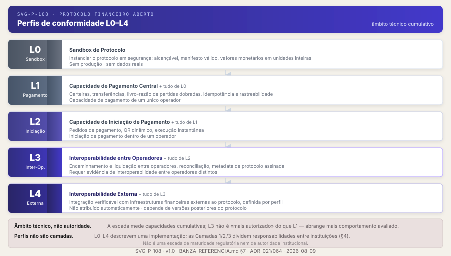

# BANZA — Referência do Protocolo

**Versão:** 1.0 · **Estado:** pré-produção · pagamentos reais desligados · sem implementações certificadas em produção

> **Edição canónica (português).** Este ficheiro é a única Referência canónica do BANZA. A
> [edição inglesa](../en/BANZA_REFERENCE.md) é uma tradução oficial; em caso de divergência não
> intencional, prevalece esta edição.
>
> **A Referência é descritiva, não normativa.** Ela organiza e explica a superfície normativa; não a
> define. A autoridade normativa é o [Manifesto Normativo](../../../contracts/production/normative-manifest.json)
> e os artefactos que ele indexa — especificações, contratos e registos. Onde esta Referência e um
> artefacto normativo divirjam, prevalece o artefacto normativo.
>
> As superfícies públicas — sítio e BanzAI — consomem ou derivam deste ficheiro. Não o editam, e não
> mantêm uma cópia editorial concorrente. Ver [`docs/reference/README.md`](../README.md).

---

## Resumo Executivo

O BANZA é um protocolo aberto de interoperabilidade financeira. Define as regras — contratos, mensagens, perfis, invariantes (regras que nunca podem ser violadas) e mecanismos de conformidade verificáveis — que implementações independentes usam para interoperar e produzir evidência verificável, sem reconstruir integrações técnicas bilaterais entre cada par de participantes e sem aprovação humana central ao nível do protocolo. A operação real em produção depende de obrigações legais, regulatórias, bancárias, KYC/KYB e AML/CFT, que pertencem ao operador e às autoridades competentes.

**O que não é:** O BANZA não é banco, PSP, carteira, esquema, operador financeiro ou prestador de serviços financeiros. Não é um serviço em execução nem um endpoint único. Não detém fundos, não mantém contas de clientes, não executa liquidação e não concede autorização regulatória. É o conjunto de regras que torna a interoperabilidade possível — a capacidade de sistemas diferentes processarem pagamentos entre si de forma verificável.

**Como está estruturado:** o ecossistema tem três camadas — a **Camada 1**, o protocolo aberto (regras abertas, neutras e verificáveis); a **Camada 2**, a Certificação de Conformidade e Interoperabilidade (por implementação, baseada em evidência, decidida em Rust); e a **Camada 3**, os esquemas operacionais independentes — o primeiro é o Esquema Operacional Banzami, com a Banzami como operadora designada do esquema (em preparação regulatória, com pagamentos reais desligados). O **BanzAI** é a interface humana primária e transversal às três camadas — não é uma quarta camada nem uma autoridade. Ver [§4](#4-arquitectura-do-protocolo).

**Quem participa:** Os *operadores* são entidades jurídicas independentes que implementam o protocolo e processam pagamentos. BANZA é um protocolo financeiro aberto. A conformidade protocolar de uma implementação é demonstrada por evidência verificável, não por aprovação humana central ao nível do protocolo. Um operador implementa o protocolo, publica o seu manifesto, expõe endpoints compatíveis e produz evidência de conformidade que qualquer parte pode verificar. Ao nível do protocolo não existem volumes mínimos, integrações técnicas bilaterais prévias exigidas nem decisões discricionárias. Ver [§8](#8-operadores).

**Como se estabelece confiança:** Por metadata de protocolo assinada, evidência de conformidade, um registo público de índice verificável, uma Trust Root, chaves delegadas de assinatura e revogação com falha fechada. Ao nível do protocolo, nenhuma entidade humana decide o resultado da avaliação de confiança: é determinística e executável por qualquer parte. Ver [§7](#7-conformidade-e-certificação) e [§6](#6-confiança).

**Quem governa:** A governação BANZA, em fase de bootstrap, define o processo pelo qual ADRs e RFCs são aprovados e mantém a neutralidade do protocolo. A governação evolui as regras do protocolo — não admite, aprova nem autoriza operadores. A entidade formal de governação é definida no processo de institucionalização. O protocolo evolui por processo documentado — nenhum operador decide unilateralmente. Ver [§11](#11-governança).

**Como funciona em alto nível:** Quando a federação de produção estiver activa, operadores com o perfil de conformidade aplicável e evidência verificável poderão trocar pagamentos entre si através de federação — com confiança estabelecida por avaliação sobre metadata assinada e evidência verificável, sem reconstruir integrações técnicas bilaterais entre cada par de operadores; a capacidade de federação não implica operação automática. A verificação de conformidade demonstra que as implementações conformes respeitam os mesmos invariantes financeiros. Actualmente `/operators` devolve uma lista vazia; a federação de produção depende das condições de produção de federação. Ver [§10](#10-federação).

**Porque existe:** Angola tem os componentes de um sistema financeiro moderno e tem interoperabilidade operacional entre participantes; o que ainda não tem é uma camada aberta que a torne pública e reproduzível por terceiros. O BANZA é essa camada — aberta, verificável, independente de qualquer operador — e complementa as infraestruturas em uso. O protocolo sobrevive a qualquer operador individual, por design. Ver [§2](#2-por-que-o-banza-existe).

> **Ponto de entrada recomendado para novos leitores:** [§15 — Perguntas Frequentes](#15-perguntas-frequentes) oferece respostas directas às questões mais comuns. Para implementar um operador: [§7 Conformidade e Certificação](#7-conformidade-e-certificação) → [§8 Operadores](#8-operadores) → [§13 Recursos para Programadores](#13-recursos-para-programadores).

> **Estado público v1.0:** Esta referência define o protocolo BANZA v1.0 em pré-produção. O Registo Técnico devolve uma lista vazia. O Manifesto de Chaves e o BRL (Lista de Revogação BANZA — *BANZA Revocation List*) têm localizações canónicas especificadas, mas a publicação de produção depende das condições de produção. A federação de produção depende das condições de produção de federação. A conformidade técnica não substitui obrigações legais, regulatórias, bancárias ou KYC/KYB aplicáveis. O estado operacional é documentado em [§5 Estado Protocolar](#5-estado-protocolar); a evolução do protocolo em [§14](#14-evolução-do-protocolo).

---

## Índice

1. [O Que É o BANZA](#1-o-que-é-o-banza)
2. [Por Que o BANZA Existe](#2-por-que-o-banza-existe)
3. [Propriedades Estruturais do Protocolo](#3-propriedades-estruturais-do-protocolo)
4. [Arquitectura do Protocolo](#4-arquitectura-do-protocolo)
5. [Estado Protocolar](#5-estado-protocolar)
6. [Confiança](#6-confiança)
7. [Conformidade e Certificação](#7-conformidade-e-certificação)
8. [Operadores](#8-operadores)
9. [Operador Zero](#9-operador-zero)
10. [Federação](#10-federação)
11. [Governança](#11-governança)
12. [BanzAI — Agente do Protocolo](#12-banzai-agente-do-protocolo)
13. [Recursos para Programadores](#13-recursos-para-programadores)
14. [Evolução do Protocolo](#14-evolução-do-protocolo)
15. [Perguntas Frequentes](#15-perguntas-frequentes)

---

## Navegação Rápida

### Conformidade e Certificação
- [Perfis de conformidade (L0–L4)](#perfis-de-conformidade-l0-l4) · §7
- [Como uma implementação é validada](#como-uma-implementação-é-validada) · §7
- [Certificação técnica formal (Camada 2)](#certificação-técnica-formal-camada-2) · §7
- [O que a certificação não concede](#o-que-a-certificação-não-concede) · §7
- [Revogação de material de confiança](#o-brl-lista-de-revogação-banza) · §6

### Federação
- [Elegibilidade técnica: o perfil L3](#elegibilidade-técnica-o-perfil-l3) · §10
- [Como a federação é avaliada](#como-a-federação-é-avaliada) · §10
- [O que a federação não cria](#o-que-a-federação-não-cria) · §10

### Confiança
- [O que significa confiar](#o-que-significa-confiar-no-banza) · §6
- [O Manifesto de Chaves](#o-manifesto-de-chaves) · §6
- [O BRL — Lista de Revogação](#o-brl-lista-de-revogação-banza) · §6
- [O que a confiança não prova](#o-que-a-confiança-não-prova) · §6
- [Avaliação Aberta de Confiança](#avaliação-aberta-de-confiança) · §8
- [Arquitectura institucional de confiança](https://github.com/banza-protocol/banza/blob/main/docs/governance/BANZA_TRUST_ARCHITECTURE.md) · doc dedicado

### Governança
- [O que a governança governa](#o-que-a-governança-governa) · §11
- [O que permanece fora da sua autoridade](#o-que-permanece-fora-da-sua-autoridade) · §11
- [Quem governa e como uma mudança é decidida](#quem-governa-e-como-uma-mudança-é-decidida) · §11
- [Versionamento e publicação](#versionamento-e-publicação) · §11

### Programadores
- [Fontes normativas e artefactos](#fontes-normativas-e-artefactos-legíveis-por-máquina) · §13
- [Interfaces por perfil](#interfaces-por-perfil-de-conformidade) · §13
- [Ferramentas de validação](#ferramentas-de-validação-e-conformidade) · §13
- [Da implementação à validação](#da-implementação-à-validação) · §13
- [O que não é requisito do protocolo](#o-que-não-é-requisito-do-protocolo) · §13

### Perguntas Frequentes
- [§15 — FAQ completa](#15-perguntas-frequentes)

---

## 1. O Que É o BANZA

**O BANZA é um protocolo aberto de interoperabilidade financeira: define regras públicas, contratos, mensagens, perfis e mecanismos verificáveis que implementações independentes podem adoptar para interoperar de forma verificável.** Duas implementações que nunca se conheceram interoperam porque ambas respeitam os mesmos contratos públicos e produzem a mesma evidência verificável.

O BANZA não é banco, PSP, carteira, esquema, operador financeiro ou prestador de serviços financeiros. Não detém fundos, não mantém contas de clientes, não executa liquidação e não concede autorização regulatória. É a camada comum de regras — contratos, mensagens, invariantes, evidência e confiança — que torna a interoperabilidade verificável e reproduzível, sem que cada par de participantes tenha de reconstruir separadamente as mesmas integrações técnicas.

### Um protocolo comum, aberto e verificável

O título desta secção nomeia quatro ideias — um protocolo comum, aberto, verificável e de interoperabilidade — que, em conjunto, definem que tipo de protocolo o BANZA é. Cada uma é explicada em seguida, com o seu significado, o seu alcance e a sua fronteira.

Um **protocolo** é um conjunto de regras comuns que implementações independentes seguem para produzir comportamentos e artefactos compatíveis. No BANZA, essas regras abrangem contratos e formatos, invariantes financeiros, descoberta e identidade técnica, mecanismos de confiança, evidência e conformidade.

A função de um protocolo comum é substituir a repetição das mesmas decisões técnicas por regras públicas e versionadas: cada implementação adopta os mesmos contratos aplicáveis, em vez de redefinir com cada contraparte formatos, semântica e critérios de validação equivalentes. Isto reduz as integrações técnicas bilaterais, mas não elimina as restantes relações entre operadores — conectividade, acordos comerciais, participação num esquema, liquidação, suporte e obrigações regulatórias podem continuar a ser necessários.

O protocolo torna comum apenas a parte técnica necessária à interoperabilidade. Por que essa repetição existe, e o que a torna dispensável, é o tema do [§2 Por Que o BANZA Existe](#2-por-que-o-banza-existe).

**Aberto** significa que as regras do protocolo podem ser conhecidas e implementadas sem depender de especificações privadas negociadas entre participantes. As regras são públicas; os contratos são versionados; a evolução das regras segue um processo de governação documentado; e uma parte independente pode estudar e implementar o protocolo.

A abertura permite também escrutínio: as regras, os contratos e os mecanismos de avaliação podem ser examinados por terceiros, e a implementação de referência é disponibilizada como código aberto.

Aberto não significa ausência de regulação, de operadores, de condições de participação num esquema ou de responsabilidade institucional. Uma regra pública do protocolo não substitui requisitos comerciais, operacionais, jurídicos ou regulatórios — significa apenas que ninguém precisa de permissão privada para ler, implementar ou verificar as regras.

**Verificável** significa que uma afirmação técnica sobre uma implementação não precisa de ser aceite apenas porque quem a publica declara que está conforme.

A avaliação identifica a implementação observada, a versão do protocolo, o perfil, o ambiente, os artefactos consumidos e as versões dos motores que produziram o resultado; assinaturas, resumos criptográficos (*hashes*), códigos de motivo (*reason codes*), evidência e recibos permitem relacionar essas entradas com o resultado obtido. Um terceiro pode assim inspeccionar o que foi avaliado, segundo que regras e com que resultado.

Quando dispõe das mesmas entradas, da mesma especificação, do mesmo perfil e da mesma versão do motor, esse terceiro pode ainda voltar a executar a avaliação e obter um resultado semanticamente equivalente. A reprodutibilidade é uma dessas garantias, mas não esgota a verificabilidade: verificar implica também conhecer a proveniência das entradas, confirmar a sua integridade e ligar cada resultado à evidência que o suporta.

Esta verificabilidade continua delimitada. Demonstrar como um resultado técnico foi obtido não transforma o BANZA numa autoridade, nem converte conformidade em certificação, admissão a um esquema ou autorização regulatória.

A **interoperabilidade** que o BANZA torna comum é, antes de mais, técnica: implementações independentes partilham contratos, formatos, invariantes, mecanismos de confiança, evidência e perfis de conformidade.

A interoperabilidade operacional é mais ampla. A troca efectiva de pagamentos em produção pode continuar a depender de conectividade, participação num esquema, liquidação, acordos comerciais e das autorizações regulatórias aplicáveis; implementar o protocolo não elimina essas dependências.

Por isso o BANZA não procura tornar iguais os operadores. Os produtos, as interfaces, os modelos de negócio, as políticas de risco e os enquadramentos regulatórios das implementações podem continuar diferentes: o protocolo normaliza apenas aquilo que precisa de ser comum e verificável para a interoperabilidade.

### Protocolo, operador e implementação

O BANZA é o protocolo — não é um operador. Estes termos não são intercambiáveis, e a distinção percorre toda a referência:

| Termo | O que é |
|---|---|
| **Entidade** | Pessoa jurídica independente; responde legal e regulatoriamente pela sua actividade. |
| **Operador** | Entidade que implementa o BANZA para processar pagamentos, sob as suas próprias autorizações. |
| **Implementação** | O conjunto de artefactos (o *build*) de um operador, identificado pelo *hash*; é o sujeito da conformidade e da certificação técnica. |

É a **implementação**, e nunca a entidade ou a marca, que é sujeita a conformidade e a certificação técnica. Um operador pode publicar mais do que uma implementação, e um resultado técnico aplica-se a uma implementação delimitada, não à entidade em abstracto. A distinção completa — incluindo implementação certificada e participante de esquema — está em [§8 Operadores](#8-operadores).

Três determinações mantêm-se distintas, com donos distintos, e nenhuma implica as outras: **certificação técnica ≠ admissão a esquema ≠ autorização regulatória** (ADR-005). Demonstrar conformidade, obter a certificação técnica de uma implementação, ser admitido a um esquema operacional e obter autorização regulatória são passos diferentes — ver [§7 Conformidade e Certificação](#7-conformidade-e-certificação).

### Propriedades

Quatro escolhas estruturais fazem do BANZA este tipo de protocolo:

- **Separação de responsabilidades.** O protocolo aberto, a certificação de conformidade e os esquemas operacionais são camadas distintas, separadas por responsabilidade, infraestrutura e chaves.
- **Avaliação de implementações, não de entidades.** O que é avaliado, testado e certificado é uma implementação delimitada, identificada pelo *hash* — nunca a reputação, a marca ou a entidade.
- **Resultados ligados à evidência.** Cada resultado técnico liga-se aos inputs observados e é acompanhado de evidência verificável e reproduzível: dados os mesmos inputs canónicos e a mesma versão de especificação e de perfil, execuções independentes produzem veredictos equivalentes.
- **Decisão determinística, explicação subordinada.** As decisões são determinísticas e tomadas por motores em Rust; um modelo de linguagem local pode explicar um resultado, mas nunca o decide.

Estas propriedades são a identidade do protocolo; as propriedades estruturais que delas decorrem — neutralidade, correcção financeira, abertura e separação de responsabilidades — são desenvolvidas em [§3 Propriedades Estruturais do Protocolo](#3-propriedades-estruturais-do-protocolo). **Neutralidade**, em particular, significa que as regras do protocolo não concedem privilégio técnico a nenhuma implementação; não significa ausência de governação, de responsabilidade ou de políticas externas.

### Princípios Fundamentais — BANZA R²S²

O BANZA tem **quatro** princípios fundamentais, e apenas quatro. Em conjunto chamam-se **BANZA R²S²** — *Robusto · Resiliente · Seguro · Simples*.

| Princípio | Significado |
|---|---|
| **Robusto** | comportamento determinístico e correcto perante implementações independentes, entrada adversarial e condições-limite |
| **Resiliente** | contém falhas, preserva operação segura onde é possível e recupera de forma determinística sem enfraquecer as garantias do protocolo |
| **Seguro** | as propriedades críticas são impostas por construção e fecham por omissão quando não podem ser estabelecidas |
| **Simples** | usa o menor mecanismo suficiente para fornecer a propriedade exigida |

A ordem é canónica. A forma curta é **R²S²**; onde o expoente não for tecnicamente adequado, escreve-se `R2S2`.

Os princípios são o **critério pelo qual as decisões são tomadas** — não uma descrição do que o protocolo faz. Cada decisão de arquitectura responde a quatro perguntas: um implementador independente continua a obter o mesmo comportamento? o que acontece quando isto falha? uma falha, um ataque ou um recurso alternativo conseguem violar a confiança ou um invariante? existe um mecanismo mais pequeno que forneça a mesma propriedade? Uma decisão que não sobreviva às quatro é reconsiderada.

**A resiliência não se sobrepõe à segurança.** Preserva operação segura e recuperação determinística perante falhas; nunca permite contornar confiança, autorização, integridade ou qualquer invariante do protocolo apenas para continuar disponível. Resiliência também não significa ausência de indisponibilidade: significa que uma falha é contida, explícita e recuperável, e que não se transforma numa violação do protocolo.

Estes princípios são distintos de outros dois eixos, e a distinção é deliberada: as **propriedades estruturais** ([§3](#3-propriedades-estruturais-do-protocolo)) são o que o protocolo tem de possuir, e os **invariantes** ([§4](#4-arquitectura-do-protocolo)) são restrições que a arquitectura não pode violar. Princípios decidem; propriedades caracterizam; invariantes restringem.

### Âmbito e Fronteiras

O BANZA define as regras (Camada 1); não executa a actividade financeira. A fronteira é explícita:

| O BANZA define (Camada 1) | O BANZA nunca executa |
|---|---|
| Contratos, mensagens, schemas, perfis e versões | KYC/KYB, AML/CFT |
| Invariantes financeiros e *reason codes* | Contas de clientes e carteiras |
| Identidade técnica, descoberta e manifestos | Detenção ou movimentação de fundos (*safeguarding*) |
| Chaves, metadata assinada, confiança e revogação | Liquidação e compensação de fundos reais |
| Conformidade, interoperabilidade e evidência | Admissão a um esquema |
| Certificação técnica, registo técnico e federação | Autorização regulatória |

O que o BANZA define é verificável por qualquer parte; o que não executa pertence aos operadores e às autoridades competentes e existe integralmente fora do protocolo. Cada operador implementa o protocolo na sua própria infraestrutura — o protocolo não reside num servidor central de execução de pagamentos. As únicas superfícies comuns são as de descoberta e de ancoragem de confiança — o Registo Técnico, a metadata de confiança assinada, a Lista de Revogação e o Manifesto de Chaves — que não movimentam fundos nem executam pagamentos.

O ecossistema organiza-se em três camadas, separadas por responsabilidade, infraestrutura e chaves (ADR-004): a **Camada 1**, o protocolo aberto; a **Camada 2**, a Certificação de Conformidade e Interoperabilidade, por implementação e baseada em evidência; e a **Camada 3**, os esquemas operacionais independentes — o primeiro é o Esquema Operacional Banzami, com a **Banzami — Tecnologia e Serviços, Lda.** como operadora designada do esquema, em preparação regulatória e com pagamentos reais desligados. O detalhe está em [§4 Arquitectura do Protocolo](#4-arquitectura-do-protocolo). O **BanzAI** é a interface humana primária e transversal às três camadas — não é uma quarta camada nem uma autoridade, e o protocolo funciona sem ele: a conformidade e a verificação máquina-a-máquina permanecem possíveis independentemente da sua utilização ([§12](#12-banzai-agente-do-protocolo)).

A dependência corre numa única direcção permanente: os operadores dependem do BANZA; o BANZA e o BanzAI nunca dependem de nenhum operador. Esta direcção é um invariante arquitectónico, não uma preferência de design.

A especificação v1.0 está publicada e o ambiente é de pré-produção: o Registo Técnico devolve uma lista vazia, não há certificações de produção e os pagamentos reais estão desligados. Publicada não é congelada — o congelamento é uma decisão deliberada sobre um candidato exacto, e não foi tomada. Este estado é verificável nas rotas públicas do protocolo e documentado em [§5 Estado Protocolar](#5-estado-protocolar).

### Onde Continuar

Este capítulo define o que o BANZA é. Os capítulos seguintes explicam como funciona:

- [§2 Por Que o BANZA Existe](#2-por-que-o-banza-existe) — o problema de fragmentação técnica que o protocolo resolve.
- [§3 Propriedades Estruturais do Protocolo](#3-propriedades-estruturais-do-protocolo) — os princípios que decorrem destas propriedades.
- [§4 Arquitectura do Protocolo](#4-arquitectura-do-protocolo) — as três camadas, os componentes e os invariantes.
- [§7 Conformidade e Certificação](#7-conformidade-e-certificação) e [§8 Operadores](#8-operadores) — como uma implementação demonstra conformidade e o que um operador assume.
- [§11 Governança](#11-governança) — como as regras do protocolo evoluem.

---

## 2. Por Que o BANZA Existe

A interoperabilidade financeira não é um problema por resolver: acontece todos os dias. Operadores independentes trocam valor e informação através de vários modelos — integrações directas, redes e *switches*, esquemas e infraestruturas partilhadas, padrões comuns de mensagens. Esses modelos funcionam e podem ser adequados ao seu contexto. A razão de existir do BANZA é mais específica, e este capítulo delimita-a.

### A interoperabilidade financeira já existe

Operadores financeiros independentes já interoperam. Podem integrar-se directamente uns com os outros, participar em infraestruturas partilhadas de liquidação e de troca, ou adoptar padrões comuns de mensagens e de operação. Estes mecanismos permitem a troca de valor e de informação e continuam a desempenhar um papel essencial — o BANZA não os substitui.

O problema que motiva o BANZA aparece noutro plano. As regras técnicas, os testes e os resultados necessários para *demonstrar* interoperabilidade tendem a ser específicos de cada relação, ou a estar disponíveis apenas aos participantes autorizados. Quando um terceiro não consegue implementar essas regras, comparar resultados e reproduzir a validação de forma independente, cada participante resolve repetidamente problemas semelhantes e produz resultados difíceis de confrontar.

A tese deste capítulo é, por isso, precisa: **o que falta em determinados contextos não é interoperabilidade operacional, mas uma base pública comum que permita implementar, comparar, verificar e reproduzir de forma independente a conformidade técnica.** É essa base que o BANZA acrescenta.

O contexto de origem e de primeira aplicação do protocolo é Angola. Como noutros mercados, a interoperabilidade operacional entre participantes já existe — através de bancos, de infraestruturas partilhadas de liquidação e de troca e de canais digitais. Esse contexto motiva o trabalho, mas não limita o problema: a lacuna que o protocolo aborda é técnica e geral, e a mesma análise aplica-se a outros contextos.

### Integrações bilaterais

A forma mais directa de dois operadores interoperarem é uma integração bilateral: acordam entre si os elementos técnicos de que precisam — formatos de mensagens, identidade, chaves, tratamento de erros, testes de aceitação, suporte e a operação específica dessa ligação. É um modelo válido e, para muitas relações, suficiente.

O custo potencial não está numa integração isolada, mas na repetição. Quando os mesmos elementos têm de ser definidos de novo para cada relação, cada par reconstrói um trabalho técnico semelhante, com regras ligeiramente diferentes de cada vez. Bilateral não significa, por si, um defeito; significa a possibilidade de repetir a integração técnica à medida que o número de participantes cresce.

#### A malha completa

Este padrão de repetição tem uma forma conhecida. Se `n` operadores se ligarem todos entre si, o número de relações técnicas distintas é `n(n−1)/2`: cinco operadores dão dez relações; dez operadores dão quarenta e cinco. O que esta expressão conta são relações técnicas entre pares — não implementações, nem custos monetários, nem número de APIs, contratos ou transacções.

Com um conjunto comum de regras públicas, a grandeza muda de natureza. Cada operador implementa uma vez o mesmo conjunto de regras: `n` operadores dão `n` implementações. A segunda expressão conta implementações independentes, não relações. As duas fórmulas descrevem padrões de crescimento diferentes de grandezas diferentes — relações contra implementações — e é essa diferença, e não um custo específico, que a comparação ilustra.

A malha completa é um modelo ilustrativo, não uma descrição de todos os mercados. Ecossistemas reais recorrem frequentemente a *hubs*, a redes, a *gateways*, a sistemas centrais ou a integrações parcialmente partilhadas, precisamente para não multiplicarem ligações par a par. Um novo participante acrescenta, no limite de uma malha bilateral completa, até `n` novas relações; num conjunto comum de regras, acrescenta uma implementação.

### Infraestruturas partilhadas

O segundo modelo de interoperabilidade é a infraestrutura partilhada: um sistema comum — uma rede, um *switch*, um esquema, uma infraestrutura central — através do qual vários participantes interoperam sem negociar uma ligação distinta com cada contraparte. Este modelo resolve precisamente parte do problema de multiplicação bilateral; a malha completa não é a única forma de conter a multiplicação de ligações par a par.

A centralização, por si só, não é o problema. Uma infraestrutura central pode oferecer eficiência, segurança, operação, liquidação, governação e supervisão, e a participação controlada — com critérios de adesão e autorização — é uma característica institucional legítima de muitos sistemas. O BANZA não elimina a necessidade de participação institucional onde ela se aplique.

A questão relevante para o BANZA é outra: até que ponto um terceiro consegue observar, implementar e reproduzir de forma independente as regras e as avaliações técnicas. Uma infraestrutura pode resolver muito bem a interoperabilidade operacional e, ainda assim, manter as suas especificações, os seus testes e os seus resultados acessíveis apenas aos participantes — o que deixa a verificação dependente de cooperação.

### O problema da verificabilidade

Esta é a lacuna central. Quando as especificações, as entradas, os testes, os critérios, as versões, os *reason codes* e os resultados não estão disponíveis de forma suficiente, um terceiro pode não conseguir reproduzir a avaliação técnica. Não se trata de insegurança nem de mau funcionamento — o sistema pode funcionar perfeitamente; trata-se de reduzir a comparabilidade, a auditabilidade e a independência da verificação.

A comparabilidade sofre pela mesma razão. Resultados produzidos segundo critérios diferentes, versões diferentes, testes privados ou artefactos não identificados são difíceis de confrontar. Uma base comum torna explícitos o sujeito avaliado, a versão, o perfil, o ambiente, as entradas, o motor e a evidência — de modo que dois resultados possam ser postos lado a lado com o mesmo significado. O tratamento formal desta ligação entre entradas, execução e resultado é desenvolvido em [§7 Conformidade e Certificação](#7-conformidade-e-certificação).

A diferença prática é entre *confiar* e *verificar*. Num modelo verificável, um terceiro não precisa de aceitar apenas a declaração de que uma implementação passou determinado teste: pode inspeccionar a base técnica do resultado. Isto não elimina a confiança — que continua a existir em origens, governação, chaves, instituições, operadores e reguladores —, mas desloca parte dela de uma declaração para a evidência.

### O que o BANZA acrescenta

Um conjunto comum de regras públicas muda o ponto de partida. Passam a existir regras públicas, contratos versionados, perfis comparáveis, invariantes explícitos, critérios comuns, evidência ligada às entradas e avaliação reproduzível. Deixa de ser necessário redefinir as mesmas regras técnicas entre cada par de participantes: quem implementa a especificação uma vez fica apto a interoperar tecnicamente com qualquer outra implementação conforme.

O BANZA acrescenta — não substitui. À interoperabilidade operacional que já existe, junta uma base aberta de regras comuns, perfis públicos, conformidade determinística e evidência verificável. Prefere-se aqui *base* a *camada* para não confundir com as três camadas institucionais descritas em [§4 Arquitectura do Protocolo](#4-arquitectura-do-protocolo).

Em síntese, a lacuna resolve-se por quatro necessidades: regras comuns, avaliação comparável, evidência verificável e reprodução independente. É isso — e apenas isso — que o protocolo torna público e comum. Reduzir integrações técnicas repetidas não elimina as restantes relações entre operadores — comerciais, de conectividade, de liquidação, de esquema e regulatórias ([§1](#1-o-que-é-o-banza)) —, que podem continuar a ser necessárias.

### O que permanece fora

Tornar as regras técnicas explícitas e a conformidade verificável tem um limite deliberado. O BANZA não substitui as infraestruturas operacionais, os sistemas de liquidação, os padrões existentes nem as decisões regulatórias. Continuam a cargo dos operadores e das entidades competentes:

- **adoção** — nenhum protocolo garante utilizadores, comerciantes ou casos de uso;
- **regulação e autorização** — operar serviços financeiros exige as licenças e autorizações aplicáveis, que só as entidades competentes concedem;
- **liquidez e relações bancárias** — o financiamento das operações e o acesso às vias de liquidação são relações dos operadores;
- **KYC/KYB e AML/CFT** — a identificação, a verificação e a prevenção pertencem aos operadores, sob o quadro legal que lhes for aplicável;
- **risco operacional** — disponibilidade, segurança dos sistemas e continuidade de negócio são responsabilidade de quem opera.

Estas determinações mantêm-se distintas, e com donos distintos: **demonstrar conformidade, obter a certificação técnica de uma implementação, ser admitido a um esquema operacional e obter autorização regulatória são passos diferentes** (ver [§7 Conformidade e Certificação](#7-conformidade-e-certificação)). O protocolo dá uma base comum verificável; não confere estatuto institucional nem legal.

### Onde Continuar

Este capítulo explicou por que existe um protocolo aberto e comum: a interoperabilidade financeira já existe, mas falta, em certos contextos, uma base pública, comum e reproduzível sobre a qual ela possa ser demonstrada e verificada de forma independente. O que o BANZA é foi definido em [§1 O Que É o BANZA](#1-o-que-é-o-banza); segundo que princípios foi concebido é o tema de [§3 Propriedades Estruturais do Protocolo](#3-propriedades-estruturais-do-protocolo).

## 3. Propriedades Estruturais do Protocolo

O BANZA foi concebido para que a interoperabilidade técnica possa ser demonstrada sem depender de regras implícitas nem de uma implementação privilegiada. Dessa escolha decorre um conjunto de propriedades que condicionam a arquitectura, a validação e a evolução do protocolo.

Estas propriedades não descrevem componentes nem tecnologias. Descrevem qualidades que devem permanecer verdadeiras independentemente da implementação, das versões e das ferramentas usadas para realizar o protocolo. É essa a diferença entre uma propriedade estrutural e uma decisão de implementação: a implementação pode mudar; a propriedade tem de sobreviver à mudança.

**Propriedades não são princípios.** Os **Princípios Fundamentais** do BANZA são quatro — **Robusto · Resiliente · Seguro · Simples**, o conjunto **R²S²** — e são o critério pelo qual as decisões são tomadas ([§1 O Que É o BANZA](#1-o-que-é-o-banza)). As propriedades deste capítulo são o que o protocolo tem de possuir; os princípios são como se decide construí-lo para que as possua. A distinção existe porque um documento que chame *princípio* a ambas as coisas não consegue proteger nenhuma das duas.

Cada propriedade é apresentada pelo seu **significado**, pela **consequência** estrutural que produz e pela **fronteira** que a delimita.

### Correcção financeira

Onde o protocolo define comportamento financeiro, a correcção não é opcional. Os valores monetários, a integridade dos lançamentos e a repetição segura das operações são especificados como invariantes, de modo que cada operação seja auditável e reproduzível por um terceiro.

A consequência é que uma implementação não pode trocar correcção por conveniência: as garantias financeiras aplicáveis são impostas pela verificação de conformidade, não deixadas ao critério de cada operador. O detalhe formal — que invariantes se aplicam, e em que perfil ou capacidade — pertence a [§4 Arquitectura do Protocolo](#4-arquitectura-do-protocolo) e a [§7 Conformidade e Certificação](#7-conformidade-e-certificação).

A fronteira é dupla. Primeiro, correcção financeira não significa que o protocolo detém ou movimenta dinheiro — a não-custódia é uma fronteira definida em [§1 O Que É o BANZA](#1-o-que-é-o-banza); o que dela decorre para esta propriedade é apenas que o protocolo define como os lançamentos devem comportar-se, mas não os executa: o valor move-se nos sistemas dos operadores e nas vias de liquidação competentes. Segundo, nem todos os requisitos financeiros são universais: alguns aplicam-se apenas a partir de um perfil ou de uma capacidade específica e não devem ser lidos como exigências de todo o protocolo.

### Neutralidade

As regras do protocolo aplicam-se sem conceder privilégio técnico a nenhuma implementação. Os mesmos contratos, perfis, critérios e mecanismos de avaliação valem para qualquer implementação no mesmo âmbito, incluindo a implementação de referência.

A consequência é que a conformidade é com o protocolo, não com o código de uma implementação em particular. Duas implementações em linguagens ou arquitecturas diferentes podem satisfazer o mesmo perfil; a implementação de referência é um exemplo aberto, nunca uma implementação obrigatória. O valor acumula na camada comum de regras, não numa implementação individual.

A fronteira é que neutralidade não significa ausência de governação, de responsáveis, de operadores ou de autoridades. Um protocolo pode ser governado e continuar tecnicamente neutro: a neutralidade limita o privilégio técnico, não a existência de responsabilidade institucional.

### Regras públicas, explícitas e versionadas

Nenhuma regra normativa existe apenas em prosa. Quando a implementação começa, a regra tem de existir como artefacto público — contrato, *schema*, invariante ou vector de conformidade — e nenhuma implementação é avaliada contra regras implícitas ou não declaradas.

A consequência é uma ordem fixa: a regra nasce na especificação, depois é implementada, depois produz evidência, depois é avaliada. O que não tem contrato público não pode ser testado; o que não pode ser testado não pode gerar evidência nem ser comparado. E a versão aplicável a um resultado é sempre explícita, para que se possa saber que regras estavam em vigor quando o resultado foi produzido.

A fronteira é que esta propriedade fixa apenas que as regras são públicas e versionadas — não como evoluem. O processo de alteração, depreciação e compatibilidade pertence a [§11 Governança](#11-governança).

### Decisão determinística

Os estados técnicos são determinados por regras e por motores determinísticos, não por interpretação linguística nem por juízo discricionário no momento da avaliação. Dadas as mesmas entradas e as mesmas regras, a decisão é a mesma.

A consequência é que os resultados são reproduzíveis e acompanhados de razões legíveis por máquina, o que permite compará-los e automatizá-los sem depender de linguagem natural.

A fronteira é que determinismo não significa ausência de explicação. Uma interface pode orientar, encaminhar e explicar um resultado, mas explicar não é decidir: os motores verificam, a evidência prova e a autoridade competente decide — a interface humana do protocolo é tratada em [§12 BanzAI — Agente do Protocolo](#12-banzai-agente-do-protocolo). A propriedade é que a decisão normativa seja determinística e controlada, não uma tecnologia de implementação específica.

### Evidência e reprodutibilidade

Um resultado deve poder ser remontado às entradas que o sustentam. As afirmações relevantes do protocolo são verificáveis por artefactos públicos — rotas em formato máquina, testes reproduzíveis, documentos assinados — sem exigir confiança num sítio, numa empresa ou numa pessoa.

A consequência é que a auditoria independente se torna possível por construção: uma autoridade competente ou um terceiro encontram os mesmos artefactos que qualquer participante e, dispondo do mesmo material, podem voltar a executar a avaliação e obter um resultado equivalente. A verificação deixa de depender da cooperação activa de quem é avaliado.

A fronteira é que reproduzir não é reproduzir byte a byte todo o resultado: metadados não determinísticos — como um instante ou um identificador de execução — podem variar sem invalidar a equivalência semântica. E a reprodutibilidade é uma das garantias da verificabilidade, não o seu todo; a distinção está em [§1 O Que É o BANZA](#1-o-que-é-o-banza).

### Âmbito explícito e sem autoridade implícita

Nenhum resultado técnico é universal. Aplica-se ao sujeito, à versão, ao perfil, ao ambiente e à evidência efectivamente avaliados — e o sujeito é a implementação delimitada, nunca a entidade ou a marca.

A consequência é dupla. Um resultado não generaliza silenciosamente para além do que foi avaliado, o que o torna comparável com significado. E um resultado técnico não adquire significado institucional que o protocolo não lhe atribui: conforme não é certificado, certificado não é admitido a um esquema, admitido não é autorizado por um regulador.

A fronteira é que o protocolo afirma apenas o que observa. Uma implementação tecnicamente conforme não implica boa governação interna, solvência, conformidade jurídica, segurança organizacional nem autorização — essas propriedades não são observáveis pela avaliação técnica e não são deduzidas dela.

### Fecho por omissão

A ausência ou a inconsistência de prova de confiança não é convertida em aprovação. Perante evidência em falta, inválida, expirada ou incompatível, o comportamento correcto é não prosseguir: o sistema falha para o lado seguro (*fail-closed*).

A consequência é que a interoperabilidade entre operadores é concedida por verificação determinística — não aberta por defeito, nem concedida por decisão humana no encaminhamento — e que remover confiança tem de ser tão rápido como concedê-la. O mecanismo concreto, com verificações determinísticas e revogação pública assinada, é tratado em [§6 Confiança](#6-confiança) e [§10 Federação](#10-federação).

A fronteira é que fechar por omissão descreve a evidência disponível, não julga uma entidade. Não é uma lista de exclusão, uma sanção, uma proibição nem uma decisão regulatória: é uma postura técnica de segurança perante a incerteza.

### Separação de responsabilidades

O protocolo, a avaliação técnica de conformidade, a operação e a autoridade regulatória são responsabilidades distintas, e nenhuma herda automaticamente as decisões das outras. Nenhum participante detém autoridade unilateral sobre a camada de confiança do protocolo.

A consequência é que responsabilidades diferentes não colapsam numa única autoridade — é isso que permite que operadores, supervisores e implementações concorrentes coexistam na mesma camada comum sem que nenhum tenha acesso privilegiado. A materialização concreta desta separação, em camadas distintas por responsabilidade, infraestrutura e chaves, é o tema de [§4 Arquitectura do Protocolo](#4-arquitectura-do-protocolo).

A fronteira é que a separação é de responsabilidades, não de cooperação: as camadas continuam a articular-se. E não elimina a governação — distribui-a, para que a captura de um participante não capture o protocolo.

### Onde Continuar

Estas propriedades condicionam tudo o que se segue. Como se materializam em componentes, camadas e chaves é o tema de [§4 Arquitectura do Protocolo](#4-arquitectura-do-protocolo); como uma implementação demonstra conformidade com eles está em [§7 Conformidade e Certificação](#7-conformidade-e-certificação); e como as regras evoluem sem quebrar estas propriedades está em [§11 Governança](#11-governança).

## 4. Arquitectura do Protocolo

A arquitectura do BANZA responde a uma pergunta simples: quem faz o quê, e onde termina a competência de cada um. Separa três responsabilidades que não devem herdar autoridade umas das outras — definir regras, avaliar implementações e operar serviços — e mantém-nas distintas por desenho, não por convenção.

Este capítulo descreve responsabilidades e fronteiras, não servidores nem software. É uma descrição que sobrevive a uma mudança de linguagem, de base de dados ou de infraestrutura, porque fixa o que tem de permanecer verdadeiro, não a forma como está implementado hoje.

### Visão geral

O ecossistema tem três camadas institucionais e uma interface transversal. A **Camada 1** é o protocolo aberto, que define as regras. A **Camada 2** é a certificação, que avalia implementações face a essas regras. A **Camada 3** são os esquemas operacionais, que adoptam o protocolo para operar. O **BanzAI** atravessa as três como interface humana — orienta e explica, mas não decide.

Duas ideias sustentam o resto do capítulo. Primeira: cada responsabilidade é separada das outras por desenho, e nenhuma determinação passa automaticamente de uma para a seguinte. Segunda: o protocolo não se executa a si próprio — quem processa pagamentos são os operadores, nas suas próprias infraestruturas, sob as regras do protocolo mas fora dele.

### As três camadas

O ecossistema organiza-se em três camadas institucionais, separadas por responsabilidade, infraestrutura e chaves. A separação é um invariante arquitectónico, não uma escolha de apresentação (ADR-004).

| Camada | Responsabilidade |
|---|---|
| **Camada 1 — Protocolo aberto** | As regras públicas comuns: contratos, mensagens, schemas, invariantes, identidade técnica, descoberta, confiança, revogação, conformidade e evidência. Define o comportamento correcto; não é banco, PSP, carteira, esquema nem operador, e não detém nem movimenta fundos. |
| **Camada 2 — Certificação de Conformidade e Interoperabilidade** | Avalia uma implementação delimitada face a perfis públicos e versionados, por evidência e decisão determinística. Certifica uma implementação, nunca uma entidade; não é licença, admissão a um esquema nem autorização regulatória (ADR-032). |
| **Camada 3 — Esquemas operacionais independentes** | Esquemas operacionais independentes que podem adoptar o protocolo para operar, definindo participação, operação e responsabilidades sob o enquadramento aplicável (ADR-006). O primeiro é o Esquema Operacional Banzami, promovido pela **Banzami — Tecnologia e Serviços, Lda.** como operadora designada. O BANZA ≠ esquema: a continuidade do protocolo não depende de nenhum esquema. |

As três camadas são responsabilidades simultâneas, não etapas de um processo nem níveis de maturidade. Cada uma pode existir, evoluir e ser auditada sem depender das decisões internas das outras: uma implementação pode ser certificada na Camada 2 sem pertencer a nenhum esquema, e um esquema da Camada 3 pode operar sob o seu próprio enquadramento sem alterar o protocolo da Camada 1.

**As camadas não são os perfis de conformidade.** As Camadas 1, 2 e 3 repartem *responsabilidades entre instituições* — quem define, quem avalia, quem opera. Os perfis de conformidade L0–L4 medem outra coisa: as *capacidades técnicas* que uma única implementação demonstrou e o âmbito da sua avaliação. Um eixo divide competências entre instituições; o outro descreve o alcance de uma implementação. Não se substituem nem se sobrepõem — o detalhe dos perfis está em [§7 Conformidade e Certificação](#7-conformidade-e-certificação).

![Arquitectura institucional do BANZA em três camadas separadas por responsabilidade, infraestrutura e chaves — Camada 1 Protocolo aberto (regras públicas, neutras e verificáveis; não movimenta fundos), Camada 2 Certificação de Conformidade e Interoperabilidade (certifica uma implementação, nunca uma entidade, por evidência e decisão determinística; não é licença, admissão nem autorização) e Camada 3 Esquemas operacionais independentes que podem adoptar o protocolo — com o BanzAI transversal às três, a interface humana primária, não uma quarta camada nem uma autoridade; certificação técnica ≠ admissão a esquema ≠ autorização regulatória, nenhuma determinação se propaga automaticamente, e o BANZA não movimenta fundos](../../../website/public/diagrams/protocol/banza-protocol-architecture-overview-v1.svg)

### O BanzAI é transversal, não uma camada

O BanzAI atravessa as três camadas como interface humana primária: orienta, consulta as fontes do protocolo, invoca os motores determinísticos e explica os resultados com as fontes citadas. É por onde uma pessoa trabalha com o protocolo, das regras à validação.

A sua posição não lhe dá autoridade. A regra é constante em toda a arquitectura: **o BanzAI orienta, os motores determinísticos verificam, a evidência prova e a autoridade competente decide.** A explicação nunca é a decisão.

Por isso o BanzAI não é uma quarta camada nem uma autoridade: não define regras, não decide conformidade, não certifica, não admite, não autoriza e não movimenta fundos. E não é indispensável. O protocolo funciona sem ele — a conformidade e a interoperabilidade são verificáveis directamente pelas interfaces públicas, e um consumidor automático pode obter os artefactos e reproduzir a avaliação sem passar pela interface humana ([§12 BanzAI — Agente do Protocolo](#12-banzai-agente-do-protocolo)).

### Os planos do protocolo

Dentro da Camada 1, o protocolo existe como três planos de artefactos públicos — Normativo, Verificação e Confiança. Nenhum deles processa pagamentos; em conjunto, definem o comportamento correcto, permitem verificá-lo e sustentam a confiança entre implementações independentes.

| Plano | Artefactos | Responsabilidade |
|---|---|---|
| **Normativo** | Especificação, ADRs, RFCs, contratos, schemas, invariantes | Definir o comportamento correcto — o que uma implementação conforme tem de fazer. |
| **Verificação** | Vectores de conformidade, executor de conformidade, evidência reproduzível | Testar implementações contra a especificação e produzir evidência que terceiros podem reproduzir. |
| **Confiança** | Trust Root, Manifesto de Chaves, chaves delegadas, Lista de Revogação (BRL), Registo Técnico | Ancorar, publicar e revogar material de confiança por via criptográfica, sem autoridade humana no caminho. |
| **Execução** *(fora do protocolo)* | Implementações dos operadores, nas suas próprias infraestruturas | Processar pagamentos, guardar saldos e cumprir obrigações legais — externo ao protocolo, sob as regras dele. |

A execução não é um quarto plano do protocolo. Processar pagamentos, guardar saldos e cumprir obrigações legais pertence aos operadores, nas suas próprias infraestruturas — sob as regras do protocolo, mas fora dele. É esta separação que mantém o protocolo neutro: define o comportamento correcto sem nunca o executar.

As superfícies comuns — Registo Técnico, metadata assinada, Lista de Revogação, manifestos e evidência de conformidade — publicam o estado destes artefactos em formato máquina, para que qualquer parte o verifique sem confiar em texto de apresentação. O Registo Técnico é um índice público de metadados e evidência: estar nele não é licença, admissão nem autorização.

### Execução local, sem servidor central

O protocolo não reside num servidor central. Cada operador implementa-o na sua própria infraestrutura, e dois operadores interoperam por respeitarem as mesmas regras públicas — não por se ligarem a uma infraestrutura comum do BANZA. A interoperabilidade nasce de regras comuns e conformidade verificável, não de um ponto central partilhado.

O caminho de uma implementação até à interoperação é uma sequência de artefactos verificáveis, sem aprovação humana em nenhum passo:

1. **A especificação define o comportamento** — contratos, invariantes e critérios de conformidade públicos e versionados.
2. **O operador implementa localmente**, na sua própria infraestrutura e tecnologia, sob as suas próprias autorizações.
3. **Os testes verificam o comportamento** contra os vectores oficiais de conformidade.
4. **A evidência é publicada**, reproduzível por terceiros — um resultado técnico, não uma autorização legal.
5. **O operador auto-publica metadata assinada** — manifesto, versão, capacidades, endpoints e evidência, ancorados na cadeia de confiança do protocolo. A entrada aparece então no Registo Técnico por regras públicas de indexação, não por decisão de ninguém.
6. **A interoperação avalia-se a cada encaminhamento**, pela Avaliação Aberta de Confiança — verificações determinísticas sobre metadata, evidência, assinaturas e revogação, que falham fechado perante qualquer inconsistência ([§10 Federação](#10-federação)).

Em nenhum passo existe uma entidade que decida quem entra: o que muda de passo para passo é a evidência disponível, não a vontade de um avaliador.

A figura seguinte segue este percurso de ponta a ponta — da pessoa ou do consumidor automático até à interoperação — e mostra onde cada responsabilidade começa e termina. É um fluxo de arquitectura, validação e evidência; não é um fluxo de dinheiro, que nunca atravessa o protocolo.

![Fluxo arquitectural do BANZA de ponta a ponta — uma pessoa trabalha através do BanzAI, a interface humana primária e opcional, que orienta e explica mas não decide, enquanto um consumidor automático acede directamente às mesmas interfaces públicas sem passar pelo BanzAI; o operador implementa o protocolo na sua própria infraestrutura e auto-publica os artefactos públicos (descoberta, manifesto, manifesto de chaves, endpoints); os motores determinísticos verificam esses artefactos e produzem evidência e recibos reproduzíveis; a Camada 2 certifica a implementação a partir dessa evidência e o registo entra no Registo Técnico; os esquemas operacionais independentes da Camada 3 podem depois adoptar implementações conformes. A regra de autoridade percorre todo o fluxo: o BanzAI orienta, os motores verificam, a evidência prova e a autoridade competente decide. O BANZA não movimenta fundos — este é um fluxo de validação e evidência, não de dinheiro](../../../website/public/diagrams/protocol/banza-architectural-flow-v1.svg)

### Núcleo normativo: correcção financeira

O plano Normativo da Camada 1 é onde a *correcção financeira* ([§3 Propriedades Estruturais do Protocolo](#3-propriedades-estruturais-do-protocolo)) deixa de ser um princípio e passa a ser estrutura. Fixa o comportamento financeiro correcto como invariantes que qualquer implementação conforme tem de satisfazer:

- valores monetários em unidades inteiras, sem vírgula flutuante;
- um livro-razão de partidas dobradas, imutável e atómico;
- a identidade de liquidação — o montante bruto é a soma do líquido com a taxa, sem criar nem destruir dinheiro;
- saldos derivados do livro-razão e nunca negativos;
- operações idempotentes, seguras perante repetição;
- rastreabilidade completa de cada operação.

O protocolo organiza os seus invariantes em famílias — as de correcção financeira e as restantes, de confiança, identidade e federação — cada uma com um âmbito próprio:

| Família | Âmbito |
|---|---|
| `INV-LEDGER-*` | Partidas dobradas, imutabilidade, aritmética inteira, atomicidade |
| `INV-WALLET-*` | Saldo consistente, sem negativos |
| `INV-STL-*` | Identidade de liquidação (bruto = líquido + taxa), sem criação de dinheiro |
| `INV-IDEM-*` | Âmbito da chave de idempotência, segurança de repetição |
| `INV-TRACE-*` | Completude da rastreabilidade |
| `INV-QR-*` · `INV-IDENT-*` | Ciclo de vida e resolução única do QR; unicidade do identificador |
| `INV-OTE-*` · `INV-FEDEVAL-*` | Avaliação Aberta de Confiança e confiança de encaminhamento |
| `INV-ROOT-*` | Trust Root, manifesto de chaves e validação de chaves de produção |

Nem todos os requisitos financeiros são universais: alguns aplicam-se apenas a partir de um perfil ou de uma capacidade específica. A enumeração completa dos invariantes, dos *reason codes* e da representação monetária é fixada nos contratos públicos, e a forma como uma implementação é avaliada contra eles é o tema de [§7 Conformidade e Certificação](#7-conformidade-e-certificação).

### Fronteiras de autoridade

A arquitectura impede que uma determinação produzida numa responsabilidade adquira automaticamente significado noutra. Demonstrar conformidade não é obter a certificação técnica de uma implementação: a evidência não é o certificado (ADR-032). E **certificação técnica ≠ admissão a um esquema ≠ autorização regulatória** (ADR-005). Cada fronteira exige a sua própria determinação, e passar uma não concede a seguinte.

A fronteira entre o ambiente do protocolo e o ambiente do operador é um limite de responsabilidade:

- **O ambiente do protocolo** publica especificação, registo, revogação, manifestos e evidência. Não toca em dinheiro, não guarda dados de clientes e não participa em nenhuma transacção — comprometê-lo não move dinheiro, porque nele não existe valor para mover.
- **O ambiente do operador** processa pagamentos, mantém contas e saldos, guarda dados de clientes e cumpre KYC/KYB, AML/CFT e as demais obrigações, sob as suas próprias licenças. O protocolo define como esse ambiente deve comportar-se para ser conforme; não o opera, não o supervisiona e não responde por ele.
- **A evidência de conformidade** atesta comportamento técnico verificável, num dado âmbito e momento. Não é licença nem aprovação regulatória, e não transfere para o protocolo nenhuma responsabilidade do operador. A autorização, quando exigida, vem do regulador competente.

A separação estende-se à infraestrutura e às chaves: nenhuma camada adquire autoridade sobre outra por partilhar infraestrutura, e nenhuma chave exerce poder para além do âmbito que a Trust Root lhe delega explicitamente. O detalhe do modelo de confiança está em [§6 Confiança](#6-confiança).

### Onde Continuar

Este capítulo mostrou como os princípios se tornam estrutura: três camadas institucionais separadas; três planos de artefactos do protocolo, mais a execução que lhe é externa; execução local sem servidor central; e fronteiras de autoridade que não se propagam. Como o estado protocolar é guardado de forma verificável — sem que o protocolo detenha valor financeiro — é o tema de [§5 Estado Protocolar](#5-estado-protocolar); como uma implementação declara e demonstra o perfil de conformidade que satisfaz está em [§7 Conformidade e Certificação](#7-conformidade-e-certificação).

## 5. Estado Protocolar

O protocolo não se limita a definir regras: mantém um conjunto de factos duráveis que o tornam inspeccionável e reproduzível por terceiros. A esse conjunto chamamos **estado protocolar** — artefactos públicos, na sua maioria assinados, cuja *semântica* é definida pelo protocolo, independentemente da tecnologia que os armazena.

Uma fronteira governa todo o capítulo: **o estado protocolar é estado do protocolo, não valor financeiro.** Não é livro-razão de pagamentos, carteira, core bancário nem base de dados de operador. O livro-razão de partidas dobradas, os saldos e a liquidação são responsabilidade de cada operador, no seu próprio ambiente; o protocolo guarda a *evidência de conformidade de uma implementação delimitada* — nunca os seus dados financeiros.

Este capítulo descreve a semântica desse estado: o que contém, de onde vem a sua autoridade, o que é observado e o que é actual, o que é derivado e o que é persistido, o que é histórico. A escolha de base de dados da implementação de referência é tratada no fim, como o que é — uma decisão de implementação.

### O que constitui o estado protocolar

O estado protocolar reparte-se por categorias com naturezas distintas. Nenhuma delas guarda valor: todas guardam factos, referências e provas verificáveis.

| Categoria | O que contém |
|---|---|
| **Artefactos de confiança assinados** | Raiz de confiança e manifesto de chaves (apenas chaves públicas e *fingerprints*), lista de revogação. Nunca material de chave privada ([§6](#6-confiança)). |
| **Registo Técnico** | Auto-publicações dos operadores e apontadores para a sua metadata pública. Vazio na fase actual. |
| **Evidência de conformidade** | *Hashes* de relatórios e marcadores de resultado, nunca os dados financeiros subjacentes. Um resultado técnico, não uma certificação ([§7](#7-conformidade-e-certificação)). |
| **Índice do agente** | O índice do texto **público** de referência que o BanzAI consulta para explicar o protocolo — perguntas, respostas e identificadores de fonte, nunca segredos nem identificadores de utilizador ([§12](#12-banzai-agente-do-protocolo)). |
| **Registo de auditoria** | Um registo *append-only* das escritas governadas. |
| **Marcadores de estado** | Sinalizadores de fase do protocolo. |
| **Recibos de validação** | Recibos *append-only*, endereçados por conteúdo, de cada percurso de validação; o artefacto autoritativo é a forma canónica que a resposta devolve, não a linha guardada. |

A maioria destas categorias é **verificável sem confiança no armazenamento**: recalculando *hashes* e conferindo assinaturas ancoradas na raiz, um terceiro confirma-as sem conta e sem endpoint privilegiado. É por isso que a tecnologia que as guarda é invisível para quem verifica.

### Fonte, estado derivado e estado persistido

Nem todo o estado tem a mesma autoridade. A distinção decisiva é entre a **fonte** de um facto e a sua *representação* guardada.

**A autoridade vem das regras, das fontes canónicas, da evidência e do processo aplicável — nunca da persistência.** Um valor não se torna verdadeiro por estar guardado numa base de dados. Guardar é conveniência e desempenho; a verdade de um facto é sempre reconferível a partir da sua fonte.

Daí três naturezas de estado:

- **Fonte canónica** — o artefacto público e assinado (ou o contrato que o define). É a autoridade.
- **Estado derivado** — o que se reconstrói deterministicamente a partir das fontes, da evidência e dos motores. Um veredicto de conformidade reconstruído assim não ganha autoridade por ser materializado; continua a valer o que as fontes disserem.
- **Estado persistido** — a materialização durável de um ou outro, para servir e auditar. Uma *cache*, um *snapshot* ou um índice é estado persistido: acelera a leitura, não decide a verdade.

A figura seguinte segue este percurso: de uma fonte canónica, por observação e avaliação determinística, a um resultado com evidência, depois materializado e publicado numa superfície. Distingue o que é fonte, o que é derivado, o que é apenas persistido e o que é publicado.

![Modelo do estado protocolar do BANZA — de uma fonte canónica (artefactos públicos assinados, contratos) por observação e avaliação determinística até um resultado com evidência reproduzível, depois materializado (persistência) e publicado numa superfície pública; a legenda distingue três naturezas — fonte (autoridade), estado derivado (recalculável) e estado persistido (materialização, sem autoridade) — e a superfície pública onde o estado é publicado; a persistência não cria autoridade e o protocolo não guarda valor financeiro](../../../website/public/diagrams/protocol/banza-estado-protocolar-modelo-v1.svg)

### Identidade, âmbito e versão do estado

Um facto de estado não flutua solto: pertence a um sujeito e a um contexto.

**O sujeito de um estado técnico é uma implementação delimitada, não uma entidade.** Um resultado de conformidade descreve uma *build*/implementação num perfil e ambiente, não «o operador». Representar `operador = certificado` seria colapsar essa distinção; o estado técnico aplica-se ao que foi avaliado ([§8](#8-operadores)).

Por isso cada facto de estado está ligado à **versão do protocolo, ao perfil, ao ambiente, à implementação e à evidência** que o produziram. Quando o conteúdo avaliado muda — um novo *hash* de artefactos —, muda o sujeito da avaliação: o estado anterior descreve a versão anterior, não a nova.

E o âmbito não se generaliza em silêncio: **nenhum estado técnico vale para além do âmbito em que foi produzido.** Um resultado num perfil não é um resultado noutro; uma avaliação num ambiente não fala por outro.

### Persistência, histórico e revogação

Guardar estado ao longo do tempo obriga a distinguir palavras que não são sinónimas:

- **Imutável** — não muda depois de escrito (por exemplo, a forma canónica de um recibo).
- **Append-only** — nunca se reescreve nem apaga; só se acrescenta. É o caso do registo de auditoria e dos recibos de validação.
- **Versionado** — coexistem versões sucessivas, cada uma identificável.
- **Substituído** — uma versão passa a vigente sem apagar a anterior.
- **Revogado** — a confiança futura é retirada.

Certos factos históricos não devem ser silenciosamente reescritos: é isso que *append-only* garante — no protocolo, ao nível da semântica, e na implementação de referência, ao nível do próprio armazenamento. Não é um livro-razão imutável nem *event sourcing*: é a regra, mais simples, de que o histórico governado não se reescreve.

**Revogar não é apagar.** Retirar a confiança futura de uma chave ou de um artefacto não elimina a evidência passada: o histórico permanece, e o novo estado apenas invalida o que se segue ([§6](#6-confiança)).

### Estado observado e estado actual

Esta é a distinção temporal mais importante do capítulo, e a mais fácil de perder.

Um resultado ou um recibo descreve **estado observado num instante `t`** — o que foi verificado quando as fontes tinham um determinado conteúdo. Não é, por si só, o **estado actual**. As fontes mudam: um artefacto é republicado e o seu *hash* muda, a metadata é actualizada, uma chave expira, uma revogação aparece.

Daí que **a persistência não seja actualidade**. Um estado guardado pode ficar desactualizado sem deixar de ser um registo fiel do que se observou; a sua validade depende da frescura das fontes canónicas.

Quando as fontes mudam, é necessária uma **nova avaliação**. A figura seguinte mostra esse ciclo: os artefactos mudam, produz-se uma nova observação e uma reavaliação, daí um novo resultado — e o resultado anterior é preservado, não apagado.

### A fronteira: estado, não valor

A fronteira anunciada na abertura é o invariante que mantém o protocolo neutro. **O estado protocolar guarda factos e provas, nunca valor.**

Nunca — nem em modelo, nem em armazenamento, nem em cópias de segurança: saldos, fundos ou carteiras; transacções de pagamento reais, liquidação, contas bancárias, IBANs ou cartões; KYC/AML nem dados pessoais de utilizadores, clientes ou comerciantes; chaves privadas, *seed phrases* ou segredos de custódia. Estes dados pertencem — quando existem — ao ambiente regulado do operador, nunca ao estado neutro do protocolo.

O **BANZA não detém nem movimenta dinheiro**: não é core bancário, não executa liquidação e a sua base não é um livro-razão. Os invariantes financeiros (`INV-LEDGER-*`, `INV-WALLET-*`, `INV-STL-*`) permanecem regras que o protocolo **define e verifica** para os operadores — o protocolo mede livros-razão; não mantém um (ADR-013).

### Registo Técnico

O Registo Técnico é uma **superfície pública de metadados e evidência** — uma projecção de parte do estado, não o estado inteiro do protocolo, e muito menos um cadastro de participantes autorizados.

Duas consequências, que o capítulo de conformidade desenvolve ([§7](#7-conformidade-e-certificação)):

- **Constar no registo não é autorização.** É a publicação verificável de metadados e evidência de uma implementação, não uma licença, uma admissão a um esquema nem uma autorização regulatória.
- **A ausência de entrada não é proibição.** O registo projecta o que foi publicado e verificado; o que não está listado não está, por isso, interdito.

### Implementação de referência

Nada do que precede depende de uma tecnologia de base de dados. **A persistência do estado protocolar é uma decisão de implementação, não um requisito do protocolo.**

A implementação de referência do BANZA persiste este estado numa base **PostgreSQL** dedicada (com `pgvector` para o índice do agente), interna à infraestrutura do protocolo, e impõe aí a fronteira de dados com um esquema único, papéis de privilégio mínimo e restrições *append-only*, verificados por `make postgres-data-boundary-check`. Isto é o mecanismo escolhido para o *serviço* do protocolo — não é uma condição de conformidade.

**Nenhuma implementação BANZA é obrigada a usar PostgreSQL.** Uma implementação alternativa pode usar outra tecnologia de persistência desde que preserve a mesma semântica de estado, os mesmos contratos observáveis e a mesma fronteira. O protocolo define-se pelas superfícies e contratos verificáveis, não pela forma como os dados são guardados por dentro: pela mesma razão, a verificação de um facto de estado não precisa de aceder à base.

### Onde Continuar

Este capítulo definiu o estado protocolar pela sua semântica — categorias, autoridade, identidade, temporalidade e fronteira — e situou a base de dados no seu lugar: implementação, não protocolo. Como os artefactos de confiança que constituem grande parte deste estado são ancorados, publicados e revogados é o tema de [§6 Confiança](#6-confiança); como uma implementação demonstra a conformidade cuja evidência aqui se guarda está em [§7 Conformidade e Certificação](#7-conformidade-e-certificação).

## 6. Confiança

### O que significa confiar no BANZA

No BANZA, confiança é uma propriedade técnica delimitada e verificável — não uma aprovação geral de uma entidade. Dizer que algo é confiável significa que se pode verificar, com material público e sem pedir permissão a ninguém, de onde veio, quem o assinou com uma chave reconhecida, se foi alterado, se continua válido e se a confiança nele não foi entretanto retirada. Nada disto afirma que a entidade por detrás é solvente, está licenciada ou pode operar: são perguntas de outro domínio.

Por isso a pergunta certa nunca é apenas "confio?", mas quatro lentes mais estreitas: **confiança em quê, com base em quê, válida quando e válida para quê.** O capítulo mantém separadas afirmações que se confundem com facilidade — que um artefacto veio da origem esperada, que uma assinatura foi produzida por uma chave autorizada, que essa chave não estava revogada nem expirada no instante relevante, que um resultado foi calculado sobre determinadas entradas — de afirmações que o protocolo nunca faz: que uma implementação satisfaz um perfil, que uma entidade pode operar financeiramente, que uma autoridade a autorizou. As primeiras são verificáveis dentro do protocolo; as últimas pertencem à conformidade ([§7](#7-conformidade-e-certificação)), ao esquema operacional e à regulação.

O BANZA não elimina a confiança. Transforma um conjunto de afirmações que antes dependiam da palavra de alguém — "este parceiro é de fiar" — em propriedades que qualquer parte recalcula de forma determinística. O que muda não é a ausência de confiança, mas o facto de ela passar a repousar numa cadeia verificável de assinaturas e regras, e não numa infra-estrutura física nem em nenhum participante em particular.

### Cada mecanismo responde a uma pergunta diferente

A força do modelo está em manter separadas perguntas que parecem uma só. Cada mecanismo de confiança responde a exactamente uma, e nenhuma resposta se converte automaticamente nas outras:

- **Origem** — onde foi publicado este artefacto? (o domínio que o operador controla)
- **Assinatura** — quem o assinou, com uma chave autorizada para aquele domínio?
- **Integridade** — o conteúdo mudou desde que foi assinado?
- **Frescura** — ainda é válido, ou expirou?
- **Revogação** — a confiança neste material foi entretanto retirada?

Estas cinco perguntas são criptográficas e locais: qualquer parte as responde offline, com os artefactos públicos, e dois avaliadores independentes chegam sempre ao mesmo resultado. Reuni-las numa única decisão é o papel da **Avaliação Aberta de Confiança**, que só estabelece confiança quando todas verificam e, em qualquer outro caso, falha fechada — a ausência, a expiração ou a inconsistência de material nunca produzem confiança assumida. Ao nível do protocolo, nenhuma entidade humana decide o resultado desta avaliação: ele é determinístico e executável por qualquer parte. As dez verificações concretas e a sua aplicação ao encaminhamento estão em [§8 Operadores](#avaliação-aberta-de-confiança) (ADR-025); aqui interessa o princípio.

Duas outras perguntas ficam deliberadamente fora deste conjunto, porque são de outra natureza:

- **Conformidade** — esta implementação satisfaz as regras aplicáveis? É uma medição reproduzível, tratada em [§7](#7-conformidade-e-certificação).
- **Autorização** — esta entidade pode prestar serviços financeiros? É uma decisão das autoridades competentes, inteiramente fora do protocolo.

Manter estas sete perguntas distintas é o que impede o erro mais comum: ler uma assinatura válida como se fosse uma licença.

### Origem e identidade técnica

Cada implementação publica os seus artefactos numa **origem que o operador controla** — o seu próprio domínio, em caminhos bem conhecidos. A origem responde a uma pergunta modesta mas essencial: onde devo ir buscar a metadata, as chaves e a evidência desta implementação? Ninguém emite esse material em nome do operador; é ele que o publica e assina (ADR-031). A obtenção segura desse material é tratada como mecanismo próprio; aqui importa apenas que a relação com a origem — a proveniência técnica de um artefacto — é verificável.

Controlar uma origem demonstra uma relação técnica com aquele domínio, e nada mais. Não significa que a implementação é conforme, nem que está certificada, nem que a entidade está autorizada. O protocolo verifica controlo técnico da origem; não verifica identidade jurídica nem faz KYB. Onde não existe mecanismo, o capítulo não insinua que existe.

A confiança técnica liga-se sempre à **implementação e aos seus artefactos**, não à entidade em abstracto. Um operador pode ter várias implementações, cada uma com a sua metadata, as suas chaves e a sua evidência. "Identidade técnica" é esse conjunto de identificadores, origem, chaves e artefactos que permite distinguir e verificar uma implementação — e não se confunde com a identidade jurídica da entidade que a opera.

O Registo Técnico pode ajudar a **localizar** uma implementação, a sua origem e a sua metadata, mas é um índice de descoberta, não uma raiz de confiança: constar do registo não cria confiança criptográfica, e a verificação pode ocorrer a partir da origem e dos artefactos publicados, sem depender de uma entrada no registo.

### A Raiz de Confiança e as chaves delegadas

No topo da cadeia está a **Raiz de Confiança** (*Trust Root*): a âncora que cada implementação conforme fixa e usa para verificar todo o material subsequente. A raiz é gerada offline, mantida em custódia repartida por limiar — nenhuma pessoa isolada a reconstrói — e nunca toca no caminho operacional. O seu âmbito é deliberadamente estreito: **assina apenas o Manifesto de Chaves e o conjunto de autoridades que a sucede.** Não assina metadata de operadores, revogações ou evidência, e — o ponto que governa todo o capítulo — **não autoriza operadores, não emite licença e não autoriza pagamentos.** A Raiz de Confiança não é uma autoridade certificadora sobre operadores; é a origem verificável de uma cadeia de assinaturas (ADR-025).

A raiz não é uma chave única guardada por alguém. São **três autoridades de assinatura independentes**,
e qualquer acção autorizada da raiz exige **duas assinaturas de duas delas**. Uma assinatura isolada
nunca autoriza. É esse o significado prático de «âncora distribuída»: nenhuma parte age sozinha, o
comprometimento de uma chave não basta, e a indisponibilidade de uma das três não bloqueia o protocolo.

O limiar é criptográfico e lógico. Quantos dispositivos existem, onde estão guardados e como o material
é transportado são controlos de custódia, que podem mudar sem redefinir a autoridade do protocolo.

O que é fixado nos verificadores não é uma chave: é o **conjunto génese** de autoridades. A partir dele,
a raiz avança como uma linhagem — cada conjunto de autoridades é autorizado pelo limiar do conjunto
predecessor, que o nomeia por digest. A distinção não é formal. Um conjunto assinado pelas suas próprias chaves
prova apenas que duas chaves nele nomeadas concordam entre si, coisa que qualquer pessoa produz sobre
chaves que gerou há um instante; o que tem de ser provado é que o conjunto **já confiado** autorizou este.

Daqui decorre a continuidade. Se uma autoridade for perdida, comprometida ou se recusar a colaborar, as
duas restantes autorizam um conjunto sucessor que a substitui — sem a sua participação, porque exigi-la
tornaria o caminho 3-de-3 e daria-lhe um direito de veto. Se restar menos do que o limiar, a continuidade
canónica fica bloqueada e assim permanece: não existe chave-mestra de emergência nem via de recuperação
por uma só parte. Uma porta dessas seria um caminho unipessoal para a autoridade máxima do protocolo —
exactamente o que o limiar existe para impedir — e seria mais perigosa do que a perda contra a qual
protegeria.

Dessa raiz derivam **chaves delegadas de assinatura**, de validade curta e âmbito limitado, cada uma restrita a um único domínio:

- **assinatura de metadata de protocolo**,
- **revogação**,
- **evidência de conformidade**.

A separação por domínios é um princípio de confiança, não um pormenor: uma chave autorizada para um domínio **não ganha autoridade noutro** — o âmbito de cada chave é apenas o que o protocolo lhe delega explicitamente. Assim, o comprometimento de uma chave fica contido: afecta um domínio, não a cadeia inteira, e a raiz, offline, permanece íntegra para emitir um novo manifesto com chaves renovadas. Os identificadores concretos das chaves seguem uma convenção de nomenclatura da implementação; o que é normativo é a separação de domínios e a validade limitada, não o formato do nome.

Todo este material assenta num mecanismo de assinatura único, documentado e auditável, escolhido para ser substituível. O protocolo é concebido para poder migrar de algoritmo por via da governação — nova cerimónia da raiz, novo manifesto, período de coexistência — e não para depender indefinidamente de uma única escolha criptográfica.

### O Manifesto de Chaves

O **Manifesto de Chaves** é o documento público que a Raiz de Confiança assina para declarar quais as chaves delegadas activas, cada uma com o seu domínio, a sua validade e o seu estado. É assinado por duas autoridades distintas do conjunto activo, e é a partir dele que qualquer parte decide se uma chave delegada é reconhecida. Está deliberadamente separado do conjunto de autoridades: as chaves delegadas rodam com frequência e as autoridades raramente, e juntar os dois num só documento obrigaria a convocar o limiar da raiz para cada delegação de rotina. Um limiar que tem de ser convocado constantemente acaba por ser contornado, e a propriedade de segurança erodir-se-ia por pressão operacional, não por ataque. A sua localização canónica é um caminho bem conhecido em `banza.network`; a fonte de verdade é o próprio manifesto assinado, não qualquer biblioteca que o copie.

Uma implementação fixa o manifesto no momento do lançamento e pode mantê-lo em cache para verificação offline. Mas a cache é conveniência, não autoridade: um manifesto expirado deixa de ser aceitável, e a implementação passa a rejeitar o material de confiança que dele dependia até o manifesto ser renovado. Confiar num manifesto é confiar na assinatura da raiz sobre ele — nunca na sua mera presença num servidor.

### O BRL — Lista de Revogação BANZA

Nem toda a confiança dura para sempre, e retirá-la tem de ser tão verificável como concedê-la. A **Lista de Revogação BANZA** (BRL, *BANZA Revocation List*) é a lista assinada do material de confiança que deixou de ser aceitável na rede. É assinada pela chave delegada do domínio de revogação — não pela raiz — e publicada num caminho canónico, em ciclos curtos, para que a retirada de confiança se propague a toda a rede sem notificar cada par individualmente.

Revogar é uma mudança no estado de confiança aplicável a determinado material — não é apagar, não é sancionar e não é um juízo sobre a legalidade da actividade de quem quer que seja. Retira a aceitabilidade criptográfica futura de uma chave ou de um artefacto; **não elimina a evidência passada**, que permanece verificável, e não afecta autorizações, que vivem fora do protocolo. Uma entrada no BRL exige sempre um fundamento objectivo, publicado com ela: não há revogação por juízo discricionário.

> **Três "revogações" distintas, que partilham o nome informal mas não o mecanismo:**
> 1. **Revogação de chave** — uma chave delegada ou de operador entra no BRL; a metadata assinada por ela deixa de verificar. Mecanismo de confiança.
> 2. **Revogação de material de operador** — o material auto-publicado de um operador entra no BRL; a Avaliação Aberta de Confiança passa a falhar fechada para esse operador. Não é a "revogação do operador" enquanto entidade — é a retirada de aceitabilidade do seu material. Mecanismo de confiança.
> 3. **Suspensão ou revogação de um registo de certificação** — um registo da Camada 2 transita para `SUSPENDED` ou `REVOKED` na máquina de estados fechada da certificação (ADR-032). Mecanismo de certificação, tratado em [§7](#7-conformidade-e-certificação).
>
> Nenhum destes é uma sanção regulatória: a autorização e as sanções pertencem às autoridades competentes, fora do protocolo.

### Frescura, expiração e confiança no tempo

Uma assinatura válida responde a "quem assinou isto?" — não a "devo confiar nisto agora?". As duas perguntas separam-se no tempo. Uma chave expira; pode ser substituída; pode ser revogada. Um artefacto correctamente assinado no passado pode estar hoje desactualizado, incompatível ou revogado. Por isso a confiança depende também da **frescura**: da validade temporal do material e do seu estado actual, e não apenas da assinatura. O material assinado por uma chave expirada, substituída ou revogada deixa de verificar até ser republicado sob uma chave válida.

Daqui decorre a lição de temporalidade que o [§5](#5-estado-protocolar) já estabeleceu, agora aplicada à confiança: **um resultado de confiança representa o material observado num instante.** Quando as chaves mudam, quando a revogação muda, quando a validade expira, o resultado de um instante anterior não continua silenciosamente válido — é preciso reavaliar. A evidência de conformidade, em particular, não é revogada por ninguém quando envelhece: deixa simplesmente de satisfazer a política de frescura, e a avaliação falha fechada a partir desse momento.

### O que a confiança não prova

Vale a pena declarar as fronteiras de forma directa, porque é onde a linguagem escorrega. Uma cadeia de confiança válida permite verificar origem, chave, assinatura, integridade e estado de revogação. Não produz, por si só, nenhuma das afirmações da coluna da direita:

| Uma cadeia de confiança válida **estabelece** | Uma cadeia de confiança válida **não** estabelece |
|---|---|
| Que um artefacto veio da origem esperada e não foi alterado | Que o seu conteúdo é correcto ou conforme em todos os sentidos |
| Que foi assinado por uma chave reconhecida e ainda válida | Que a implementação satisfaz um perfil de conformidade ([§7](#7-conformidade-e-certificação)) |
| Que a confiança no material não foi retirada | Que a entidade está admitida a um esquema operacional |
| Uma base técnica para uma decisão posterior | Que uma autoridade a autorizou a operar |

Três planos coexistem e nenhum substitui outro: a **evidência técnica** diz o que uma implementação faz; a **confiança criptográfica** diz que essa afirmação é autêntica e actual; a **autorização legal** diz que a entidade pode exercer a actividade. O protocolo cobre os dois primeiros e nunca o terceiro. Em particular, uma assinatura válida não é uma certificação: a Certificação de Conformidade e Interoperabilidade (Camada 2) é um processo próprio, por implementação e baseado em evidência ([§7](#7-conformidade-e-certificação)). É distinta tanto da avaliação de confiança como da admissão a um esquema operacional (Camada 3), que o esquema decide segundo a sua própria política, e da autorização regulatória, que pertence às autoridades competentes. Estas fronteiras não se propagam umas para as outras (ADR-005).

### Onde continuar

- [§7 Conformidade e Certificação](#7-conformidade-e-certificação) — como uma implementação demonstra que satisfaz as regras, e o que a Certificação da Camada 2 acrescenta à confiança.
- [§8 Operadores](#avaliação-aberta-de-confiança) — as dez verificações da Avaliação Aberta de Confiança e a distinção entre entidade, operador e implementação.
- [§10 Federação](#10-federação) — como a confiança verificável sustenta a interoperabilidade entre operadores.
- [§11 Governança](#11-governança) — a arquitectura institucional que governa a Raiz de Confiança: a sua custódia repartida, a recuperação e a continuidade, detalhadas em [`docs/governance/BANZA_TRUST_ARCHITECTURE.md`](https://github.com/banza-protocol/banza/blob/main/docs/governance/BANZA_TRUST_ARCHITECTURE.md).

## 7. Conformidade e Certificação

Conformidade e certificação respondem a perguntas diferentes. A **conformidade** determina se uma implementação satisfaz requisitos técnicos públicos dentro de um âmbito declarado; a **certificação técnica** é uma determinação formal da Camada 2, produzida por um processo próprio e baseada em evidência delimitada. Entre as duas há ainda a **prontidão para certificação**, que agrega resultados técnicos mas nunca certifica por si só. Este capítulo separa estes objectos — e distingue-os, no fim, do que pertence a outros domínios: a admissão a um esquema e a autorização regulatória.

Uma ideia atravessa todo o capítulo: o BANZA avalia **implementações** face a requisitos públicos e delimitados; não atribui estatutos globais a entidades. Tudo o que se segue — âmbitos, validação, evidência, prontidão, certificação — é sempre uma afirmação sobre uma implementação concreta, num âmbito concreto, sustentada por evidência que qualquer parte reproduz.

### Dois objectos diferentes: perfil de conformidade e perfil de certificação

Duas coisas neste capítulo usam a palavra «perfil» e não são a mesma. Um **perfil de conformidade** — **L0–L4** — descreve *o que uma implementação demonstrou saber fazer*: é uma posição numa escada de capacidades técnicas. Um **perfil de certificação** é um *documento*: o critério público e versionado contra o qual uma implementação é medida. O primeiro é um atributo da implementação; o segundo é a régua.

Um registo de certificação liga os dois de formas diferentes: nomeia o **perfil de certificação** pelo qual a implementação foi medida — o documento que fixa, entre outras coisas, um perfil de conformidade alvo — e regista o **âmbito** que a evidência efectivamente sustenta (os perfis L0–L4 e as capacidades demonstradas, nunca mais largos do que a evidência). O perfil L0–L4 é, assim, um *campo* do perfil de certificação (o alvo) e um *resultado* confirmado pela evidência (o âmbito atingido) — nunca um objecto do mesmo tipo que o documento que é o perfil de certificação. Por isso um perfil de certificação não é um «L5», um degrau acima da escada: muitas das suas versões podem fixar o mesmo perfil L0–L4.

Nenhum dos dois é uma **camada** da arquitectura. As camadas — Camada 1 (protocolo), Camada 2 (certificação), Camada 3 (esquemas) — dividem responsabilidades entre instituições ([§4](#4-arquitectura-do-protocolo)); os **perfis de conformidade L0–L4** descrevem o alcance técnico de uma implementação. **A letra «L» pertence aos perfis; nunca a uma camada.** Camadas e perfis são eixos diferentes: um divide competências entre instituições, o outro mede capacidades de uma implementação.

### Perfis de conformidade L0–L4

Os perfis de conformidade descrevem, de forma cumulativa, o que uma implementação demonstrou. Cada perfil é uma afirmação sobre comportamento verificável, sempre acompanhada da evidência que a sustenta — não um estatuto que alguém concede.

| Perfil | Nome | O que acrescenta |
|---|---|---|
| **L0** | Sandbox de Protocolo | Instanciar o protocolo em segurança: alcançável, manifesto válido (`simulated=true`), valores monetários em unidades inteiras |
| **L1** | Capacidade de Pagamento Central | Carteiras, transferências, livro-razão de partidas dobradas, idempotência e rastreabilidade |
| **L2** | Capacidade de Iniciação de Pagamento | Pedidos de pagamento, QR dinâmico, execução instantânea |
| **L3** | Interoperabilidade entre Operadores | Encaminhamento e liquidação entre operadores, reconciliação, metadata de protocolo assinada e verificável |
| **L4** | Interoperabilidade Externa | Integração verificável com infraestruturas externas ao protocolo, definida por perfil |

Os perfis são **cumulativos**: L(n) inclui os requisitos de todos os perfis inferiores. Demonstrar L2 implica ter demonstrado L1 e L0. A cumulatividade é de capacidade técnica, não de autoridade — L3 não é «mais autorizado» do que L1; abrange apenas mais comportamento avaliado.

A avaliação de uma **implementação** isolada em sandbox demonstra L0 a L2; **L3** requer evidência de interoperabilidade entre implementações de operadores distintos, e **L4** é definido por perfil e nunca atribuído automaticamente. O L4 — interoperabilidade com infraestruturas externas ao protocolo, de forma tecnologicamente neutra — está definido; a sua demonstração depende de capacidades introduzidas em versões posteriores do protocolo (ver [§14](#14-evolução-do-protocolo)).

### Como uma implementação é validada

**Validar** uma implementação é executar, sobre uma implementação delimitada e os artefactos que ela publica, as verificações determinísticas aplicáveis ao perfil declarado. A avaliação corre nos motores determinísticos do protocolo; o resultado não depende de quem a executa, e dois avaliadores independentes chegam ao mesmo veredicto porque avaliam os mesmos artefactos com as mesmas regras.

A jornada de validação percorre nove passos, cada um decidido por um motor próprio: **descoberta, manifesto, chaves, conformidade, interoperabilidade, confiança, federação, pacote de evidências e prontidão para certificação.** Os artefactos são obtidos dos endpoints públicos da implementação — resolvida no Registo Técnico — por uma camada segura de obtenção, nunca a partir de uma localização fornecida pelo utilizador ([§13](#13-recursos-para-programadores)).

Cada passo termina num de poucos estados — *verificado*, *pendente*, *falhado* ou *bloqueado* — ou fica *não avaliado* quando não se aplica ao perfil declarado. Um passo fora do âmbito de um perfil (por exemplo, a federação para um perfil L0) não é uma falha: é apenas inaplicável, e não conta contra a implementação.

A avaliação **fecha por omissão**: evidência ausente, incompleta, inconsistente ou não reproduzível nunca produz uma aprovação — resolve para *pendente* ou *bloqueado*. Cada recusa carrega um código de motivo de um conjunto fechado, verificável a partir dos artefactos públicos; o modelo local nunca inventa nem altera um.

**Validar não é certificar.** Executar a jornada produz evidência e uma prontidão — nunca emite uma certificação nem escreve um registo de certificação.

### Resultado, evidência e prontidão

O resultado técnico de uma validação é **evidência**: um relatório ligado a *hash*, que qualquer parte reproduz a partir da mesma origem pública para obter os mesmos *hashes*. A evidência demonstra comportamento; **não é um certificado** e não afirma prontidão legal ou regulatória.

O nono passo — **prontidão para certificação** — agrega os veredictos dos passos técnicos *aplicáveis* ao perfil declarado e devolve um de dois valores: *pronto* ou *bloqueado*. Está pronto quando todos os passos aplicáveis estão verificados; caso contrário, bloqueado. Prontidão é uma condição técnica para poder entrar num processo de certificação — **não é uma certificação.** O estado de certificação permanece **`NOT_CERTIFIED`** enquanto não existir um registo de certificação próprio: a prontidão nunca devolve `CERTIFIED` nem cria um registo.

**Publicar evidência não é estar certificado.** Um operador publica a sua evidência e assina a sua metadata de protocolo para que os pares a possam avaliar; isso torna a afirmação de conformidade verificável, não a converte num veredicto de certificação.

### Certificação técnica formal (Camada 2)

A **Camada 2 — Certificação de Conformidade e Interoperabilidade** transforma evidência num **veredicto**. O nome da camada reúne dois factos técnicos distintos: a **conformidade** (a implementação satisfaz os requisitos do perfil) e a **interoperabilidade** (as suas trocas com implementações de outros operadores comportam-se como o protocolo exige); a certificação exige ambos, e passar num não substitui o outro. Uma certificação técnica é uma determinação *por implementação*, baseada em evidência, decidida pelos motores determinísticos, reproduzível, ligada a *hash*, com âmbito e validade próprios, e sujeita a suspensão ou revogação. Atesta um facto técnico delimitado — «esta implementação passou este perfil de certificação, nesta versão, com esta evidência, neste âmbito, até esta data» — e nada para além dele (ADR-032, ADR-005).

O modelo assenta em três objectos, todos decididos pelo motor `banza-conformance`:

- o **perfil de certificação** — o critério público e versionado, imutável por versão e fixado por *hash*, derivado apenas dos contratos da Camada 1, sem critérios específicos de operador;
- a **implementação certificada** — o sujeito, identificado pelo *hash* do conjunto exacto de artefactos avaliados; um *build* diferente é um sujeito diferente, e a parte que a declara é atribuição, nunca o sujeito;
- o **registo de certificação** — o veredicto, que liga o sujeito ao perfil, transporta a evidência (por *hash*, reproduzível), o âmbito (nunca mais largo do que a evidência), a janela de validade e o estado.

O sujeito é sempre uma **implementação**, nunca uma entidade. Não existe uma «entidade certificada» como estatuto global: existe uma implementação que satisfez um perfil, num âmbito e por um período determinados.

**Não há autoridade certificadora.** Nenhuma cadeia de certificados atesta o veredicto, e não existe assinatura de autoridade sobre o registo de certificação: o seu `record_hash` **fixa o conteúdo exacto avaliado e torna qualquer alteração detectável**, e qualquer parte **reproduz** o veredicto de forma determinística a partir dos vectores públicos do perfil fixado — chegando ao mesmo resultado sem pedir nada a ninguém. A evidência de conformidade, essa, é **assinada** pela chave delegada do domínio de evidência, e a Raiz de Confiança assina apenas o Manifesto de Chaves ([§6](#6-confiança)); não assina certificações nem estatutos de operadores.

### Ciclo e âmbito da certificação

O estado de uma certificação é um valor de um conjunto fechado, decidido apenas pelos motores determinísticos: **`NOT_CERTIFIED`** (a base e a falha por omissão), **`CERTIFIED`** (válido, no âmbito e dentro da janela, com evidência que reproduz), **`EXPIRED`**, **`SUSPENDED`**, **`REVOKED`** (terminal) e **`SUPERSEDED`**. Só `CERTIFIED`, dentro do âmbito e da janela, lê como válido; todos os outros lêem como não certificado. Nenhum humano, modelo ou configuração efectua, alarga ou reverte uma transição, e uma renovação é sempre um registo inteiramente novo — nunca a reactivação de um anterior.

Uma certificação está presa ao que foi avaliado: a **implementação** e o *hash* dos seus artefactos, a **versão do perfil**, a **versão do protocolo**, o **ambiente** e a **evidência**, dentro de uma **janela de validade**. Daí decorre uma regra simples: um novo *build*, uma nova versão do protocolo, um novo perfil de certificação ou um novo ambiente constituem um novo sujeito de avaliação — a certificação anterior não se herda em silêncio. Uma certificação de sandbox não é, também, prontidão operacional de produção.

A **revogação de uma certificação** — retirar um registo da Camada 2 — é distinta da **revogação de material de confiança**, que retira aceitabilidade a chaves ou metadata através da lista de revogação e é tratada no modelo de confiança ([§6](#6-confiança)). São objectos diferentes, com mecanismos diferentes; por isso o capítulo usa sempre o termo qualificado. Qualquer que seja o estado, a evidência subjacente permanece reproduzível: uma certificação acrescenta uma determinação, não apaga o material técnico que a fundamenta.

### O que a certificação não concede

Uma certificação técnica é um facto técnico — e apenas isso. **Certificação técnica ≠ admissão a esquema ≠ autorização regulatória.** São três determinações distintas, com donos distintos, e o estado **não se propaga em nenhuma direcção**: ter uma nunca é prova, causa nem substituto de outra (ADR-005).

- a **certificação técnica** é uma determinação da Camada 2, decidida pelos motores do protocolo a partir de evidência;
- a **admissão a um esquema** (Camada 3) é uma decisão do próprio esquema sobre a participação de uma entidade, segundo os seus critérios e contratos; pode exigir certificação como pré-requisito, mas nunca decorre automaticamente dela;
- a **autorização regulatória** é concedida pelo regulador competente ao operador; o BANZA não é parte nessa decisão e não a concede, representa nem substitui.

Nenhuma evidência ou certificação autoriza a prestação de serviços financeiros, e nenhuma dispensa as obrigações de KYC/KYB, de prevenção de branqueamento, de segurança ou de supervisão — que pertencem ao operador, sob as entidades competentes, e que o BANZA não afere. Constar do **Registo Técnico** — o índice público e verificável das implementações, dos perfis e dos registos de certificação (ADR-033) — nunca é «admitido a um esquema» nem «autorizado»: é apenas a publicação verificável de um facto técnico.

### Quem decide o quê

Cada determinação tem o seu dono, e nenhum invade o do outro:

- a **governação** do protocolo define as regras e os perfis;
- os **motores determinísticos** avaliam e produzem o resultado técnico;
- o **processo de certificação** da Camada 2 produz a determinação formal;
- um **esquema** decide a admissão dos seus participantes;
- o **regulador competente** decide a autorização;
- o **BanzAI** orienta e explica, sem criar regras nem decidir veredictos ([§12](#12-banzai-agente-do-protocolo)).

Vale, também aqui, a regra que atravessa o protocolo: **o BanzAI orienta; os motores verificam; a evidência prova; a autoridade competente decide.** «A autoridade competente decide» não significa que alguém altera o resultado determinístico — significa que cada domínio mantém a sua própria determinação, no seu âmbito.

### Onde continuar

- [§8 — Operadores](#8-operadores): a distinção entre entidade, operador, implementação e implementação certificada.
- [§10 — Federação](#10-federação): como os pares avaliam a evidência publicada e verificam a confiança localmente.
- [§11 — Governança](#11-governança): o processo público que define os perfis e as regras.
- [§13 — Recursos para Programadores](#13-recursos-para-programadores): os contratos, os schemas, os endpoints e o percurso de validação no BanzAI.
- [§14 — Evolução do Protocolo](#14-evolução-do-protocolo): o estado actual da certificação e das condições de produção.
- [§5 — Estado Protocolar](#5-estado-protocolar) e [§6 — Confiança](#6-confiança): o estado verificável e o modelo de confiança em que a evidência assenta.

## 8. Operadores

### O que é um Operador

Um operador é uma entidade jurídica independente que implementa o protocolo BANZA para processar pagamentos nos seus próprios sistemas, sob as suas próprias autorizações. No plano do protocolo não está sujeito a aprovação prévia, a volumes mínimos, nem à reconstrução de acordos bilaterais entre cada par: a sua participação decorre da verificação de conformidade das suas implementações — os mesmos testes determinísticos e públicos que se aplicam a qualquer participante. Fora do protocolo permanece sujeito a todas as obrigações legais e regulatórias da sua actividade e da sua jurisdição, que são inteiramente suas. O operador é independente e responde pela sua actividade perante os seus clientes e as autoridades competentes; o BANZA não é um operador, mas a camada de regras que os operadores implementam.

O primeiro operador a entrar em produção e qualquer operador futuro estão sujeitos exactamente às mesmas regras e às mesmas obrigações. Nenhuma entidade concede acesso, porque nenhuma entidade o pode negar: a participação é uma propriedade estrutural do modelo de confiança, não uma promessa que dependa da vontade de alguém.

Este capítulo mantém rigorosamente separados dois sujeitos que a linguagem corrente tende a confundir: **o operador é a entidade organizacional; a implementação é o sistema técnico observado, avaliado e eventualmente certificado.** A distinção tem consequências. Uma propriedade demonstrada por um sistema técnico — conformidade, certificação, perfil de conformidade, veredicto de confiança — pertence a esse sistema, no âmbito e na janela em que foi demonstrada; não se transforma num estatuto global da empresa que o publica. Sempre que uma frase parecer dizer «o operador é conforme» ou «o operador é L3», o que é rigorosamente verdade é que *uma das suas implementações* o demonstrou.

### Operador e implementação

Cinco termos precisam de ficar separados, porque nomeiam sujeitos e determinações diferentes:

| Termo | Sujeito | Determinação associada | Dono da determinação |
|---|---|---|---|
| **Entidade** | Pessoa jurídica | Autorização regulatória (quando a actividade a exige) | Regulador competente |
| **Operador** | Entidade que implementa o BANZA | — (papel, não estatuto concedido) | — |
| **Implementação** | O *build* (conjunto de artefactos, por `hash`) | Conformidade — evidência reproduzível | Testes públicos; qualquer par reproduz |
| **Implementação certificada** | Uma implementação (por `implementation_hash`) | Certificação técnica (Camada 2) — `CertificationRecord` | Motor determinístico da Camada 2 (`banza-conformance`); qualquer parte reproduz o veredicto e o `record_hash` fixa o conteúdo avaliado — sem autoridade certificadora ([§7](#7-conformidade-e-certificação)) |
| **Participante de esquema** | Entidade/implementação admitida | Admissão a esquema (Camada 3) | O próprio esquema (ex.: Esquema Operacional Banzami) |

A certificação certifica uma **implementação**, nunca genericamente uma entidade; não existe «credencial de operador» nem «entidade certificada» como estatuto global. E as três determinações — certificação técnica, admissão a esquema e autorização regulatória — são distintas e não propagam entre si (ADR-005). O BANZA não é um operador, não certifica entidades, não admite participantes e não autoriza actividade.

**O operador é a entidade responsável; a implementação é o sistema técnico avaliado** (ADR-034 §4.2/§4.3). Por isso, **validar um operador significa avaliar uma das suas implementações publicadas** — nunca a entidade em abstracto.

### Um operador, várias implementações

Um operador pode publicar várias implementações ao mesmo tempo — uma demonstração de leitura, um ambiente de *sandbox*, uma pré-produção, uma produção; com versões, perfis de conformidade e capacidades distintos. Cada uma é um sujeito de avaliação distinto, com a sua própria origem canónica, a sua própria versão e os seus próprios artefactos. A cardinalidade é deliberada: **um operador, muitas implementações** (ADR-034 §4.2).

Daqui decorre a regra que atravessa o capítulo: as propriedades técnicas não sobem da implementação para a entidade, nem atravessam de uma implementação para outra do mesmo operador. Uma implementação certificada não torna «certificada» a entidade que a publicou, nem certifica as suas outras implementações. Uma nova versão de um sistema é uma nova implementação — um novo sujeito de avaliação — e não herda o veredicto da versão anterior. Falar do «nível de um operador» é, no rigor do protocolo, falar do perfil de conformidade de uma das suas implementações, num âmbito e numa janela determinados.

### Identidade, origem e responsabilidade

No Registo Técnico, `operator_id` identifica a entidade e `implementation_id` identifica o sistema técnico; a relação entre ambos é de um para muitos. A **origem canónica** — o domínio a partir do qual os artefactos são obtidos e verificados — é uma propriedade da implementação, não da entidade: dois sistemas do mesmo operador podem publicar em origens distintas, e é a origem resolvida para o sistema escolhido que fixa onde a avaliação vai buscar os artefactos.

A prova de origem demonstra o controlo de um domínio; não é, nem substitui, a identidade jurídica da entidade nem qualquer autorização da sua actividade. O operador responde pelos artefactos que publica na origem que controla e, fora do protocolo, por todas as obrigações legais e regulatórias da sua actividade — identificação de clientes, prevenção de branqueamento, licenciamento e deveres de informação — que existem independentemente de qualquer artefacto BANZA e nunca são dispensadas por ele. Os invariantes financeiros que cada implementação tem de respeitar, e os endpoints que tem de expor, estão em [§13 Recursos para Programadores](#13-recursos-para-programadores).

### Publicação e visibilidade técnica

Uma implementação torna-se visível para os pares quando o operador **publica**, no domínio que controla, a metadata de protocolo assinada e a evidência de conformidade a que ela se refere. A publicação é um acto unilateral: não há candidatura, não há fila, não há entidade a contactar nem prazo de resposta pelo qual esperar, porque não existe autoridade central que admita ou recuse. Passar a verificação de conformidade gera evidência; assiná-la e publicá-la é o que a torna utilizável pelos pares.

Publicar não é certificar. Um operador não se certifica a si próprio por publicar: a publicação torna os artefactos descobríveis e verificáveis, mas o veredicto de conformidade decorre dos testes públicos e é reproduzível por qualquer terceiro, e a certificação técnica é uma determinação separada, no seu âmbito e na sua janela ([§7](#7-conformidade-e-certificação)). Publicar também não é ser admitido a um esquema nem ser autorizado a operar — essas são determinações de outros donos (adiante). O percurso concreto de implementação e validação está em [§7](#7-conformidade-e-certificação) e [§13](#13-recursos-para-programadores); o BanzAI pode ser consultado em qualquer etapa para orientação e análise, mas não avalia confiança nem decide.

### Registo Técnico BANZA

O **Registo Técnico BANZA** — cuja listagem pública de operadores reais é a rota máquina `/operators` — é o índice público, verificável de forma independente, das implementações, dos seus perfis de certificação, dos `CertificationRecord` e das respectivas revogações (ADR-033). Qualquer terceiro o verifica sem conta e sem confiar na palavra de nenhum operador. Não é uma lista de operadores licenciados, aprovados ou autorizados pela BANZA: a presença nunca significa autorização, e a ausência nunca significa proibição.

O Registo Técnico é **estritamente independente** do directório de participantes de um esquema (Camada 3, ADR-006): estar indexado no Registo Técnico nunca significa «admitido a um esquema» nem «autorizado». Responde apenas à pergunta técnica — «esta implementação está certificada, contra que perfil, em que âmbito, até quando, ainda válida?» — e indexa o que os operadores publicam nos seus próprios domínios. É um índice reproduzível: qualquer parte o reconstrói a partir das mesmas fontes públicas e obtém o mesmo resultado; nenhuma entrada é adicionada ou removida por decisão discricionária.

Além de indexar certificações, o Registo Técnico é a **única fonte de alvos de validação** (ADR-034 §4.6): resolve `operator_id → implementation_id → origem canónica → descoberta` sobre um conjunto fechado de registos de operador e de implementação. Seleccionar um alvo é escolher um operador **e** uma das suas implementações publicadas; é a partir da origem canónica assim resolvida que o BanzAI obtém, por uma **camada segura de fetch em Rust** (SSRF-*hardened*, nunca o navegador), os artefactos que os motores avaliam — nunca uma URL fornecida pelo utilizador. Implementações não publicadas, revogadas, sem origem ou incompatíveis não são alvos elegíveis.

Cada entrada carrega um estado **derivado**, não atribuído: `indexed` (a metadata verifica e a evidência está dentro da política de frescura), `stale` (a evidência perdeu frescura sem republicação) ou `revoked` (o material de confiança consta da Lista de Revogação). Os estados são função dos artefactos publicados e do BRL, recalculáveis por qualquer parte a qualquer momento; o formato de entrada e o cálculo de frescura estão em [§13](#13-recursos-para-programadores). Uma entrada existe porque o operador publicou metadata assinada que verifica contra o Manifesto de Chaves, e deixa de estar `indexed` porque a evidência perdeu frescura ou porque o material consta do BRL.

A listagem pública de operadores reais do Registo é consultável em `banza.network/operators` sem autenticação. Esta é a publicação canónica de referência; o protocolo permite réplicas federadas verificáveis por assinatura, e uma réplica que divirja da canónica está errada de forma demonstrável — a canónica não tem autoridade especial, tem apenas a conveniência de estar num sítio conhecido. O estado actual do Registo em produção é registado em [§5 Estado Protocolar](#5-estado-protocolar) e [§14 Evolução do Protocolo](#14-evolução-do-protocolo), não aqui.

### Avaliação Aberta de Confiança

Antes de qualquer encaminhamento federado, cada operador avalia o seu par (ADR-025). A avaliação é executada **localmente, por máquina**, sobre os artefactos que o par publicou, e o seu resultado é uma decisão local válida para aquela interacção — **nunca um estatuto conferido ao operador avaliado**. O sujeito da avaliação são os artefactos publicados de uma implementação, não a entidade. Consiste exactamente nestas dez verificações:

1. **Manifesto de operador válido** — presente, bem formado e conforme ao schema publicado
2. **Versão de protocolo compatível** — a `protocol_version` declarada é interoperável com a do avaliador
3. **Metadata de protocolo assinada** — presente, canónica e com assinatura íntegra
4. **Evidência de conformidade presente e válida** — obtenível, reproduzível e com *hash* coincidente com o declarado
5. **Assinatura válida ancorada no Manifesto de Chaves** — o `issuer_key_id` da assinatura da evidência ancora numa chave delegada do Manifesto de Chaves activo, e a assinatura verifica ([§6](#6-confiança))
6. **Ausência do BRL** — o material de confiança do par avaliado não consta da Lista de Revogação actual
7. **Capacidades compatíveis** — as capacidades declaradas cobrem a operação pedida
8. **Contrato de endpoint compatível** — os endpoints exigidos pelo âmbito existem e respeitam o contrato
9. **Frescura da evidência dentro da política** — a evidência satisfaz a política de frescura aplicável ao âmbito (≤ 90 dias para o perfil L3 e superiores)
10. **Falha fechada** — material de confiança em falta, inválido, expirado, revogado ou incompatível impõe a recusa do encaminhamento

As dez verificações são conjuntivas: qualquer falha recusa o encaminhamento. A avaliação é determinística — dois pares independentes, perante os mesmos artefactos, produzem sempre o mesmo veredicto — e nenhuma consulta uma autoridade, um estatuto concedido ou o juízo de uma pessoa. Material de confiança em falta, inválido, expirado, revogado ou incompatível impõe a recusa: a avaliação **falha fechada**. Quando o material de um par é revogado ou perde frescura, é essa implementação que os pares deixam de aceitar em federação — não a empresa que a publicou, cujas outras implementações e cuja actividade permanecem o que forem por direito próprio.

> Para o detalhe criptográfico de cada verificação — incluindo a confirmação de que a Raiz de Confiança não participa no caminho operacional normal — ver a arquitectura institucional de confiança em [`docs/governance/BANZA_TRUST_ARCHITECTURE.md`](https://github.com/banza-protocol/banza/blob/main/docs/governance/BANZA_TRUST_ARCHITECTURE.md).

### O que pertence à implementação — e o que permanece separado

Reunindo o capítulo numa só regra: as propriedades verificáveis pertencem à implementação; os estatutos que não se propagam pertencem a donos distintos.

- **Conformidade e certificação técnica** são propriedades de uma implementação, num âmbito e numa janela (Camada 2, [§7](#7-conformidade-e-certificação)). A federação entre operadores torna-se possível a partir do perfil L3; os perfis, definidos em §7, são sempre propriedades de uma implementação, nunca graus de autoridade de uma empresa.
- **Admissão a um esquema** é decidida pelo próprio esquema, sob os seus critérios (Camada 3, ADR-006). A certificação técnica pode ser um pré-requisito, mas a admissão nunca se deduz dela.
- **Autorização regulatória** vem do regulador competente e existe fora do protocolo. Nenhum artefacto BANZA a confere nem a substitui.

Nenhuma destas determinações se propaga para as outras nem sobe para a entidade como um estado global (ADR-005). O BANZA verifica o comportamento técnico de implementações; não decide relações comerciais, admissões a esquemas nem autorizações — e, porque o critério é técnico e igual para todos, não existe em nenhuma destas dimensões «operador privilegiado» nem «operador tolerado».

### Onde continuar

- [§9 Operador Zero](#9-operador-zero) mostra como uma implementação se apresenta: os artefactos que publica nos seus endpoints e como são descobertos e verificados.
- [§7 Conformidade e Certificação](#7-conformidade-e-certificação) define os perfis, os testes e a certificação técnica de uma implementação.
- [§10 Federação](#10-federação) descreve como os pares avaliam localmente a evidência publicada de cada implementação antes de qualquer encaminhamento federado.
- [§13 Recursos para Programadores](#13-recursos-para-programadores) reúne os contratos, os schemas, os endpoints e o percurso de validação no BanzAI.
- [§5 Estado Protocolar](#5-estado-protocolar) e [§14 Evolução do Protocolo](#14-evolução-do-protocolo) registam o estado actual da certificação e das condições de produção.

---

## 9. Operador Zero

O **Operador Zero** é a implementação de referência do protocolo BANZA, **só de leitura**, criada para tornar observáveis e testáveis as superfícies públicas do protocolo. **Não é um operador de produção, não é uma implementação certificada, não é uma autoridade e não é uma especificação; não movimenta dinheiro real.** As regras normativas do BANZA vivem nos contratos e nas especificações públicas; o Operador Zero apenas as materializa numa implementação concreta, sem as substituir. A referência vive em [zero.banza.network](https://zero.banza.network/).

### O que demonstra

Demonstra, de forma concreta e verificável, **como uma implementação se apresenta ao protocolo**: um manifest de operador, capabilities e endpoints declarados, metadata de protocolo assinada, chaves públicas, uma lista de revogação, evidência de conformidade e um estado de certificação honesto. Disponibiliza exemplos válidos e exemplos deliberadamente inválidos, para que a rejeição correcta também possa ser exercitada. Torna estas superfícies observáveis para que qualquer parte as possa descobrir, obter e verificar.

O que demonstra tem limites precisos. Uma demonstração funcional **não** é prontidão de produção: o Operador Zero não representa produção nem demonstra automaticamente segurança à escala, escalabilidade, capacidade operacional ou adequação regulatória. Prova que determinadas interfaces e a jornada de validação **podem ser implementadas** — nada mais do que isso.

### O que não representa

O Operador Zero **não é banco, PSP, carteira, operador financeiro nem prestador de serviços financeiros**, e não movimenta dinheiro real.

**É:**
- uma implementação de referência, só de leitura;
- um alvo seguro de demonstração e de teste;
- uma superfície de artefactos observáveis.

**Não é:**
- um operador de produção — não tem clientes, custódia nem risco;
- uma implementação certificada — não possui certificação formal, o seu estado é `NOT_CERTIFIED`;
- um participante de esquema (Camada 3), uma licença nem uma autorização;
- uma autoridade — não se valida nem se certifica a si próprio, e a sua Demo Operator Root não é a Raiz de Confiança do protocolo;
- uma especificação — não define o protocolo.

Não corre execução ao vivo nesta superfície: não mantém estado mutável e não executa conformidade, confiança, federação, construção de evidência nem qualquer acção de certificação — um guard falha a build se aparecer um ponto de execução local. Nunca aparece em `/operators`, a rota de operadores reais.

Por não ser normativo, decorrem três consequências. Nada do que faz é obrigatório por o fazer — ninguém precisa de copiar a sua tecnologia para implementar o BANZA. **É substituível:** outra implementação que sirva os mesmos artefactos observáveis é resolvida e validada pelo mesmo caminho, sem atalho (ADR-034 §4.9), e reimplementá-lo com outra tecnologia deixa o protocolo igual. E **o protocolo funciona sem ele:** é definido pelos contratos e pela suite de conformidade, e se desaparecesse os contratos continuariam suficientes para o implementar — o que se perderia seria pedagógico, não normativo. Onde a implementação e a especificação divergirem, a especificação prevalece (ADR-035). Por fim, **«Zero» é o nome desta implementação, não um perfil: L0 é um perfil de conformidade** (§7); a implementação declara o perfil L0, mas declarar um perfil não é estar certificado nele.

### Identidade técnica e ambiente de demonstração

No modelo do [§8](#8-operadores), o operador é a entidade e a implementação é o sujeito técnico avaliado. O Operador Zero ocupa os dois lugares no Registo Técnico: o operador `operator-zero` publica a implementação `operator-zero-ref-impl` na origem canónica `zero.banza.network`. Mas o lugar de «operador» é aqui um marcador de demonstração, não uma entidade real: `operator_real` é `false`. Sempre que este capítulo diz «o Operador Zero demonstra…», o sujeito rigoroso é a implementação de referência, avaliada nos seus artefactos.

O ambiente é de **demonstração** (sandbox): os valores são a moeda inventada `KZ_DEMO`, em unidades mínimas inteiras, impossível de confundir com valor real, e cada artefacto está marcado `demo_only`, `monetary_value: false` e `production_allowed: false` (um guard falha a build se essa marcação se perder). Um estado de demonstração nunca deve ser lido como custódia real — no espírito do [§5](#5-estado-protocolar), estado protocolar não é valor financeiro, e aqui não há sequer valor a que se referir.

A **Demo Operator Root** é a raiz de assinatura demonstrativa do Operador Zero, **separada da Raiz de Confiança do protocolo**: assina material demo e mais nada, não é uma âncora de confiança do protocolo e não pode ser confundida com uma. Só material público é publicado — chave pública, key manifest, lista de revogação, assinaturas e evidência; nenhuma chave privada, *seed* ou *token* existe no repositório. O vocabulário de confiança da referência é prefixado `demo_` para que um veredicto de demonstração não possa passar por um resultado de confiança do protocolo.

### Artefactos e superfícies observáveis

Os artefactos vivem em [`examples/operators/zero/`](https://github.com/banza-protocol/banza/tree/main/examples/operators/zero) e são **expostos** como endpoints JSON sob `zero.banza.network` — artefactos canónicos pré-construídos, não estado calculado ao vivo:

| Artefacto | Endpoint |
|---|---|
| Manifest do operador | [`/.well-known/banza/operator.json`](https://zero.banza.network/.well-known/banza/operator.json) |
| Key manifest da Demo Operator Root | [`/key-manifest.json`](https://zero.banza.network/key-manifest.json) |
| Lista de revogação demo | [`/revocation-list.json`](https://zero.banza.network/revocation-list.json) |
| Evidência de conformidade | [`/conformance/evidence.json`](https://zero.banza.network/conformance/evidence.json) |
| Metadata de federação demo | [`/federation/metadata.json`](https://zero.banza.network/federation/metadata.json) |
| Evidence bundle | [`/evidence-bundle.json`](https://zero.banza.network/evidence-bundle.json) |
| Exemplo de ledger (leitura) | [`/ledger/demo.json`](https://zero.banza.network/ledger/demo.json) |
| Trace E2E completo | [`/traces/full-e2e.json`](https://zero.banza.network/traces/full-e2e.json) |

Cada resposta é `GET` só de leitura; uma escrita devolve `405` e um caminho desconhecido devolve `404`. O exemplo de ledger é estado de exemplo exposto para leitura, não um ledger em execução.

### Como é validado e testado no BanzAI

A validação não corre nesta superfície: corre no **BanzAI**, iniciada por uma pessoa em modo de validação (ADR-035). O Operador Zero é aqui um **alvo** — um sujeito seguro de exploração —, nunca uma fonte de autoridade ou de verdade.

O mecanismo é o do [§8](#8-operadores): o BanzAI resolve o alvo no Registo Técnico (`operador → implementação → origem canónica → descoberta`) e **obtém** os artefactos da origem canónica por uma camada segura de *fetch* em Rust; os motores de decisão, sem rede, avaliam o conteúdo obtido. A jornada percorre nove etapas — descoberta, manifest, chaves, conformidade, interoperabilidade, confiança, federação, *evidence bundle* e prontidão de certificação —, cada uma avaliada pelos motores determinísticos sobre os artefactos obtidos dos endpoints públicos.

A regra operacional é fixa: **o operador publica · o BanzAI obtém · o Rust verifica · o *receipt* fixa o resultado · o Registo publica o estado verificável** — o modelo local apenas explica. Cada etapa produz um *OperationReceipt* ligado à origem exacta dos seus inputs, selado num *JourneyReceipt*; em modo de validação, `qwen_calls = 0` e `external_model_calls = 0` por construção — o modelo nunca executa um teste, escolhe um resultado nem emite um registo. O resultado é categórico e honesto, sem pontuação, e é específico da implementação, do perfil, da versão, do ambiente e do momento da avaliação. Carregar ou colar um artefacto é permitido apenas numa ferramenta de rascunho local, separada e não-autoritativa, que verifica só um conteúdo local e nunca constitui evidência oficial (ADR-034 §4.5).

Nada disto precisa de ser aceite sob palavra: os endpoints, os *receipts* (incluindo `qwen_calls = 0`) e a ausência do Operador Zero em `/operators` são todos re-verificáveis de forma independente.

### Relação com o Registo Técnico e a certificação

No Registo Técnico, o Operador Zero é um **único** registo de referência/demonstração — um operador e uma implementação, no ambiente sandbox. **A sua presença significa apenas que existe um alvo verificável; não significa autorização, admissão nem certificação** (§8): a presença no Registo nunca confere estatuto.

O seu estado de certificação é **`NOT_CERTIFIED`** (e `PRE_PRODUCTION`, por ser demonstração). Isto significa a **ausência de uma certificação formal — o estado de base do protocolo — e não uma reprovação de conformidade**: a jornada de validação completa-se sem bloqueios; o Operador Zero está `NOT_CERTIFIED` porque é demonstração (`production_allowed=false`), não porque falhe. A prontidão de certificação agrega os veredictos das etapas como evidência técnica local — **a prontidão de certificação não é certificação emitida**, nunca devolve `CERTIFIED`, e certificação técnica não é admissão a esquema nem autorização regulatória ([§7](#7-conformidade-e-certificação), ADR-005).

### Onde continuar

- [§8 Operadores](#8-operadores) define a distinção operador/implementação e o Registo Técnico que este capítulo exemplifica.
- [§7 Conformidade e Certificação](#7-conformidade-e-certificação) define os perfis, a validação e a certificação técnica.
- [§10 Federação](#10-federação) descreve a avaliação entre pares que a jornada do Operador Zero demonstra localmente.
- [§13 Recursos para Programadores](#13-recursos-para-programadores) reúne os contratos, os schemas e os endpoints; os artefactos vivem em [`examples/operators/zero/`](https://github.com/banza-protocol/banza/tree/main/examples/operators/zero).
- [§5 Estado Protocolar](#5-estado-protocolar) e [§14 Evolução do Protocolo](#14-evolução-do-protocolo) registam o estado actual da certificação e das condições de produção.

---

## 10. Federação

No BANZA, **federação** é a **avaliação técnica, local e por interacção**, das condições necessárias para a interoperabilidade entre dois operadores, através das implementações concretas envolvidas: antes de encaminhar um pagamento, cada parte avalia, por si própria, o material que a implementação da outra publica, segundo as regras públicas do protocolo. Cada avaliação produz **um único resultado, sobre uma única interacção** — encaminhar é permitido (`ROUTING_ALLOWED`) ou fecha por omissão (`FAIL_CLOSED`); um `ROUTING_ALLOWED` significa apenas que as condições técnicas necessárias foram satisfeitas naquela interacção e **não obriga a encaminhar**. Federação **não é** um estatuto de operador, uma organização, uma rede central, uma inscrição, uma lista de membros nem uma autoridade: não é conferida por ninguém, não cria por si um esquema operacional, um acordo comercial, uma liquidação executada pelo BANZA nem uma autorização regulatória. O BANZA publica as regras e assina o material de protocolo, mas **não está no caminho da confiança nem no caminho dos fundos**: não escolhe parceiros e não obriga ninguém a encaminhar.

O termo tem ainda um segundo uso, independente deste: a *federação de infraestrutura* — a publicação do Registo Técnico e da Lista de Revogação por múltiplas réplicas, em que qualquer réplica com assinatura válida é tão autoritativa como a canónica. Não depende de âmbito de conformidade nem de encaminhamento de pagamentos. Sem qualificação, «federação» neste capítulo é sempre a federação de pagamentos entre operadores.

### Uma decisão local, não um estatuto

Uma federação não é algo que um operador *tem*; é algo que dois operadores *fazem*, avaliação a avaliação. Antes de encaminhar um pagamento, a parte que encaminha executa a avaliação sobre o material publicado da contraparte e chega, sozinha, a `ROUTING_ALLOWED` ou `FAIL_CLOSED`. O resultado é **local** — calculado pela própria parte, sem consultar o BANZA —, **por interacção** — vale para aquele encaminhamento, não para sempre — e **reproduzível** — qualquer terceiro que recolha o mesmo material público chega ao mesmo resultado. Não é um crachá: o resultado da avaliação não é sequer assinado; é uma computação re-derivável, não uma credencial emitida. Não existe inscrição, adesão nem registo de «federados» — existe material publicado que verifica, ou não verifica, no momento em que é avaliado.

### Sujeito e âmbito da relação

A relação de federação é **entre operadores** — cada um é a contraparte do outro no encaminhamento e na obrigação que dele resulta. Mas o que cada parte **avalia** é o **material publicado de uma implementação delimitada** da contraparte: o seu manifesto, a sua metadata de protocolo assinada e a sua evidência de conformidade, num âmbito e numa versão concretos ([§8](#8-operadores)). **Uma relação de federação aplica-se a um par de operadores através das implementações concretas envolvidas, e não atribui automaticamente um estado global à entidade.** No espírito do [§8](#8-operadores), uma propriedade técnica de uma implementação nunca sobe à empresa como estatuto, nem atravessa para outra implementação do mesmo operador. A relação é **par a par**: dez operadores interoperáveis são dez relações bilaterais independentes, não uma adesão comum.

### Elegibilidade técnica: o perfil L3

Encaminhar entre operadores é uma capacidade que a implementação tem de **demonstrar** antes de a poder exercer. Essa capacidade é o **perfil de conformidade L3**. **L3 significa que uma implementação demonstrou, por evidência reproduzível, a conformidade com o protocolo de pagamentos inter-operadores; não significa que essa implementação esteja federada, admitida a um esquema ou autorizada a operar.** L3 é um **perfil** — uma propriedade técnica da implementação ([§7](#7-conformidade-e-certificação)) — e nunca a **Camada 3**, que é o plano dos esquemas operacionais ([§4](#4-arquitectura-do-protocolo)); a letra «L» pertence aos perfis.

Ser tecnicamente **elegível** significa reunir as condições mínimas para poder ser avaliado: declarar a capacidade de federação e publicar evidência L3 válida, fresca e não revogada. **Elegibilidade significa poder ser avaliado; não significa que uma relação já exista.** O perfil L3 é **necessário mas nunca suficiente**: cada encaminhamento continua sujeito à avaliação completa, e uma capacidade declarada sem evidência que a cubra não prova nada.

### Como a federação é avaliada

A avaliação que decide o encaminhamento é a **Avaliação Aberta de Confiança** ([§6](#6-confiança)) aplicada ao caso de dois operadores — dez verificações conjuntivas, executadas localmente pela parte que encaminha sobre material público, e definidas em detalhe em [§8](#avaliação-aberta-de-confiança). Verifica-se que o manifesto é válido e a versão do protocolo compatível; que a metadata de protocolo está assinada e a assinatura ancora no Manifesto de Chaves; que a evidência de conformidade é válida, reproduzível e dentro da janela de frescura; que o material não consta da Lista de Revogação; e que as capacidades e os endpoints cobrem a interacção pretendida. Se qualquer verificação faltar ou não for verificável, a avaliação **fecha por omissão** — nunca há passagem por defeito.

A avaliação é **bidireccional**: antes de aceitar um encaminhamento, a contraparte executa a mesma avaliação em sentido inverso. Os seus **inputs** são material técnico — metadata assinada, evidência de conformidade, estado de revogação, frescura. **Um resultado de confiança válido pode habilitar um encaminhamento; não estabelece por si só uma relação comercial, uma admissão nem uma autorização.** A **certificação técnica da Camada 2** — uma determinação institucional, distinta dos perfis de conformidade L0–L4 — **não é** um input desta avaliação: a federação corre sobre a **evidência** que a implementação publica, não sobre um certificado emitido — a certificação técnica pode existir em paralelo, mas **não cria automaticamente** uma federação entre os operadores ([§7](#7-conformidade-e-certificação), ADR-005). E constar do Registo Técnico é descoberta, não aprovação: uma réplica completa do Registo produz o mesmo resultado, o que prova que é um índice e não um portão.

![Avaliação de federação entre o Operador A e o Operador B (exemplos): antes de encaminhar, cada parte avalia localmente o material publicado da implementação da outra — manifesto e versão compatíveis, metadata assinada ancorada no Manifesto de Chaves, evidência de conformidade válida e fresca, ausência da Lista de Revogação, capacidades e endpoints compatíveis, e o perfil L3 como pré-condição — chegando a ROUTING_ALLOWED ou, por omissão, FAIL_CLOSED; a avaliação é bidireccional, não movimenta fundos e não consulta o BANZA](../../../website/public/diagrams/protocol/banza-controlled-federation-gate-v1.svg)

### Relações independentes, não simétricas e não transitivas

Cada relação de federação é avaliada por si. **A federação não é automaticamente simétrica:** uma parte considerar a outra encaminhável, segundo a sua avaliação, não implica que a relação inversa exista — cada lado avalia e decide de forma independente, e mesmo uma avaliação que passa não obriga ninguém a encaminhar. **A federação não é transitiva:** de o Operador A interoperar com o Operador B, e o B com o C, não decorre que o A interopere com o C — cada par avalia-se directamente, e nenhum resultado se propaga por intermédio de um terceiro.

E nenhuma relação é permanente. O material de confiança **expira** — a evidência de conformidade tem uma janela máxima de validade; a avaliação é **repetida** a cada encaminhamento; e a revogação, uma mudança de versão ou a perda de frescura fazem a avaliação voltar a fechar por omissão, até a implementação republicar material válido. Um `ROUTING_ALLOWED` de ontem não é uma garantia de hoje.

### O que o protocolo especifica e o que os operadores executam

Quando duas partes encaminham um pagamento, o protocolo especifica o **contrato de encaminhamento**, o **formato da obrigação** que a parte que encaminha regista, e os **invariantes de reconciliação** — o mesmo identificador de transacção em todos os artefactos de ambos os lados, o montante da obrigação igual ao do encaminhamento, e a conservação de valor através da fronteira entre operadores. Isto torna qualquer pagamento inter-operadores auditável de forma independente, a partir dos lançamentos imutáveis de cada operador.

O que o protocolo **não** faz é mover o dinheiro. **A federação não movimenta fundos e não executa liquidação:** o crédito ao beneficiário, o apuramento de posições líquidas entre pares e a transferência bancária que as salda são executados pelos **operadores**, nas vias competentes e fora do protocolo — cada parte calcula a posição de forma autónoma e ambas têm de concordar antes de qualquer transferência. O BANZA define as regras de cálculo e os invariantes de reconciliação; não detém saldos, não faz clearing e não garante a solvência de nenhuma parte.

### O que a federação não cria

Uma determinação técnica de federação é deliberadamente estreita. **Federação técnica ≠ admissão a um esquema operacional:** um esquema (Camada 3) pode considerar resultados técnicos como input das suas próprias políticas, mas a admissão é uma decisão do esquema, não uma consequência da avaliação ([§4](#4-arquitectura-do-protocolo)). **A federação não substitui** contratos comerciais, acordos de nível de serviço, gestão de risco de contraparte, deveres de *compliance* nem obrigações regulatórias — que permanecem, integralmente, com os operadores e as autoridades competentes. E não é uma licença: um `ROUTING_ALLOWED` não autoriza actividade financeira.

**O BANZA não decide com quem um operador se relaciona; essa decisão pertence a cada operador**, que aplica a sua própria política por cima do piso técnico do protocolo e pode recusar mesmo uma contraparte que passa a avaliação — o protocolo define quando um encaminhamento **não** pode acontecer, nunca quando tem de acontecer. **Uma determinação técnica de federação não se propaga automaticamente para admissão a esquema, para liquidação de fundos nem para autorização regulatória:** cada uma dessas é uma determinação de outro dono, avaliada no seu próprio âmbito.

### Onde continuar

- [§6 Confiança](#6-confiança): o modelo de confiança — Raiz, Manifesto de Chaves, chaves delegadas e revogação — de que a avaliação de federação depende.
- [§7 Conformidade e Certificação](#7-conformidade-e-certificação): os perfis L0–L4, incluindo o L3 que a federação pressupõe, e a certificação técnica da Camada 2.
- [§8 Operadores](#8-operadores): a distinção operador/implementação e a Avaliação Aberta de Confiança em detalhe.
- [§11 Governança](#11-governança): o processo público que define as regras e os perfis.
- [§5 Estado Protocolar](#5-estado-protocolar) e [§14 Evolução do Protocolo](#14-evolução-do-protocolo): o estado actual da federação e das condições de produção — que não se descreve aqui.

---

## 11. Governança

A governança do BANZA é o **processo público pelo qual as regras do protocolo evoluem** — como uma proposta passa de ideia a regra oficial, quem pode propor, quem decide e como cada decisão fica registada. Não é uma empresa nem um órgão central: é um processo aberto, conduzido pelos **maintainers activos** do protocolo segundo regras públicas. **A governança define como as regras públicas do protocolo evoluem; não decide quem implementa o protocolo, quem é certificado, quem é admitido a um esquema nem quem é autorizado a operar.** Mantém e evolui o protocolo — não administra os operadores que o usam.

Uma distinção governa todo o capítulo: **os humanos governam as regras; os motores determinísticos aplicam-nas a casos concretos.** Nenhum humano se coloca entre um operador e o protocolo. Sempre que este capítulo disser «a governança decide», a decisão é sobre uma **regra**, nunca sobre um caso individual — a certificação de uma implementação, a admissão a um esquema, a autorização de uma actividade e a relação entre duas partes pertencem a outros donos.

### O que a governança governa

A governança actua sobre a **especificação** do protocolo. As regras normativas — aquilo que uma implementação tem de satisfazer — vivem nos **invariantes, contratos e vectores de conformidade públicos e versionados**; o código, a documentação explicativa e a implementação de referência não redefinem o protocolo. Sobre esse núcleo, a governança pode alterar os contratos e os schemas, os perfis e os critérios de conformidade, o catálogo de versões e o próprio conjunto de invariantes — sempre pelo processo público.

As regras estão ordenadas por autoridade, e cada nível vincula os que lhe estão abaixo: os **Princípios Fundamentais** — BANZA R²S² ([§1](#1-o-que-é-o-banza)) — prevalecem sobre tudo, e as **propriedades estruturais** ([§3](#3-propriedades-estruturais-do-protocolo)) exprimem o que deles decorre; os **Invariantes** ([§4](#4-arquitectura-do-protocolo)) são garantias que nenhuma decisão pode violar; as **decisões de arquitectura** e as **especificações** concretizam-nos; os **guias de implementação** apenas orientam, sem criar regra. Uma proposta que contradiga um invariante só é admissível através de uma alteração que reveja o próprio invariante — e essa alteração é, ela mesma, inadmissível se contrariar os Princípios. É esta ordem que torna cada mudança verificável contra o que lhe é superior.

### O que permanece fora da sua autoridade

A autoridade da governança termina nas regras do protocolo. Ela **não produz o veredicto de conformidade de uma implementação concreta**: a governança define o perfil e os critérios; a determinação é produzida pelo **motor determinístico da Camada 2**, reproduzível por qualquer parte — não por uma decisão humana. Não admite operadores, não os certifica nem os aprova (essa função não existe no protocolo); não decide a **admissão a um esquema** operacional — é decisão do esquema, na **Camada 3, que permanece institucionalmente independente** da governança do protocolo; não substitui a **autorização regulatória**, que é das autoridades competentes; e não interfere nas relações comerciais entre participantes, que pertencem aos próprios operadores. **A governança do protocolo não é uma licença, uma supervisão nem uma autorização financeira.**

Nenhuma destas fronteiras se propaga: definir uma regra técnica não confere à governança autoridade sobre quem a implementa. O Registo Técnico reflecte o que é publicamente verificável — é um espelho, não um portão; ninguém decide quem lá consta.

![Fronteiras de autoridade da governança do BANZA — a governança do protocolo decide regras: versões, contratos, invariantes, perfis e critérios de conformidade; fora da sua autoridade ficam, cada um com o seu dono, o veredicto de conformidade de uma implementação (motor determinístico da Camada 2), a admissão a um esquema (Camada 3), a autorização regulatória (autoridades competentes) e a relação comercial e a participação de um operador; a Raiz de Confiança não está no topo desta cadeia — é uma âncora criptográfica, não um órgão de governo](../../../website/public/diagrams/protocol/banza-governance-authority-boundaries-v1.svg)

### Quem governa e como uma mudança é decidida

A governança é conduzida pelos **maintainers activos** do protocolo, segundo o processo público. Qualquer pessoa — operador, programador ou participante do ecossistema — pode **propor** uma alteração; nenhum operador singular decide unilateralmente. A revisão pública informa a decisão, mas não confere nem retira participação; a decisão de integrar cabe aos maintainers, pelo processo.

Uma mudança percorre um caminho observável: **proposta → revisão → decisão → publicação**. É avaliada explicitamente pelo seu impacto nos invariantes financeiros e pela sua neutralidade — uma proposta que beneficie desproporcionalmente um único operador é recusada, mesmo que seja tecnicamente correcta. A rejeição documentada vale tanto como a aceitação: o registo guarda não só o que foi aceite, mas as alternativas consideradas e as razões da recusa.

**Uma alteração normativa torna-se observável através de um artefacto público — uma decisão de arquitectura, uma especificação ou um release — e de uma nova versão quando muda uma regra.** As ferramentas do repositório (um *merge*, um *pull request*, a integração contínua) executam e verificam essa decisão; não são, elas próprias, a decisão de governança nem a regra. Uma alteração que não siga o processo não é uma alteração ao protocolo — é uma alteração privada de um operador: a verificação de conformidade não a reconhece e nenhum outro operador é obrigado a segui-la. É esta propriedade que impede a captura do protocolo pelo operador mais influente.

### Versionamento e publicação

O protocolo segue **versionamento semântico** (maior.menor.correcção). A versão do protocolo representa alterações às regras, invariantes ou contratos — **correcções editoriais, diagramas ou clarificações de texto não constituem uma nova versão do protocolo** (uma clarificação que altere um contrato é uma correcção de versão — o terceiro número; uma que apenas melhore a explicação não altera a versão). As versões dos vários artefactos são eixos distintos: a versão do protocolo, a de um perfil de conformidade, a de um schema, a de um motor e a do Manifesto de Chaves evoluem cada uma no seu ritmo. O protocolo permanece na mesma versão ainda que se publiquem muitos diagramas ou edições documentais; a sua versão só avança quando as regras mudam — de forma **menor** para uma extensão compatível, **maior** para uma alteração incompatível.

### Mudanças sem mutação silenciosa nem retroactividade

Duas propriedades protegem quem constrói sobre o protocolo. Primeira: **uma versão publicada não é alterada silenciosamente; uma mudança normativa subsequente exige uma nova versão.** Uma decisão de arquitectura, um perfil de conformidade ou um vector de conformidade, uma vez publicados, não são reescritos no lugar — uma regra que muda entra por um novo artefacto, com identificador próprio e referência explícita ao que substitui. Nada muda sem rasto.

Segunda: **uma nova versão do protocolo não reescreve a evidência nem as determinações produzidas sob uma versão anterior.** Cada facto — uma avaliação, um pacote de evidência, um registo de certificação — está ligado à versão, ao perfil e ao ambiente que o produziram ([§5](#5-estado-protocolar), [§7](#7-conformidade-e-certificação)); uma versão posterior cria um **novo sujeito de avaliação**, não reinterpreta o anterior. A governança evolui as regras para o futuro; não reescreve o passado.

### Confiança, chaves e governança são domínios distintos

Decidir uma regra é diferente de a assinar. A **Raiz de Confiança assina apenas o Manifesto de Chaves** ([§6](#6-confiança)); não governa o protocolo. A custódia das chaves e a operação de assinatura são uma **função operacional, não uma função de governança**: quem opera as chaves não pode alterar as regras que definem o que essas chaves podem assinar. **A custódia de chaves executa a autoridade criptográfica dentro do âmbito delegado; não substitui a decisão de governança sobre as regras.** O âmbito delegado é público e não modificável pela operação, pelo que qualquer parte independente pode verificar que as chaves assinaram apenas o que podiam assinar — as chaves assinam artefactos do protocolo, nunca estatutos de participantes. A custódia é **repartida por limiar**, de modo que nenhuma pessoa isolada a controla; o número concreto de detentores é configuração operacional, não uma regra do protocolo. Rodar uma chave, actualizar o Manifesto de Chaves ou publicar a Lista de Revogação altera o estado de confiança — não a versão do protocolo.

### Origem, neutralidade e governança aberta

Nenhum operador — e nenhuma entidade — governa sozinho o BANZA. O protocolo não é propriedade de nenhum operador, nem do primeiro a entrar em produção nem de qualquer implementação de referência; a direcção de dependência é permanente: os operadores dependem do BANZA, o BANZA nunca depende dos operadores. O BANZA foi **criado pela Banzami — Tecnologia e Serviços, Lda.**, que actua como criadora original e mantenedora institucional inicial: é atribuição de origem, não controlo privado, e não confere autoridade sobre operadores. A constituição de uma entidade de governança formal e independente é um passo **futuro** do protocolo — não uma autoridade já existente; enquanto não existir, as suas funções são desempenhadas pelos maintainers activos, e o estado e a evolução do protocolo são acompanhados no Estado Protocolar ([§5](#5-estado-protocolar)) e na Evolução do Protocolo ([§14](#14-evolução-do-protocolo)).

**Governança aberta** significa proposta pública, processo público, regras e artefactos públicos e história pública e auditável — não que qualquer pessoa possa alterar directamente o protocolo. Propor é aberto a todos; a mudança entra apenas por artefactos públicos, integrada pelos maintainers segundo o processo. O BanzAI pode explicar a governança, localizar documentos e resumir propostas; **não vota, não aprova, não promulga e não participa na autoridade de governança** ([§12](#12-banzai-agente-do-protocolo)). E a marca é separada da licença: a licença aberta cobre o código e a documentação, mas não concede direitos sobre os nomes ou logótipos.

### Onde continuar

- [§3 Propriedades Estruturais do Protocolo](#3-propriedades-estruturais-do-protocolo) e [§4 Arquitectura do Protocolo](#4-arquitectura-do-protocolo): os níveis superiores que a governança nunca pode contradizer.
- [§6 Confiança](#6-confiança): a Raiz de Confiança, o Manifesto de Chaves e a custódia que a governança define mas não opera.
- [§7 Conformidade e Certificação](#7-conformidade-e-certificação): os perfis que a governança versiona e o veredicto que o motor determinístico produz.
- [§5 Estado Protocolar](#5-estado-protocolar) e [§14 Evolução do Protocolo](#14-evolução-do-protocolo): o estado do protocolo e a sua evolução.
- [§13 Recursos para Programadores](#13-recursos-para-programadores): onde vivem os contratos, os invariantes e os vectores de conformidade.

---

## 12. BanzAI — Agente do Protocolo

**O BanzAI é a interface humana primária e transversal e o motor cognitivo não autoritativo do BANZA.** Permite consultar o protocolo, compreender regras e artefactos, orientar uma implementação, iniciar operações técnicas e interpretar os resultados produzidos pelos motores determinísticos. Não constitui uma quarta camada do BANZA e não é fonte normativa.

Sempre que uma operação depende de um motor do protocolo, o BanzAI chama esse motor e apresenta o resultado; não o substitui. O protocolo permanece utilizável e verificável sem o BanzAI: contratos, Manifestos, schemas, endpoints públicos e motores continuam acessíveis directamente para integrações máquina-a-máquina.

> O BanzAI orienta; os motores verificam; a evidência prova; a autoridade competente decide.

### Papel no BANZA

O ecossistema tem três camadas institucionais — o protocolo aberto (Camada 1), a Certificação de Conformidade e Interoperabilidade (Camada 2) e os esquemas operacionais independentes (Camada 3). O BanzAI atravessa estas superfícies como interface transversal — consultar, implementar e validar num só lugar — mas não pertence a nenhuma como autoridade própria e não cria uma quarta camada (ver [§4](#4-arquitectura-do-protocolo)). A sua autoridade começa e termina na mediação: a interface humana, o motor cognitivo, o modelo de linguagem local opcional e a verificação da resposta. Lê, cita, orquestra e explica; a validade das regras vem do protocolo e os veredictos e a evidência vêm dos motores.

![BanzAI no protocolo — os utilizadores humanos falam com o BanzAI, a interface humana e o motor cognitivo não autoritativo, cuja mediação está delimitada por uma fronteira (dentro: interface, motor cognitivo, modelo local opcional, verificação da resposta); o BanzAI lê e cita as fontes do protocolo, invoca por contrato tipado as ferramentas e motores do protocolo — que executam, decidem e devolvem resultados e códigos — e apresenta a evidência formal que esses motores produzem e selam; fora da sua autoridade ficam os destinos externos: publicação opcional no Registo Técnico pelo operador, pares, federação, esquemas operacionais e reguladores; em paralelo, um consumidor automático acede directamente às interfaces públicas, aos motores e à evidência, sem passar pelo BanzAI](../../../website/public/diagrams/protocol/banzai-no-protocolo.svg)

### Como o BanzAI responde

Uma resposta não nasce do caminho `utilizador → modelo → resposta`, mas de um percurso determinístico em Rust. O pedido é normalizado, situado no seu contexto e âmbito e sujeito às guardas de segurança, autoridade e política; o planeamento decide então que fontes e ferramentas são necessárias e se uma explicação em linguagem natural acrescenta valor.

O contexto conversacional permite resolver referências, elipses e continuidade entre perguntas — «e uma RFC?» pode herdar a intenção da pergunta anterior. Esse contexto determina o pedido pretendido, mas não constitui evidência: os factos continuam a ser obtidos das fontes e ferramentas do protocolo, e o estado observado é novamente consultado quando pode ter mudado.

As fontes devolvem factos e citações; as ferramentas e motores, invocados por contrato tipado, devolvem resultados a partir de um snapshot que um módulo de obtenção segura recolhe da origem — os motores não obtêm directamente. Tudo converge num **FactualPackage**: a evidência fechada — factos autorizados, citações, resultados, códigos de motivo, âmbito e fronteiras — que é a única base da resposta.

![Processamento cognitivo de uma solicitação — fluxo determinístico em Rust: pedido, normalização, contexto, âmbito, guardas, planeamento, fontes e ferramentas, FactualPackage, modo de resposta, verificação final e resposta citada; as fontes devolvem factos e citações e as ferramentas e motores devolvem resultados técnicos; o FactualPackage é a evidência fechada; no modo de resposta, um template determinístico ou, opcionalmente, o modelo de linguagem local produz um rascunho explicativo, nunca a resposta final; a verificação final, obrigatória e em Rust, confere afirmações, autoridade, citações, consistência com os motores, limites, política e cobertura antes de publicar a resposta citada e não autoritativa; o caminho directo utilizador → modelo → resposta é rejeitado](../../../website/public/diagrams/protocol/banzai-motor-cognitivo.svg)

Muitas respostas não precisam de modelo: um facto canónico, uma definição, um contrato, um recibo, um código de motivo, uma métrica ou o resultado de um motor resolvem-se por um caminho determinístico. Quando uma síntese linguística é útil, recorre a inferência local, sem chamadas externas, e é subordinada: o modelo recebe apenas o FactualPackage e um contrato de saída e redige um rascunho, nunca a resposta final. Segue-se sempre a verificação final, obrigatória e em Rust: as afirmações, a autoridade reclamada e as citações são verificadas contra a evidência, e uma afirmação sem suporte é removida. Só então a resposta é publicada — fundamentada, citada e não autoritativa (`authoritative:false`). O BanzAI distingue informação suportada, resultado derivado, hipótese e informação insuficiente, e não preenche lacunas por plausibilidade. Em operações mais longas, a interface pode mostrar progresso e factos já verificados antes da resposta final; a prosa do modelo só aparece depois da verificação aplicável.

### Fontes e ferramentas

O BanzAI distingue duas naturezas de informação. O **conhecimento documental** — a Referência, as specs, os contratos, os ADRs e os RFCs — descreve o que o protocolo é e o que exige. O **estado observado** — o Registo Técnico, os artefactos live nas suas origens canónicas, os recibos, os Pacotes de Evidências, as execuções e as métricas — descreve o que existe num dado momento. Quando uma pergunta depende do estado actual, o BanzAI consulta a superfície adequada em vez de confiar na memória da conversa ou numa observação antiga.

### Proveniência

Toda afirmação sobre o protocolo deve poder ser remontada à sua fonte. As fontes **Normativas** — a Referência, as specs, os contratos, os schemas, os invariantes e as releases, mais os ADRs e RFCs onde definem regras vigentes — são a única base de uma afirmação factual. A **Governação e racional** regista decisões e o seu porquê; as fontes **Informativas** — guias, exemplos, relatórios — contextualizam, mas por si sós não sustentam uma regra.

Um RFC ainda não aceite não é tratado como regra activa; um documento substituído não prevalece sobre a versão vigente; e uma afirmação sobre o estado actual exige uma observação actual quando esse estado pode ter mudado. O output de um modelo nunca é uma fonte. Quando a pergunta não encontra suporte suficiente nas fontes ou ferramentas autorizadas, o BanzAI declara a limitação em vez de a completar por plausibilidade.

### Autoridade e limites

O BanzAI não define o protocolo, não altera os motores, não certifica, não admite operadores, não concede autorizações, não processa pagamentos, não movimenta fundos, não liquida, não revoga e não publica decisões por si próprio. A capacidade de orquestrar ferramentas não transfere para o BanzAI a autoridade dos componentes que invoca, e uma resposta do BanzAI não substitui um resultado técnico, um recibo, uma decisão de governação ou uma determinação jurídica ou regulatória.

O estado do runtime é verificável, não afirmado: cada resposta publica o seu próprio caminho de execução — as fontes citadas, o motor efectivo e se houve chamada a um modelo. Hoje nenhuma implementação corre em produção; a única implementação publicada é o **Operador Zero**, em demonstração e apenas de leitura, sem dinheiro real (ver [§9](#9-operador-zero)).

### Implementação

O BanzAI faz parte da implementação aberta do BANZA. O runtime canónico — uma camada de serviço em TypeScript sobre motores em Rust compilados para WASM, que tomam as decisões — vive no repositório canónico [`banza-protocol/banza`](https://github.com/banza-protocol/banza) (`services/banzai-api` e `engines/banzai-*`); não existe um repositório BanzAI separado. Todo o código é auditável e aberto, e as interfaces públicas permanecem utilizáveis independentemente do BanzAI: o [website](https://banza.network), a [Referência](https://banza.network/referencia), a interface do BanzAI ([`banza.network/banzai`](https://banza.network/banzai)), o [Registo Técnico](https://banza.network/registo-tecnico) e os contratos públicos (`contracts/`). A partir de qualquer um destes, o protocolo é auditável sem contactar nenhuma entidade — e sem depender do BanzAI.

---

## 13. Recursos para Programadores

O BANZA é um protocolo aberto: define regras públicas de interoperabilidade financeira, não é um produto, uma plataforma nem uma implementação específica. Este capítulo é o **mapa dos recursos** que um programador usa para implementar ou integrar uma implementação compatível — e, sobretudo, a distinção entre os que **definem** o comportamento e os que apenas **ajudam** a implementá-lo, testá-lo ou compreendê-lo.

Uma distinção governa o capítulo inteiro: **os artefactos normativos — contratos, invariantes e vectores de conformidade — definem as regras aplicáveis; as ferramentas de desenvolvimento ajudam a implementar, testar e compreender essas regras, sem as substituir.** Uma ferramenta não se torna normativa por ser mantida pelo projecto. Sempre que uma frase parecer dizer «o programador deve usar X», a pergunta certa é se X é exigido pelo protocolo ou é apenas a ferramenta que a implementação de referência usa hoje.

### Por onde começar

Um implementador percorre os recursos por autoridade, não pela ordem histórica do site: primeiro o que define, depois o que verifica, por fim o que exemplifica.

1. **Identificar o perfil de conformidade aplicável** (L0–L4, [§7](#7-conformidade-e-certificação)) — o âmbito decide o que tem de ser implementado.
2. **Ler as fontes normativas** — invariantes, contratos e vectores de conformidade.
3. **Implementar** as interfaces do perfil, em qualquer tecnologia.
4. **Validar** contra os esquemas e os vectores de conformidade.
5. **Gerar e publicar evidência** — a certificação, a admissão a um esquema e a autorização regulatória são etapas posteriores e distintas.

O protocolo funciona sem qualquer ferramenta específica: um programador pode implementá-lo lendo os contratos e verificá-lo com um executor próprio.

### Fontes normativas e artefactos legíveis por máquina

O comportamento do protocolo é definido por artefactos públicos e versionados, não por um único documento em prosa. Em caso de divergência entre uma implementação e o protocolo, prevalece, por esta ordem:

1. **Invariantes** — `contracts/invariants.json`, a fonte única legível por máquina das garantias financeiras, de confiança e estruturais; onde a prosa e o registo divergem, o registo (e a fonte que cita) prevalece.
2. **Decisões de arquitectura (ADRs)** — `decisions/adr/`, decisões vigentes e imutáveis.
3. **RFCs aplicáveis** — `decisions/rfc/`, especificações operacionais, quando aceites.
4. **Contratos e esquemas** — `contracts/`: as especificações OpenAPI das APIs HTTP (`contracts/openapi/`) e os JSON Schema de eventos, webhooks, QR e federação (`contracts/events/`, `contracts/webhooks/`, `contracts/qr/`, `contracts/federation/`).
5. **Vectores de conformidade** — `conformance/`, a prova determinística de comportamento.

Esta Referência e as especificações em prosa (`spec/`) descrevem e organizam estas regras para leitura humana; onde divergirem dos artefactos acima, os artefactos prevalecem. **Nenhuma funcionalidade do protocolo existe apenas em prosa: tudo o que é implementável tem um artefacto correspondente em `contracts/` e um vector em `conformance/`.**

Dois limites são fáceis de confundir. As especificações **OpenAPI descrevem interfaces HTTP específicas** — transferências, carteiras, cobranças, actividade — **não substituem os invariantes, o modelo de confiança, os perfis e a restante semântica do protocolo**: a semântica de federação, QR e eventos vive nos seus próprios esquemas, e os invariantes não estão em nenhum OpenAPI. E um payload **válido perante um schema pode, ainda assim, violar** um invariante, uma regra de confiança ou um requisito de perfil — o schema fixa a forma, não toda a semântica.

### Interfaces por perfil de conformidade

As interfaces que a implementação de um operador expõe dependem do perfil alvo. A forma HTTP exacta das interfaces de carteira, transferência, QR e pagamento está nos contratos OpenAPI (`contracts/openapi/`); as interfaces de federação estão em `contracts/federation/`; a semântica dos perfis está em [§7](#7-conformidade-e-certificação). O quadro abaixo é um índice de orientação, não a especificação:

| Perfil | Interface | Método | Finalidade |
|---|---|---|---|
| L1+ | `/wallets` · `/wallets/{id}` | `POST` · `GET` | Criar carteira; consultar saldo e estado |
| L1+ | `/transfers` | `POST` | Transferência entre carteiras |
| L1+ | `/qr` · `/qr/{id}` | `POST` · `GET` | Gerar e resolver QR (estático ou dinâmico é um atributo do payload, não uma rota distinta) |
| L2+ | `/qr/{id}/pay` | `POST` | Pagar contra um QR dinâmico (uso único, INV-QR-001) |
| L2+ | `/payment-requests` · `/payment-requests/{id}/pay` | `POST` · `POST` | Criar e pagar um link de pagamento |
| L3+ | `/federation/route` · `/federation/obligations` | `POST` · `GET` | Aceitar encaminhamento de outro operador; expor obrigações |

Todas as chamadas propagam `trace_id` (INV-TRACE-*) e representam valores em unidades inteiras (`*_minor`); a latência de finalidade (p. ex. T+0) é característica do operador, não um invariante do protocolo. Estes são endpoints que **cada operador expõe no seu próprio domínio** — não superfícies centrais do BANZA; as superfícies mantidas pelo protocolo (Registo Técnico, Manifesto de Chaves, Lista de Revogação) estão indexadas em [§6](#6-confiança) e [§8](#8-operadores).

### Ferramentas de validação e conformidade

A conformidade é definida pelos vectores e é **reproduzível por qualquer parte** a partir dos artefactos públicos. O **BanzAI** é a via **primária** pela qual um operador executa, no navegador, os motores determinísticos do protocolo que preparam o manifesto, validam o âmbito alvo e produzem o pacote de evidência — sem clonar repositórios. Não é, porém, a única via: a implementação é validada por artefactos verificáveis, não por uma ferramenta específica, e um auditor executa exactamente as mesmas verificações de forma independente.

O resultado é binário — a implementação satisfaz os vectores do âmbito ou não — e determinístico: sem revisão subjectiva de código e sem preferência por linguagem ou framework. Um **PASS é evidência técnica, não autorização legal**; para sustentar federação, essa evidência tem de ser publicada, assinada na metadata de protocolo e mantida dentro da política de frescura. O motor de conformidade de referência (`banza-conformance`, em Rust) **executa** os vectores; os vectores e o esquema de relatório (`conformance/report-schema.json`) são normativos, o executor é uma implementação substituível — qualquer executor independente reproduz o mesmo resultado.

### Implementação de referência e exemplos

O **Operador Zero** ([§9](#9-operador-zero)) é a implementação de referência do protocolo, só de leitura. Serve como **implementação de referência e alvo de teste observável**; **não é uma especificação nem uma implementação a copiar** — nenhuma tecnologia sua é obrigatória, e onde a implementação de referência divergir dos contratos, os contratos prevalecem. Os `examples/` são conceptuais e ilustrativos, sem estatuto normativo.

O repositório do protocolo **não contém SDKs nem código de produto** — apenas especificações, contratos, vectores e exemplos conceptuais. **O BANZA não apresenta actualmente um SDK público como recurso de integração; as implementações externas baseiam-se nos artefactos normativos e nas interfaces aplicáveis.** Nenhuma biblioteca específica é necessária para implementar o protocolo: a conformidade depende do comportamento observável e dos contratos, não de uma ferramenta distribuída pelo projecto.

### Da implementação à validação

O percurso técnico é uma sequência de etapas distintas — implementar não é validar, validar não é certificar, certificar não é ser admitido a um esquema, e nada disso é autorização regulatória:

1. **Explorar** — escolher o âmbito alvo (L0–L3) contra o estado verificável ([§5](#5-estado-protocolar)), não contra suposições; esclarecer requisitos no BanzAI.
2. **Integrar** — implementar as capacidades por nível (L1 → L2 → L3) em qualquer tecnologia, partindo opcionalmente dos exemplos conceptuais.
3. **Verificar** — validar a conformidade contra um endpoint de sandbox e corrigir falhas até passar o âmbito alvo, guardando o pacote de evidência.
4. **Publicar** — publicar a evidência numa URL estável e assinar a metadata de protocolo, referenciando-a por *hash*.
5. **Produção** — reunidas as condições de produção, reassinar com material ancorado no Manifesto de Chaves e manter a evidência fresca; os pares avaliam por regras públicas.

No passo de publicação, um operador publica, no seu domínio, um conjunto fixo de artefactos, cada um especificado na sua secção canónica:

| Artefacto | URL no domínio do operador | Perfil | Secção canónica |
|---|---|---|---|
| Manifesto de Operador | `/.well-known/banza/operator.json` | L1+ | [§8 Operadores](#8-operadores) |
| Metadata de protocolo assinada | `/.well-known/banza/signed-protocol-metadata.json` | L3+ | [§6 Confiança](#6-confiança) |
| Relatório de evidência | URL pública estável, referenciada pela metadata | L3+ | [§7 Conformidade e Certificação](#7-conformidade-e-certificação) |

A participação não é concedida por ninguém: é **demonstrada por conformidade verificável**. Concluir este percurso técnico **não significa automaticamente** certificação ([§7](#7-conformidade-e-certificação)), admissão a um esquema (Camada 3) nem autorização regulatória — cada uma é uma decisão de outro dono.

### Boas práticas e segurança

A implementação de protocolos financeiros repete os mesmos acidentes. Nenhum recurso desta Referência deve conter chaves privadas, credenciais, certificados reais ou endereços internos:

- **Segredos nunca no Git.** Chaves, tokens e credenciais vivem em gestão de segredos, fora do repositório e dos históricos. As chaves são do operador; o protocolo nunca as guarda nem as gera.
- **Observabilidade por `trace_id` desde o início.** Um pagamento que não seja reconstituível pelo `trace_id` falhará auditoria e conformidade.
- **Idempotência não é opcional.** A mesma chave de idempotência devolve o mesmo resultado, incluindo em repetições, timeouts e reinícios.
- **Reconciliação contínua.** Livro-razão, obrigações e posições reconciliam continuamente; uma divergência detectada tarde é um incidente financeiro, não um bug.
- **A sandbox não movimenta dinheiro real** (`simulated: true`); nenhum endpoint de teste move fundos reais — e `production_allowed` é uma declaração do regulador do próprio operador, uma etapa distinta e posterior, não um interruptor do protocolo.
- **A frescura expira em silêncio.** Fora da política de frescura, a federação passa a falhar por omissão — automatize a republicação antes do prazo, não depois.

### O que não é requisito do protocolo

O protocolo especifica comportamento observável e contratos; não prescreve a tecnologia interna de quem o implementa. **Uma implementação BANZA pode ser construída em qualquer linguagem, com qualquer base de dados e qualquer ambiente de execução, desde que satisfaça os contratos, invariantes e vectores de conformidade aplicáveis.**

- **Linguagem** — **Rust é a linguagem dos motores oficiais de referência; não é um requisito para os operadores.** Duas implementações, uma em Rust e outra noutra linguagem, são avaliadas pelo comportamento contratual, não pela tecnologia.
- **Persistência** — **a base de dados de uma implementação (PostgreSQL, ou outra) não faz parte do protocolo** ([§5](#5-estado-protocolar)); é uma decisão de implementação.
- **Empacotamento e operação** — contentores, servidores e topologia de rede são escolhas da implementação de referência, não requisitos protocolares.
- **Ferramentas** — o BanzAI e a implementação de referência ajudam a implementar e verificar; nenhuma é exigida para ser conforme.
- **Prestadores externos** — o protocolo é neutro quanto a prestadores externos: define como uma integração externa é declarada, verificada e auditada, sem impor nenhum prestador (a EMIS é um possível prestador/via, não o único), e a autoridade reguladora competente é tratada como tal, não como prestador operacional.

**O BanzAI orienta, localiza regras e explica; não decide conformidade nem emite certificação, admissão ou autorização — os motores determinísticos verificam.**

### Onde continuar

- [§4 Arquitectura do Protocolo](#4-arquitectura-do-protocolo): as camadas, os planos e o modelo de execução local que uma implementação materializa — o protocolo não impõe arquitectura interna.
- [§7 Conformidade e Certificação](#7-conformidade-e-certificação): os perfis L0–L4, a evidência e a certificação técnica.
- [§9 Operador Zero](#9-operador-zero): a implementação de referência e o ambiente de teste.
- [§12 BanzAI](#12-banzai-agente-do-protocolo): a interface que orienta e explica, sem decidir nem verificar.

---

## 14. Evolução do Protocolo

O BANZA evolui através de regras e artefactos versionados e publicados pelo processo aplicável, não de um calendário de funcionalidades. Este capítulo descreve as **direcções de evolução** que preservam a arquitectura do protocolo e a fronteira entre o que já é regra e o que é apenas uma possibilidade. **Não é um calendário, uma promessa de entrega nem um plano de produto**; foi escrito para permanecer correcto mesmo que as prioridades internas, o calendário ou a implementação do projecto mudem.

O **estado actual** do protocolo — que versões, perfis e artefactos estão activos, e o que ainda está desligado — é documentado no [§5 Estado Protocolar](#5-estado-protocolar), verificável a partir das superfícies públicas; este capítulo não o repete. O **processo** pelo qual uma regra muda — proposta, revisão e decisão dos maintainers, versionamento, sem mutação silenciosa nem retroactividade — é o do [§11 Governança](#11-governança); este capítulo não o reensina.

### O que pode evoluir

Certas áreas do protocolo estão desenhadas para crescer sem quebrar o que já existe. Cada uma é uma **direcção possível**, não um compromisso, e só se concretiza pelo processo do §11:

- **Novas capacidades dentro dos perfis L0–L4** — os perfis existentes podem ganhar âmbitos ou capacidades adicionais, sem criar um novo nível.
- **Novas versões de contratos e esquemas** — os contratos, invariantes e vectores podem ser estendidos ou revistos em versões explícitas.
- **Novos tipos de interoperabilidade** — o modelo de federação e de resolução pode acolher novas formas de interacção técnica entre implementações.
- **Extensões versionadas** — mecanismos declarados de extensão permitem acrescentar comportamento sem alterar o núcleo.
- **Reforço de segurança e de confiança** — o modelo de confiança pode ser endurecido, mantendo as suas propriedades verificáveis.
- **Formalização da governança** — a governança poderá vir a ser conduzida por uma entidade formal e independente ([§11](#11-governança)).

Nenhum destes pontos concede, por si, disponibilidade, autoridade ou estatuto: uma possibilidade mencionada aqui não integra o protocolo antes de ser adoptada, versionada e publicada.

### Como uma direcção se torna regra

Uma direcção percorre etapas distintas, e cada uma tem um estatuto diferente:

- Uma **proposta** (por exemplo, uma RFC em rascunho) está em avaliação e pode ser rejeitada — não é regra.
- Uma **decisão de arquitectura aceite** (ADR) fixa uma decisão, mas aceitar uma decisão não é o mesmo que ter a funcionalidade disponível.
- Só quando a mudança é **adoptada e publicada** pelo processo aplicável ([§11](#11-governança)) passa a integrar o protocolo.

Um marco interno de desenvolvimento não é uma versão do protocolo; a intenção de construir algo não é a sua disponibilidade.

### O que permanece invariante

A evolução acontece dentro de uma arquitectura que não muda por conveniência. Uma direcção futura **não pressupõe** alterá-la:

- as **três camadas** — Protocolo aberto (Camada 1), Certificação de Conformidade e Interoperabilidade (Camada 2) e esquemas operacionais independentes (Camada 3) — com o BanzAI transversal; **não se pressupõe uma Camada 4** ([§4](#4-arquitectura-do-protocolo));
- os **perfis L0–L4**; **não se pressupõe um L5** ([§7](#7-conformidade-e-certificação));
- o **modelo de confiança sem autoridade certificadora**; a evolução **não introduz uma CA central** ([§6](#6-confiança));
- a **federação como avaliação técnica, local e por interacção**, com o BANZA fora do caminho de confiança e de fundos ([§10](#10-federação)).

A evolução **não** cria uma quarta camada, uma autoridade certificadora, uma liquidação central nem uma federação centralizada; qualquer direcção que o fizesse contradiria a arquitectura e seria, por isso, suspeita.

### O que não é compromisso do protocolo

Para evitar que uma intenção seja lida como uma garantia, o que se segue **não** é prometido por esta Referência:

- **datas** — não há calendário, prazo nem cronograma de entrega;
- **ferramentas** — SDKs, CLIs ou outras ferramentas que ainda não existam não são apresentados como entregáveis futuros ([§13](#13-recursos-para-programadores));
- **operadores e certificações** — não se promete quantos operadores existirão, quem será certificado nem quando;
- **esquemas** — a evolução do protocolo não determina o roteiro de esquemas operacionais independentes (Camada 3), que são decididos pelos seus donos;
- **autorização regulatória** — nenhuma direcção do BANZA constitui promessa de aprovação ou autorização por qualquer autoridade competente;
- **capacidades do BanzAI** — planos de modelos, de infraestrutura ou de capacidades do BanzAI são operacionais, não regra do protocolo.

### Onde continuar

Onde o texto deste capítulo divergir do estado verificável, prevalece o estado verificável.

- [§5 Estado Protocolar](#5-estado-protocolar): o que está activo, certificado ou ainda desligado — verificável nas superfícies públicas.
- [§11 Governança](#11-governança): quem decide uma mudança e por que processo.
- [§7 Conformidade e Certificação](#7-conformidade-e-certificação): os perfis e a evidência que uma implementação demonstra.

---

## 15. Perguntas Frequentes

Esta secção responde às dúvidas mais comuns sobre o BANZA e aponta, em cada resposta, para o capítulo onde o tema é tratado em detalhe. **A FAQ existe para orientar e comprimir com fidelidade o que a Referência já estabelece; não é uma segunda especificação nem uma fonte normativa.** As respostas resumem a Referência e os artefactos normativos aplicáveis; não os substituem — onde uma resposta curta e um capítulo divergirem, prevalece o capítulo, e onde um capítulo e um contrato divergirem, prevalece o contrato.

Algumas perguntas partem de um modelo mental comum mas impreciso; a primeira frase da resposta corrige a premissa antes de a explicar.

### Sobre o protocolo

**O que é o BANZA?**

O BANZA é um protocolo aberto de interoperabilidade financeira: define regras públicas — contratos, mensagens, invariantes, perfis, evidência e confiança — que implementações independentes podem adoptar para interoperar de forma verificável. Não é um produto, uma plataforma nem uma implementação específica. Ver [§1 O Que É o BANZA](#1-o-que-é-o-banza).

**O BANZA é um banco, PSP, carteira ou esquema de pagamentos?**

Não. O BANZA é a camada comum de regras, não um participante financeiro: não é banco, PSP, carteira, esquema nem operador, não tem licença bancária e não presta serviços financeiros. Quem processa pagamentos e presta serviços são os operadores, que implementam o protocolo sob as suas próprias autorizações. Ver [§1 O Que É o BANZA](#1-o-que-é-o-banza).

**O BANZA detém fundos ou processa pagamentos?**

Não. O protocolo não detém fundos, não guarda saldos, não mantém contas de clientes e não está em nenhum ponto da trajectória do dinheiro; define como os lançamentos devem comportar-se, mas não os executa. Os fundos vivem nos sistemas dos operadores e nas vias de liquidação competentes, sob as autorizações de quem opera. Ver [§1 O Que É o BANZA](#1-o-que-é-o-banza) e [§5 Estado Protocolar](#5-estado-protocolar).

**Existe um servidor central BANZA por onde passam os pagamentos?**

Não. Não existe um servidor central que execute pagamentos: cada operador implementa o protocolo na sua própria infraestrutura, e dois operadores interoperam por respeitarem as mesmas regras públicas, não por se ligarem a um ponto central. As superfícies comuns — Registo Técnico, metadata assinada, Lista de Revogação, manifestos e evidência de conformidade — publicam metadados e confiança verificáveis; nenhuma movimenta fundos. Ver [§4 Arquitectura do Protocolo](#4-arquitectura-do-protocolo).

**O BANZA substitui os bancos, a EMIS ou a infraestrutura existente?**

Não — acrescenta, não substitui. A interoperabilidade operacional já existe através de bancos, infraestruturas partilhadas de liquidação e troca e canais digitais, que continuam a desempenhar o seu papel; o que o BANZA acrescenta é uma base pública comum para a demonstrar, comparar e reproduzir de forma independente. O protocolo é neutro quanto a prestadores externos: a EMIS pode ser um prestador/via possível, mas não é imposta nem única. Ver [§2 Por Que o BANZA Existe](#2-por-que-o-banza-existe) e [§13 Recursos para Programadores](#13-recursos-para-programadores).

**Quem é o dono do BANZA? É uma empresa ou pertence ao Estado?**

Nenhum operador — e nenhuma entidade — é dono do protocolo. O BANZA é um protocolo aberto composto por especificações, invariantes, contratos e processos de governança públicos; os operadores implementam-no, não o possuem. Foi criado pela **Banzami — Tecnologia e Serviços, Lda.**, que actua como criadora original e mantenedora institucional inicial — atribuição de origem, não controlo privado. Autoridades públicas podem utilizá-lo, supervisioná-lo ou participar, mas as regras permanecem públicas e verificáveis para todos. Ver [§11 Governança](#11-governança).

**O protocolo é aberto? Preciso de permissão, licença ou NDA para o implementar?**

O protocolo é aberto e não exige permissão privada, contrato de confidencialidade nem acordo prévio para ser lido, implementado ou verificado. Toda a documentação necessária — Referência, ADRs, RFCs, contratos, esquemas e vectores de conformidade — é pública. Isto é uma propriedade técnica de implementação; não dispensa as autorizações legais e regulatórias que a actividade financeira exija, que vivem fora do protocolo. Ver [§1 O Que É o BANZA](#1-o-que-é-o-banza).

### Implementação, conformidade e certificação

**Quem pode implementar o BANZA? É preciso ser membro?**

Não existe uma inscrição ou uma condição de membro no protocolo. Qualquer entidade pode implementar o BANZA: a participação técnica decorre da conformidade verificável das suas implementações, não de uma admissão — nenhuma entidade concede o acesso, porque nenhuma o pode negar. Fora do protocolo, o operador permanece sujeito a todas as obrigações legais e regulatórias da sua actividade. Ver [§8 Operadores](#8-operadores).

**Qual é a diferença entre um operador e uma implementação?**

O **operador** é a entidade organizacional que implementa o protocolo, sob as suas autorizações; a **implementação** é o sistema técnico concreto (o *build*, identificado pelo *hash*) que é observado, avaliado e eventualmente certificado. Um operador pode publicar várias implementações, e uma propriedade técnica de uma implementação — conformidade, perfil, certificação — pertence a esse sistema, no âmbito e na janela em que foi demonstrada; não sobe à entidade como estatuto global. Ver [§8 Operadores](#8-operadores).

**O que é avaliado e certificado — a entidade ou a implementação?**

Uma implementação delimitada, num âmbito determinado — nunca a entidade em abstracto. **O BANZA não certifica um operador em abstracto; certifica uma implementação concreta, identificada pelo *hash* dos seus artefactos, contra um perfil público e por evidência reproduzível.** Não existe uma «entidade certificada» como estatuto global. Ver [§7 Conformidade e Certificação](#7-conformidade-e-certificação) e [§8 Operadores](#8-operadores).

**Validação, prontidão e certificação técnica são a mesma coisa?**

Não. **Validar** é executar as verificações determinísticas sobre uma implementação e produzir **evidência**; a **prontidão para certificação** agrega os passos aplicáveis e diz se a implementação pode entrar num processo de certificação; a **certificação técnica** (Camada 2) é o veredicto formal, por implementação e baseado em evidência. Publicar evidência ou estar pronto não é estar certificado — o estado de base é `NOT_CERTIFIED`. Ver [§7 Conformidade e Certificação](#7-conformidade-e-certificação).

**Uma certificação técnica autoriza a operar?**

Não, e não se propaga. **Validação, prontidão, certificação técnica, admissão a um esquema e autorização regulatória são determinações distintas, com donos distintos, e nenhuma decorre automaticamente da outra.** A certificação técnica atesta um facto técnico delimitado; **a conformidade ou a certificação técnica BANZA não substitui autorização regulatória, licença, obrigações de KYC/KYB, AML/CFT nem admissão a um esquema operacional** — a autorização, quando exigida, vem do regulador competente. Ver [§7 Conformidade e Certificação](#7-conformidade-e-certificação).

**O que são os perfis L0–L4? São camadas?**

São **perfis de conformidade** — degraus cumulativos de capacidade técnica que uma implementação demonstra (de L0, sandbox, a L4, interoperabilidade externa). Não são camadas da arquitectura: as Camadas 1, 2 e 3 repartem responsabilidades entre instituições, enquanto os perfis medem o alcance técnico de uma implementação. A letra «L» pertence sempre aos perfis, nunca a uma camada, e um perfil aplica-se a uma implementação, não é um estatuto da entidade. Ver [§7 Conformidade e Certificação](#7-conformidade-e-certificação) e [§4 Arquitectura do Protocolo](#4-arquitectura-do-protocolo).

**Preciso de usar Rust, PostgreSQL, um SDK ou software oficial?**

Não. O protocolo especifica comportamento observável e contratos, não tecnologia interna: uma implementação pode ser construída em qualquer linguagem, com qualquer base de dados e qualquer ambiente, desde que satisfaça os contratos, invariantes e vectores de conformidade. Rust é a linguagem dos motores oficiais de referência, não um requisito dos operadores; a base de dados é uma decisão de implementação. **O BANZA não apresenta actualmente um SDK público de integração; uma implementação externa baseia-se nos artefactos normativos e nas interfaces aplicáveis.** Ver [§13 Recursos para Programadores](#13-recursos-para-programadores).

**Quem aprova ou admite os operadores?**

Ninguém, ao nível do protocolo — e não há a quem pedir. Não existe autoridade certificadora, entidade de admissão nem processo de aprovação (ADR-025): um operador implementa o protocolo, publica a sua evidência e assina a sua metadata, e cada par avalia esse material com as mesmas verificações determinísticas. A admissão a um esquema (Camada 3) e a autorização regulatória são decisões de outros donos, fora do protocolo. Ver [§8 Operadores](#8-operadores) e [§11 Governança](#11-governança).

### Operadores, federação e esquemas

**O que é a federação no BANZA?**

**Federação é a avaliação técnica, local e por interacção das condições necessárias para dois operadores interoperarem, através das implementações concretas envolvidas; não é uma rede, uma inscrição, uma lista de membros, um estatuto nem uma autoridade.** Antes de encaminhar um pagamento, cada parte avalia por si o material publicado da outra e chega, sozinha, a `ROUTING_ALLOWED` ou, por omissão, a `FAIL_CLOSED`. O BANZA publica as regras, mas não está no caminho da confiança nem no dos fundos: a liquidação é executada pelos operadores, fora do protocolo. Ver [§10 Federação](#10-federação).

**O perfil L3 significa que um operador está federado?**

Não. **O perfil L3 significa que uma implementação demonstrou, por evidência reproduzível, a conformidade com o protocolo de pagamentos inter-operadores; não cria, por si só, um estado federado, uma admissão a um esquema nem uma autorização para operar.** L3 é uma pré-condição técnica necessária, nunca suficiente: cada encaminhamento continua sujeito à avaliação completa, e uma capacidade declarada sem evidência que a cubra não prova nada. Ver [§10 Federação](#10-federação).

**`ROUTING_ALLOWED` obriga a encaminhar um pagamento?**

Não. **Um `ROUTING_ALLOWED` significa apenas que as condições técnicas necessárias foram satisfeitas naquela interacção; não obriga a encaminhar.** O protocolo define quando um encaminhamento **não** pode acontecer, nunca quando tem de acontecer — cada operador aplica a sua própria política por cima do piso técnico e pode recusar mesmo uma contraparte que passa a avaliação. E o resultado é local e por interacção: vale para aquele encaminhamento, não para sempre. Ver [§10 Federação](#10-federação).

**Constar do Registo Técnico significa estar aprovado ou autorizado?**

Não. O Registo Técnico é um índice público e reproduzível de implementações, perfis e registos de certificação: qualquer parte o reconstrói a partir das mesmas fontes públicas e obtém o mesmo resultado. **Constar dele nunca é uma licença, uma admissão a um esquema nem uma autorização, e a ausência nunca é uma proibição** — é um espelho do que foi publicado e verificado, não um portão que alguém controla. Ver [§8 Operadores](#8-operadores) e [§5 Estado Protocolar](#5-estado-protocolar).

**O que acontece se um operador deixar de cumprir as regras?**

A confiança no material afectado é retirada e o encaminhamento fecha por omissão. Quando a evidência de uma implementação perde frescura, ou o seu material de confiança é revogado no BRL perante fundamento objectivo, a Avaliação Aberta de Confiança passa a falhar fechada e os pares deixam de aceitar essa implementação em federação. É um mecanismo de segurança do protocolo, aplicado por máquina em cada par — não uma sanção: retira a aceitabilidade do material afectado, não as autorizações da entidade nem a sua restante actividade. Ver [§6 Confiança](#6-confiança) e [§10 Federação](#10-federação).

**O BANZA administra esquemas de pagamento?**

Não. Os esquemas operacionais (Camada 3) são independentes: definem participação, operação e responsabilidades sob o seu próprio enquadramento, e o BANZA não os administra nem decide as suas admissões. A continuidade do protocolo não depende de nenhum esquema, e a certificação técnica pode ser um pré-requisito de admissão, mas nunca a determina. Ver [§4 Arquitectura do Protocolo](#4-arquitectura-do-protocolo).

### Confiança e governança

**Para que serve a Raiz de Confiança? Governa o protocolo?**

**A Raiz de Confiança é a âncora criptográfica da cadeia de assinaturas e assina apenas o Manifesto de Chaves; não governa o protocolo, não autoriza operadores, não emite licença e não autoriza pagamentos.** É gerada offline e mantida em custódia repartida por limiar, fora do caminho operacional. Não é uma autoridade certificadora sobre operadores — é a origem verificável de uma cadeia, e a metadata, as revogações e a evidência são assinadas por chaves delegadas, não pela raiz. Ver [§6 Confiança](#6-confiança) e [§11 Governança](#11-governança).

**O que é a Lista de Revogação (BRL) e como funciona uma revogação?**

A **Lista de Revogação BANZA** (BRL) é a lista pública e assinada do material de confiança que deixou de ser aceitável — assinada pela chave delegada do domínio de revogação, não pela raiz, e publicada em ciclos curtos para que a retirada de confiança se propague sem notificar cada par. Uma revogação não é um juízo discricionário: **exige sempre um fundamento objectivo, publicado com a entrada.** Revogar retira a aceitabilidade criptográfica futura do material afectado; não apaga a evidência passada nem é uma sanção regulatória — a autorização e as sanções pertencem às autoridades competentes, fora do protocolo. Ver [§6 Confiança](#6-confiança).

**Quem governa o BANZA e como muda uma regra?**

A governança é o **processo público** pelo qual as regras do protocolo evoluem, conduzido pelos **maintainers activos** segundo regras públicas. **A governança define e evolui as regras — invariantes, contratos, perfis e versões; não decide quem implementa, quem é certificado, quem é admitido a um esquema nem quem é autorizado a operar.** Qualquer pessoa pode propor uma alteração (RFC/ADR); a mudança entra apenas por artefactos públicos, e o veredicto de conformidade de uma implementação é produzido por um motor determinístico, não por uma decisão humana. Ver [§11 Governança](#11-governança).

**A Banzami controla o protocolo?**

Não. A Banzami é a criadora original e mantenedora institucional inicial — atribuição de origem, não controlo privado — e não tem autoridade sobre os operadores. A governança ocorre publicamente no repositório canónico, através de propostas, revisão e decisão registada; nenhum operador singular, nem a criadora, decide unilateralmente as regras. A direcção de dependência é permanente: os operadores dependem do BANZA, o BANZA nunca depende dos operadores. Ver [§11 Governança](#11-governança).

**Posso usar o código, o nome e o logótipo BANZA?**

O código e a documentação estão sob licença aberta (Apache License 2.0) e podem ser usados nos seus termos. A licença aberta não concede, porém, direitos sobre a marca: o uso dos nomes BANZA, BanzAI e Banzami e dos logótipos segue a política de marcas (`TRADEMARKS.md`), e contribuir para a governança não confere automaticamente direitos de marca. Ver [§11 Governança](#11-governança).

### Operador Zero e BanzAI

**O que é o Operador Zero? É o primeiro operador?**

**O Operador Zero é a implementação de referência do protocolo, só de leitura, criada para tornar observáveis e testáveis as superfícies públicas; não é o primeiro operador, um operador de produção, uma especificação nem uma autoridade, e não movimenta dinheiro real.** O seu estado é `NOT_CERTIFIED` por ser demonstração, não por falhar, e nunca aparece na rota de operadores reais. Não é obrigatório copiá-lo: qualquer implementação que sirva os mesmos artefactos observáveis é avaliada pelo mesmo caminho, e «Zero» é o nome desta implementação, não o perfil L0. Ver [§9 Operador Zero](#9-operador-zero).

**O BanzAI decide, avalia ou certifica alguma coisa?**

Não. **O BanzAI orienta, consulta as fontes, invoca os motores e explica os resultados com as fontes citadas; os motores determinísticos verificam, a evidência prova e a autoridade competente decide.** Não define regras, não decide conformidade, não avalia confiança, não certifica, não admite operadores, não concede autorizações e não movimenta fundos — orquestrar ferramentas não lhe transfere a autoridade delas, e cada resposta é não autoritativa e publica o seu próprio caminho de execução. Ver [§12 BanzAI](#12-banzai-agente-do-protocolo).

**Posso implementar o BANZA sem o BanzAI?**

Sim. O protocolo funciona sem o BanzAI: os contratos, os manifestos, os esquemas, os endpoints públicos e os motores permanecem acessíveis directamente, e a conformidade e a interoperabilidade máquina-a-máquina são verificáveis sem passar pela interface humana. O BanzAI é a via primária para uma pessoa trabalhar com o protocolo, não uma dependência dele. Ver [§12 BanzAI](#12-banzai-agente-do-protocolo).

### Estado, evolução e fontes

**Como sei o estado actual do protocolo?**

Pelas superfícies públicas, não por esta FAQ. **O estado actual — que versões e perfis estão activos, quantas implementações e certificações existem, o que ainda está desligado — é publicado de forma verificável e descrito no [§5 Estado Protocolar](#5-estado-protocolar); a FAQ não duplica esses valores porque mudam com o tempo.** A página `/estado` e as rotas máquina do protocolo espelham esse estado em formato legível e verificável.

**Como é que o protocolo evolui? Existe um roteiro?**

O BANZA evolui através de regras e artefactos versionados e publicados pelo processo aplicável, não de um calendário de funcionalidades. A Referência não estabelece um calendário de produto nem promessas de entrega: descreve direcções possíveis que preservam a arquitectura. **Uma possibilidade futura só passa a integrar o protocolo quando é adoptada, versionada e publicada pelo processo de governança** — uma intenção ou um marco interno não é disponibilidade. Ver [§14 Evolução do Protocolo](#14-evolução-do-protocolo) e [§11 Governança](#11-governança).

**O BANZA é apenas para Angola?**

O contexto de origem e de primeira aplicação é Angola — o panorama de pagamentos angolano motiva o trabalho e o Kwanza (AOA) é a moeda primária na especificação. Mas o problema que o protocolo aborda é técnico e geral, e o protocolo é aberto: qualquer entidade, em qualquer contexto, o pode implementar, sem depender de nenhuma via de liquidação específica. Ver [§2 Por Que o BANZA Existe](#2-por-que-o-banza-existe).

**O protocolo sobrevive se o domínio canónico ou um operador desaparecer?**

Sim — é uma propriedade fundamental do modelo. A confiança do protocolo reside nas chaves, na metadata assinada e nos artefactos verificáveis, não num domínio: o domínio canónico é apenas um ponto de publicação conhecido, e réplicas com assinatura válida são tão autoritativas como ele. Do mesmo modo, a especificação, a conformidade e os contratos existem independentemente de qualquer operador — se um desaparecer, os outros continuam. Ver [§6 Confiança](#6-confiança) e [§11 Governança](#11-governança).

**Onde estão as regras normativas e como reporto uma vulnerabilidade?**

As regras normativas vivem nos artefactos públicos e versionados — invariantes (`contracts/invariants.json`), ADRs e RFCs aplicáveis, contratos e esquemas (`contracts/`) e vectores de conformidade (`conformance/`); em caso de divergência, os artefactos prevalecem sobre a prosa. Vulnerabilidades de segurança devem ser comunicadas em privado para `security@banza.network` (não em issues públicas), com o modelo de segurança descrito em [`docs/security/README.md`](https://github.com/banza-protocol/banza/blob/main/docs/security/README.md). Ver [§13 Recursos para Programadores](#13-recursos-para-programadores).

## Referências

**ADRs:**
- ADR-012 — Livro-razão de partidas dobradas
- ADR-022 — Idempotência e limitação de taxa
- ADR-015 — Sistema de pagamento QR
- ADR-014 — Modelo de identidade de conta/participante
- ADR-001 — Protocolo financeiro aberto
- ADR-001 — Separação de operadores
- ADR-001 — Nomenclatura do ecossistema (canónico)
- ADR-025 — Modelo de confiança de protocolo aberto sem autoridade certificadora
- ADR-031 — Auto-publicação do operador e conformidade verificável por máquina
- ADR-025 — Avaliação de confiança de federação sem certificados
- ADR-013 — Estado protocolar: estado do protocolo, não valor financeiro (persistido em PostgreSQL na implementação de referência)
- ADR-009 — Licença, atribuição, marcas e governação aberta (Apache-2.0 + NOTICE + TRADEMARKS + GOVERNANCE)

**Documentos complementares:**
- `docs/governance/POSTGRESQL_PROTOCOL_STATE.md` — persistência do estado protocolar na implementação de referência (fronteira de dados)
- `docs/governance/certification-boundary.md` — Âmbitos de conformidade, evidência, manutenção (autoritativo)
- `docs/guides/conformance.md` — Visão geral da verificação de conformidade
- `docs/governance/README.md` — Enquadramento de governação
- `decisions/adr/` — Todos os Registos de Decisão de Arquitectura
- `decisions/rfc/` — Todos os Pedidos de Comentários
- `spec/federation/` — Documentação de federação
